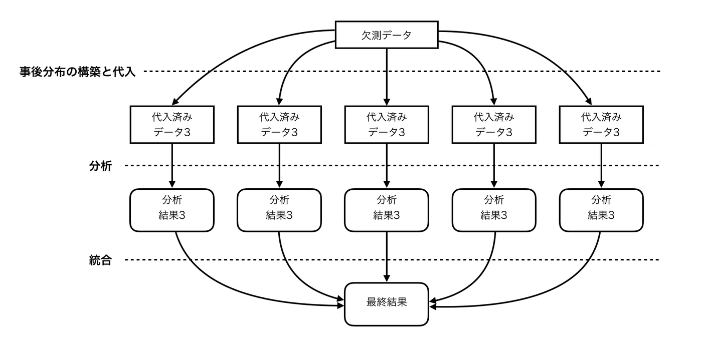
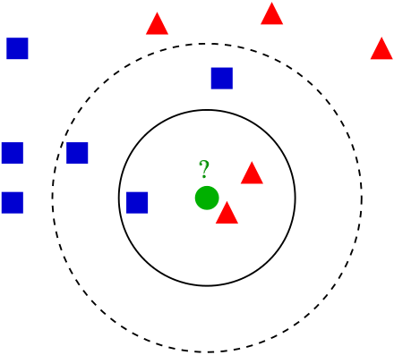

# 欠損値への対応

# もくじ
- [欠損値への対応](#欠損値への対応)
- [もくじ](#もくじ)
- [1. 欠損値とは](#1-欠損値とは)
- [2. 欠損値の種類](#2-欠損値の種類)
  - [2.1. Missing Completely At Random (MCAR)](#21-missing-completely-at-random-mcar)
  - [2.2. Missing At Random (MAR)](#22-missing-at-random-mar)
  - [2.3. Missing Not At Random (MNAR)](#23-missing-not-at-random-mnar)
- [3. 欠損値の対処法一覧](#3-欠損値の対処法一覧)
- [4. リストワイズ削除](#4-リストワイズ削除)
- [5. 代入法](#5-代入法)
  - [4.1. 単一代入法](#41-単一代入法)
    - [5.1.1. 平均値代入法](#511-平均値代入法)
    - [5.1.2. 確定的回帰代入法](#512-確定的回帰代入法)
    - [5.1.3. 比率代入法](#513-比率代入法)
    - [5.1.4. ホットデック法](#514-ホットデック法)
    - [5.1.5. 確立的回帰代入法](#515-確立的回帰代入法)
  - [5.2. 多重代入法](#52-多重代入法)
    - [5.2.1. 分析の流れ](#521-分析の流れ)
- [6. 機械学習的手法](#6-機械学習的手法)
  - [6.1. k-近傍法](#61-k-近傍法)
  - [6.2. ランダムフォレスト](#62-ランダムフォレスト)
- [99. 参考](#99-参考)

# 1. 欠損値とは

**欠損値**は「NaN」で表される**中身のないデータ**のことです。NaNがデータに存在する場合、全体の平均や標準偏差を**適切に**計算できないなどの問題が生じます**。**また、欠損値を1つでも含むからといった理由でデータを**全て**削除してしまうとデータに無駄や偏りが生じるなどの問題が発生します。そのため、データ分析する上で欠損値に対しての適切な処理が必要となります。

# 2. 欠損値の種類

## 2.1. Missing Completely At Random (MCAR)

完全にランダムで生じる欠損値です。ほとんどの欠損値補完アルゴリズムで適応可能です。

## 2.2. Missing At Random (MAR)

**観測データに依存して**ランダムに生じる欠損値です。

例えば、水稲標本を調べたデータで、ある品種（例えば、コシヒカリ）だけに限って特定の特徴量（例えば、乾燥重量）が欠損になっている場合などが考えられます。そのようなものをMARと定義しています。

MAR の場合は、ほかの特徴量と関係を利用して、ある程度バイアスを抑えて補正することができる特徴があります。

|label|length|weight|n_leaves|n_seeds|
|---|---|---|---|---|
|koshihikari|20.7|NA|79|932|
|hitomebore|18.4|19.3|86|838|
|tsuyahime|24.2|20.1|92|840|
|koshihikari|21.4|29.0|82|871|
|koshihikari|20.3|NA|91|925|

## 2.3. Missing Not At Random (MNAR)

**欠損データに依存して生じる**欠損値です。

例えば、水稲標本を調べたデータで、ななつ星という品種がほとんど栽培実験が行われていないために、そもそもデータとして収集されていないような欠損値のことです。

MAR の場合、**そもそもデータが少ない（存在しない）** ので、補正が極めて困難です。

# 3. 欠損値の対処法一覧

上述した通り、ひとえに欠損値といってもその発生メカニズムは異なります。

そのため、以下のようにそれぞれ対処していく必要があります。

| 欠損値の種類 | 対処法 |
| --- | --- |
| MCAR | ①リストワイズ削除・②代入法（①でデータ数が少なくなりすぎる場合はこちら利用） |
| MAR | ①代入法 |
| MNAR | 基本的にはデータの再収集を実施 |

- MCARの場合、欠損値を含むデータを全て削除する **「リストワイズ削除」** を行うことも可能。これによりデータ数が少なくなりすぎる時は **「代入法」** も使えます。
- MARの場合は **「代入法」** を利用。リストワイズ削除が不適切な理由は、例えば、データ削除により女性のデータが多く削除されてしまいデータに偏りが生じるなどの問題が生じる可能性があるため。
- NMARの場合は適切に対処することが困難であるため、**基本的にはデータを再収集する**。

# 4. リストワイズ削除

単にそのデータを削除して残りのデータを使って推測する方法です。

例えば、以下のようにジェームズ・キャメロンの身長の値が欠損しているデータがあったとします。

- 例：各俳優のデータ

| 名前 | 年齢 | 性別 | 身長 |
| --- | --- | --- | --- |
| レオナルド・ディカプリオ | 22 | 男 | 181 |
| ケイト・ウィンスレット | 21 | 女 | 169 |
| ジェームズ・キャメロン | 42 | 男 | 欠損 |
| セリーヌ・ディオン | 29 | 女 | 171 |

この場合、**ジェームズ・キャメロンのデータは一切使わず残り3人分のデータを使いなんらかの推定を行なう**というのがリストワイズ処理です。

リストワイズ処理は欠損原因がMCARの時は上手く作用する事が知られています。使用する標本数が小さくなるので推定自体は悪化しますが、**標本数に対して欠損数が充分少なければ問題にはなりません。**

# 5. 代入法

欠損値の代入法には大きく分けて2種類の方法があります。

1. **単一代入法**：欠損値を補完した完全なデータセットを一つ作り、それを使ってモデルを作る方法。
2. **多重代入法**：欠損値を補完した完全なデータセットを複数作り、そのそれぞれについてモデルを作り、最後にモデルを一つに統合する方法。

以降で触れていきます。

## 4.1. 単一代入法

得られているデータから欠損している箇所の値を一意に求め代入する方法です。

以下のように確定的代入法と確率的代入法にさらに分類されます。

| No | 名称 | 確定的/確率的 | 説明 |
| --- | --- | --- | --- |
| 1 | 平均値代入法 | 確定的 | 欠測を欠測していない値の平均値で補完する方法。無理やり平均値を入れることになるため、この方法は百害あって一利なしとされています。 |
| 2 | 確定的回帰代入法 | 確定的 | 欠測がある変数を目的変数、欠測がない変数を目的変数をして回帰モデルを作成し、欠測値を予測することで補完する方法。 |
| 3 | 比率代入法 | 確定的 | 切片のない単回帰分析の構造をしたモデルを用いてで代入値を予測する方法。また、説明変数の値が大きくなると目的変数のばらつきが増加することが往々にあります。 |
| 4 | ホットデック法 | 確定的 | 欠測していないデータが似通っている対象の値を用いて欠測値を代入する方法。数量項目でも質的項目でも利用可能。 |
| 5 | 確立的回帰代入法 | 確率的 | 確定的回帰代入法における、回帰モデルに誤差項を追加したモデルで予測した値で欠測値を補完する方法。確定的回帰代入法での不偏推定だけでは解決しない、データのばらつきの表現が著しく損なわれている状態を解決するために利用します。 |

### 5.1.1. 平均値代入法

欠測を欠測していない値の平均値で補完する方法です。

以下のデータを例として、平均値で欠損値補完をします。

|No|特徴量1 |特徴量2|
|---|---|---|
|0|1|NaN -> 5（平均値）|
|1|3|5|
|2|NaN -> 2（平均値）|NaN -> 5（平均値）|
|平均|2=(1+3)/2|5=5/1|

**１．Scikit-learn `SimpleImputer`関数**

Scikit-learnでの実装例を示します。

String型の特徴量を含んでいるとデフォルト設定(平均値補完)ではエラーとなるので注意が必要です。

- Scikit-learnでの実装例

```python
import numpy as np
import pandas as pd
from sklearn.impute import SimpleImputer

df_train = pd.DataFrame([[1, np.nan, 'cat1'],
                        [3, 5, 'cat1'],
                        [np.nan, np.nan, np.nan]])
print(SimpleImputer().fit_transform(df_train.iloc[:,[0,1]]))
```

- 出力

```python
[[1. 5.]
 [3. 5.]
 [2. 5.]]
```

**２．平均値補完: Pandas `fillna`関数**

DataFrame使った平均値補完を行います。

訓練時はこれで問題ないですが、推論時にはデータに手を加えにくいので実施するのをオススメしません。String型の特徴量を含んでいると欠損値は`NaN`のままです。

- Pandasでの実装例（データセット定義は上記Scikit-learnのものと同様）

```python
print(df_train.fillna(df_train.mean()))
```

- 出力

```python
0    1     2
0  1.0  5.0  cat1
1  3.0  5.0  cat1
2  2.0  5.0   NaN
/usr/local/lib/python3.7/dist-packages/ipykernel_launcher.py:1: FutureWarning: Dropping of nuisance columns in DataFrame reductions (with 'numeric_only=None') is deprecated; in a future version this will raise TypeError.  Select only valid columns before calling the reduction.
  """Entry point for launching an IPython kernel.
```

### 5.1.2. 確定的回帰代入法

**TODO：より詳しい実装でのやり方を調べる**

欠測がある変数を目的変数、欠測がない変数を目的変数をして回帰モデルを作成し、欠測値を予測することで補完する方法です。

### 5.1.3. 比率代入法

**TODO：実装でのやり方を調べる**

切片のない単回帰分析の構造をしたモデルを用いてで代入値を予測する方法です。

説明変数の値が大きくなると目的変数のばらつきが増加することがあります。

### 5.1.4. ホットデック法

欠測していないデータが似通っている対象の値を用いて欠測値を代入する方法です。

数量項目でも質的項目でも利用できます。

データの近さは、ユーグリット距離をはじめとする様々な距離定義を用いて算出します。

### 5.1.5. 確立的回帰代入法

確定的回帰代入法における、回帰モデルに誤差項を追加したモデルで予測した値で欠測値を補完する方法です。確定的回帰代入法での不偏推定だけでは解決しない、データのばらつきの表現が著しく損なわれている状態を解決するために利用します。

## 5.2. 多重代入法

多重代入法は、欠測データの分布から独立かつ無作為に抽出されたM個のシミュレーション値によって欠測値を置き換えるものです。

この代入法の目的は個々の値を完全に復元させることではなく、母集団のパラメータの推定を行います。そのため、MARであると仮定して、観測データを条件とする欠測データの事後予測確率を構築します。

### 5.2.1. 分析の流れ

N個の代入済みのデータを生成し、それぞれのデータでモデル作成や分析を行い、その後にその結果を統合するような流れとなっています。

- 分析のイメージ



統合方法は以下のようになります。

統合されたパラメータ$\theta_M$は、$m$番目の代入済みデータセット推定されたパラメータ$\hat\theta_m$
を算術平均で求めます。

$$
{\theta_M = \frac{1}{M}\sum_{m=1}^{M} \hat \theta_m
}
$$

多重代入法におけるパラメータの分散は２種類存在し、**代入内分散**と**代入間分散**となります。

**代入内分散**は、パラメータ$\hat\theta_m$の分散$var(\hat \theta_m)$の算術平均です。

$$
{\hat W_M = \frac{1}{M} \sum_{m=1}^{M} var(\hat \theta_m)
}
$$

**代入間分散**は、$\hat \theta_m$に自由度が１つ減っているため次にように求めます。

$$
{\hat B_M = \frac{1}{M-1} \sum_{m=1}^{M} (\hat \theta_m - \hat \theta_m)^2
}
$$

また、$\hat \theta_m$の分散$T_M$は代入内分散と代入間分散と合算して求めます。

$$
{T_M=\hat W_M + (1+\frac{1}{M})\hat B_M
}
$$

- 参考
    - [https://qiita.com/saltcooky/items/2e39c4bc099d20f20d59](https://qiita.com/saltcooky/items/2e39c4bc099d20f20d59)

# 6. 機械学習的手法

機械学習的手法について触れていきます。なお以下ではk-近傍法とランダムフォレストについて触れていますが、どちらも欠損値を目的変数としてそれ以外の特徴量を独立変数としてモデルを構築するようなことをします。

そのため、やることはどちらも特に変わりないです。

## 6.1. k-近傍法

似たようなデータをk個集めてそれらの多数決から目的とする値を求める手法です。回帰・分類両方で利用できます。

- k-近傍法のイメージ



実装は以下のようなイメージです。k-近傍法で欠損値を埋めていきます。

```python
from sklearn.impute import KNNImputer
import pandas as pd

# 以下のdfを想定する(NaNが欠損値)
#	id	col1	col2	col3
#0	1.0	9.0	3.0	1.0
#1	2.0	NaN	3.0	NaN
#2	3.0	8.0	NaN	1.0
#3	4.0	9.0	5.0	2.0

# 補完したい列
impute_columns = ['id', 'col1', 'col2', 'col3']

# KNNImputerによる保管
# （n_neighbors=2なので、K近傍法により最も近い2つのレコードを見つけ、その2つの平均値で埋める）
imputer = KNNImputer(n_neighbors=2)

# DataFrameに直す
df_filled = pd.DataFrame(imputer.fit_transform(df[impute_columns]), columns=impute_columns, index=df.index)
df.update(df_filled)

# df_filledは以下のように埋まる。
#	id	col1	col2	col3
#0	1.0	9.0	3.0	1.0
#1	2.0	8.5	3.0	1.0
#2	3.0	8.0	4.0	1.0
#3	4.0	9.0	5.0	2.0

#####################################

# テストデータに関しては、学習データにfitしたものを使用してtransformする
# test_df_filled = pd.DataFrame(imputer.transform(test_df[impute_columns]), columns=impute_columns, index=test_df.index)
# test_df.update(test_df_filled)
```

## 6.2. ランダムフォレスト

沢山の決定木を作成してその多数決をとるアルゴリズムです。

詳細はモデリングのところで触れますが、以下のような特徴がありk-近傍法と同様に欠損値の補填に利用されるケースもあります。

以下メリットです。

- 精度が非常に良い
- 過学習を抑える効果がある
- 何千もの入力変数を削除せずにそのまま扱うことができる
- 各変数の事前のスケーリングが不要
- 交差検証や別個のテストデータでの検証をせずとも、アルゴリズム内で未知データに対する精度を推定することができる
- 欠落値を推定する方法を持っているため、欠損値の多いデータでも精度を維持することができる
- データ間の関係について情報を得ることができる

# 99. 参考

- [https://axa.biopapyrus.jp/machine-learning/preprocessing/missing-data.html](https://axa.biopapyrus.jp/machine-learning/preprocessing/missing-data.html)

[https://axa.biopapyrus.jp/machine-learning/preprocessing/missing-data.html](https://axa.biopapyrus.jp/machine-learning/preprocessing/missing-data.html)

- [https://rightcode.co.jp/blog/information-technology/missing-value-approach](https://rightcode.co.jp/blog/information-technology/missing-value-approach)

[https://rightcode.co.jp/blog/information-technology/missing-value-approach](https://rightcode.co.jp/blog/information-technology/missing-value-approach)

- [https://qiita.com/siseru/items/7b4aa0d97be23439ada7](https://qiita.com/siseru/items/7b4aa0d97be23439ada7)
    - タイタニック・チュートリアルを用いた欠損値の扱い例

[タイタニック・チュートリアル 欠損値をどうするか 1 - Qiita](https://qiita.com/siseru/items/7b4aa0d97be23439ada7)

- [https://kopaprin.hatenadiary.jp/entry/2019/08/08/021749](https://kopaprin.hatenadiary.jp/entry/2019/08/08/021749)

[Python機械学習タスクにおける欠損補完の精度をいろいろ検証してみた件。 - 俺のOneNote](https://kopaprin.hatenadiary.jp/entry/2019/08/08/021749)

- [https://qiita.com/ngayope330/items/7dce95abc42cfe6566bf](https://qiita.com/ngayope330/items/7dce95abc42cfe6566bf)

[機械学習における前処理3　欠損値・外れ値・不均衡データ - Qiita](https://qiita.com/ngayope330/items/7dce95abc42cfe6566bf)

- [https://qiita.com/saltcooky/items/2e39c4bc099d20f20d59](https://qiita.com/saltcooky/items/2e39c4bc099d20f20d59)

[多重代入法による欠測データ処理【R】 - Qiita](https://qiita.com/saltcooky/items/2e39c4bc099d20f20d59)

- [https://qiita.com/FukuharaYohei/items/9830d5760595619352a5](https://qiita.com/FukuharaYohei/items/9830d5760595619352a5)

[Pythonでの欠損値補完(代入法) scikit-learnとpandas - Qiita](https://qiita.com/FukuharaYohei/items/9830d5760595619352a5)

- [https://www.teijitaisya.com/python-pandas-datacleansing/#index_id4](https://www.teijitaisya.com/python-pandas-datacleansing/#index_id4)

[https://www.teijitaisya.com/python-pandas-datacleansing/#index_id4](https://www.teijitaisya.com/python-pandas-datacleansing/#index_id4)

- [https://www.codexa.net/missing_value_python/](https://www.codexa.net/missing_value_python/)
    - こことは違う欠損値の扱い①

[https://www.codexa.net/missing_value_python/](https://www.codexa.net/missing_value_python/)

- [https://tagawake.work/python-preprocessing/](https://tagawake.work/python-preprocessing/)
    - こことは違う欠損値の扱い②

[](https://tagawake.work/python-preprocessing/)

- [https://dev.classmethod.jp/articles/2017ad_20171218_knn/](https://dev.classmethod.jp/articles/2017ad_20171218_knn/)

[https://dev.classmethod.jp/articles/2017ad_20171218_knn/](https://dev.classmethod.jp/articles/2017ad_20171218_knn/)

- [https://an-engineer-note.com/?p=299](https://an-engineer-note.com/?p=299)

[https://an-engineer-note.com/?p=299](https://an-engineer-note.com/?p=299)