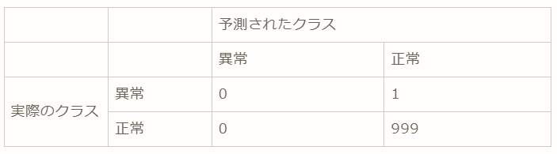
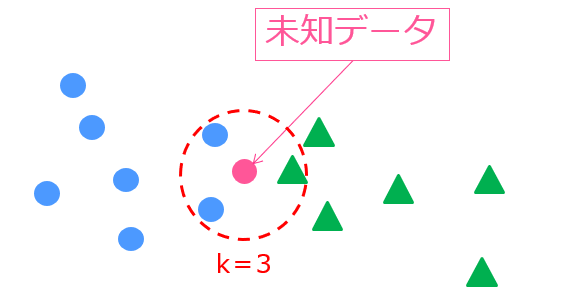
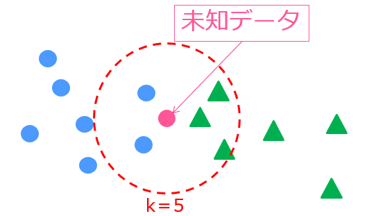
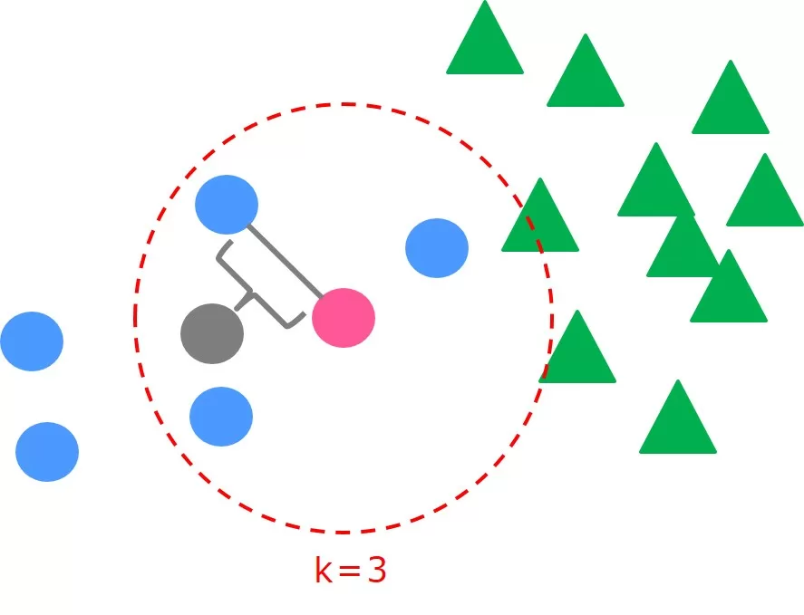

# 不均衡データへの対処
# もくじ
- [不均衡データへの対処](#不均衡データへの対処)
- [もくじ](#もくじ)
- [1. 不均衡データ](#1-不均衡データ)
  - [1.1. 不均衡データとは](#11-不均衡データとは)
  - [1.2. 具体例](#12-具体例)
- [2. 不均衡データの扱い方と対処法](#2-不均衡データの扱い方と対処法)
  - [2.1. アンダーサンプリング](#21-アンダーサンプリング)
  - [2.2. オーバーサンプリング](#22-オーバーサンプリング)
  - [2.3. 重み付け](#23-重み付け)
  - [2.4. **異常検知問題として扱う**](#24-異常検知問題として扱う)
- [3. 不均衡データ対処後の評価](#3-不均衡データ対処後の評価)
- [99. 参考](#99-参考)

# 1. 不均衡データ

## 1.1. 不均衡データとは

不均衡データとは**データ構造に偏りがあるデータ群**のことを指します。これは、機械学習で分類モデルを作ろうとするときに生じる問題で、例えば2値分類を行う際に、データ全体の99%がクラスA、1%がクラスBといったように、データが大きく偏ったりしている状態となります。

## 1.2. 具体例

例えばクレジットカードの不正利用を判別したいとしましょう。その場合、ほとんどのデータは正常と一部のデータが異常という不均衡データになります。

このデータを使ってそのまま分類モデルを構築するとどのような問題が生じるのでしょうか？

仮にこのデータに対して、全てのデータを正常と判定する分類モデルを作ったとしましょう。すると、データの予実は以下のようなマトリックスで表されます。

本来正常のデータは全て正常と予測され、本来は異常のデータは正常と予測されてしまっています。この場合、予実の精度は999/1000=99.9%となるのです。

そのため、**異常を全く判別できていないので全体で見ると精度が高く見えるような現象**が発生します。

# 2. 不均衡データの扱い方と対処法

不均衡データの解消には大きく分けて4つの方法があります。

- **アンダーサンプリング**
- **オーバーサンプリング**
- **重み付け**
- **異常検知問題として扱う**

## 2.1. アンダーサンプリング

**少数派のデータ群に合わせて多数派のデータ群を削除する**という方法です。

削除する方法はいくつかありますが、A群とB群を識別することを例として考えると以下のような方法が考えられます。

- A群とB群を識別する上で重要なのは、A群とB群の境界線付近に分布するデータであるため、境界線付近以外に分布するあまり意味のないデータは削除してA群とB群のデータバランスを取る。
- もしくは、全体のデータのバランスを崩さないために多数派群をクラスター分類し各群から均等にランダムサンプリングする。

どちらも始めに触れた通り、**「少数派のデータ群に合わせて多数派のデータ群を削除する」**という観点に立って削除しています。

このようにアプローチしていく方法をアンダーサンプリングと呼びます。

## 2.2. オーバーサンプリング

オーバーサンプリングはアンダーサンプリングとは違い、逆に **「少数派のデータを多数派に合わせて増やす」** 方法です。

オーバーサンプリングの中で特によく使われる手法が **SMOTE** と呼ばれるものです。SMOTEは、**S**ynthetic **M**inority **O**ver-sampling **TE**chniqueの略で[k-近傍法](https://toukei-lab.com/%EF%BD%8B%E8%BF%91%E5%82%8D%E6%B3%95)のアルゴリズムを利用して少数派のサンプルを増やしていきます。

なお、k-近傍法はあるサンプルに対して近傍のK個のデータから判別を行うというものです。

この場合K=3であれば未知データは青〇だと分類され、K=5であれば緑△だと判別されます。

k-近傍法の場合は、未知データに対しての判別に使いますが SMOTE ではこれをオーバーサンプリングに利用します。

ある少数派のサンプル（ピンク）を選び、k＝３であれば**近傍3つの少数派データからランダムで1つ選び新たなサンプルを内挿する**といったことを考えます。

そして、それを少数派のサンプル全てに適応します。

内挿の仕方は通常のSMOTEではランダムですが、SMOTEの拡張モデルで様々なロジックが開発されています。

## 2.3. 重み付け

少数派のサンプルに対して重みを付けて重要視するという方法です。

分類問題に使われる勾配ブースティング手法の1つである[Xgboost](https://toukei-lab.com/xgboost)ではそれぞれのサンプルごとに重みを付けることができます。Xgboostは[決定木](https://toukei-lab.com/%E6%B1%BA%E5%AE%9A%E6%9C%A8)を[アンサンブル学習](https://toukei-lab.com/ensemble)させたものですので、基本的には決定木モデルになります。

決定木モデルではある特徴量において分類した場合の損失関数を基に分類を行いますが、少数派カテゴリはなかなか出てこないので分類できなくても損失にあまり影響を及ぼしません。

そこで少数派の重みを高めて少数派カテゴリも上手く分類できるようにしようというのが、不均衡データに対する重み付けアプローチになります。

## 2.4. **異常検知問題として扱う**

そもそも問題の定義を分類問題ではなく異常検知問題として扱ってしまうという方法です。あまりにもデータに偏りがある場合にこのように対処します。

異常検知問題では、正常データを基に正常空間を作り、定めた閾値を超えるデータに関しては異常値とみなします。

品質工学の分野でよく用いられ（不良品の検出など）、以下のような手法があります。

- **[MT法](https://toukei-lab.com/mt%e6%b3%95)**
- **[管理図](https://toukei-lab.com/%e7%ae%a1%e7%90%86%e5%9b%b3)**

# 3. 不均衡データ対処後の評価

不均衡データ対処後に評価を行う際は、モデル評価と同様に混同行列を用いて**正解率(Accuracy)**や**適合率(precision)**、**再現率(recall)**、**F-measure**などを確認していきます。

# 99. 参考

- [https://toukei-lab.com/imbalance-data-smote](https://toukei-lab.com/imbalance-data-smote)

[https://toukei-lab.com/imbalance-data-smote](https://toukei-lab.com/imbalance-data-smote)

- [https://qiita.com/ryouta0506/items/619d9ac0d80f8c0aed92](https://qiita.com/ryouta0506/items/619d9ac0d80f8c0aed92)

[不均衡データに対するClassification - Qiita](https://qiita.com/ryouta0506/items/619d9ac0d80f8c0aed92)

- [https://qiita.com/ngayope330/items/7dce95abc42cfe6566bf](https://qiita.com/ngayope330/items/7dce95abc42cfe6566bf)

[機械学習における前処理3　欠損値・外れ値・不均衡データ - Qiita](https://qiita.com/ngayope330/items/7dce95abc42cfe6566bf)

- [https://bigdata-tools.com/imbalance-data/](https://bigdata-tools.com/imbalance-data/)

[機械学習における不均衡データの扱いについて解説｜BigData tools](https://bigdata-tools.com/imbalance-data/)