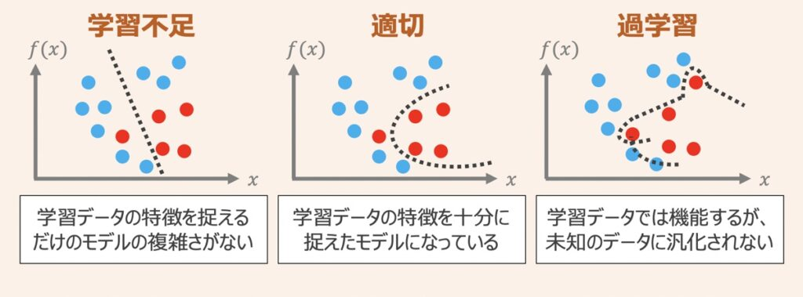

# 特徴量の正則化（L1/L2）
# もくじ
- [特徴量の正則化（L1/L2）](#特徴量の正則化l1l2)
- [もくじ](#もくじ)
- [1. 特徴量](#1-特徴量)
  - [1.1. 特徴量とは](#11-特徴量とは)
  - [1.2. 過学習と特徴量](#12-過学習と特徴量)
- [2. 正則化（L1/L2）](#2-正則化l1l2)
  - [2.1. 正則化（L1/L2）とは](#21-正則化l1l2とは)
  - [2.2. 正則化の概念](#22-正則化の概念)
  - [2.3. L2正則化とL1正則化](#23-l2正則化とl1正則化)
    - [2.3.1. L2正則化（L2 regularization）](#231-l2正則化l2-regularization)
    - [2.3.2. L1正則化（L1 regularization）](#232-l1正則化l1-regularization)
- [99. 参考](#99-参考)

# 1. 特徴量

## 1.1. 特徴量とは

特徴量＝機械学習の予測モデルを作る上で、直接与えるパラメータのことです。

予測モデルを作る際に集めたデータの中ですべての列が予測モデルに必要なわけではありません。また、逆に列が不足している可能性もあります。

機械学習ではこの列の選別をしたり、新しい列を追加して特徴量を増やしたりすることが重要で、特徴量列を増やすことを、特徴量作成と呼びます。

その調整にあたって必要な観点がいくつかあるためこちらで紹介します。

## 1.2. 過学習と特徴量

特徴量にについて触れる前に、それと切っても切れない過学習について触れます。

まず上図のように機械学習モデルを作成し、学習データに対してモデルパラメータがうまくフィッティングするよう学習したとします。

この時、学習データに対するモデルの表現力が高ければ高いほど，学習データに対してのみ過剰に当てはまりが良くなる状態になってしまい、**テストデータへの当てはまりが悪くなる状態**になってしまいます。

この状態を**過学習の状態**と言い、この対策として**正則化**という考え方が関わってきます。

# 2. 正則化（L1/L2）

## 2.1. 正則化（L1/L2）とは

正則化とは、過学習対策の手法であり、**学習データへの過剰フィッティングに伴うモデル複雑化を抑制しながら、より単純な（低い次元の）モデルとして学習データを表現できることを目指したもの**です。

高次元データをモデルに適用した場合に発現する高次元学習問題では、説明変数が多い分モデルの複雑さが増す傾向にあるため、特に正則化が有効であると言えます。

## 2.2. 正則化の概念

正則化の具体的な仕組みは、パラメータ(重み)に**ペナルティ**を科すための**追加情報(バイアス)を導入**することで、モデルの複雑性と学習データへの当てはまりの良さをバランスさせることです。

これにより過学習対策を実現しています。

例として、まず学習データを用いた一般的なモデル学習ケースを考え、モデル性能を改善するために予測性能誤差Eを最小化することを検討します。

この時、上図中心の座標（オレンジプロット）がモデルの誤差Eが最小となる(w0,w1)の座標位置だとします。

モデルの精度の追求するならば、オレンジプロット(w0,w1)を重み係数を値として採用し、モデルに用いるのが良いと言えます。一方でこの場合、過剰フィッティングした過学習の状態に陥る懸念があります。

そこで上図に対して**「ペナルティを科すことでモデルの過学習を抑制する」**という正則化について考えます。

正則化を適用すると、上図のように**小さい重みを促すペナルティ項（緑円）を追加したイメージになります。**これは、重み係数$(w_0, w_1)$が取りうる範囲を**緑円内に制限**することを意味します。

結果、大きな重みがあるとその分ペナルティを科されることになります。

以上より学習データセットへのモデルの依存を減らすことができるようになるわけです。

## 2.3. L2正則化とL1正則化

機械学習では、L1正則化とL2正則化という手法が一般的に用いられます。これら概要について後述します。

### 2.3.1. L2正則化（L2 regularization）

L2正則化の場合、重み係数$(w_0,w_1)$が取りうる範囲は**緑の円内**に限られます。

正則化パラメータ$\lambda$は任意に設定することができ、$\lambda$の値を大きく設定するほど、ペナルティ項（緑の円）は小さく縮小し、${\lambda}={\infty}$の場合は重み係数$(w_0,w_1)＝(0,0)$となります。

機械学習の世界では、後述するL1正則化に比べ、L2正則化の用いられる頻度が多いです。

### 2.3.2. L1正則化（L1 regularization）

L1正則化の場合、重み係数$(w_0,w_1)$の取りうる範囲は**ひし形**として表されるイメージです。またL1正則化のペナルティは重み係数の絶対値の和として表されます。

さらにL1正則化の特徴として、重み係数$(w_0,w_1)$が最適となる組み合わせは、**ひし形で示す角部分**となることが多いです。これは、**あまり重要でない説明変数の係数（重み）をゼロにすること**を意味します。

つまり、L1正則化による重みの最適化条件は**疎性を促す**と言えます。

L1正則化を適用すると、**本当に必要な変数だけ**モデルに利用されるため、モデル開発者がどの変数が重要か認識しやすくなります。

ただし、一般的にはL2正則化の方が予測の性能は高いと言われており、この点考慮が必要です。

# 99. 参考

- [https://di-acc2.com/analytics/ai/6335/](https://di-acc2.com/analytics/ai/6335/)

- [機械学習で「分からん！」となりがちな正則化の図を分かりやすく解説 - Qiita](https://qiita.com/c60evaporator/items/784f0640004be4eefc51)