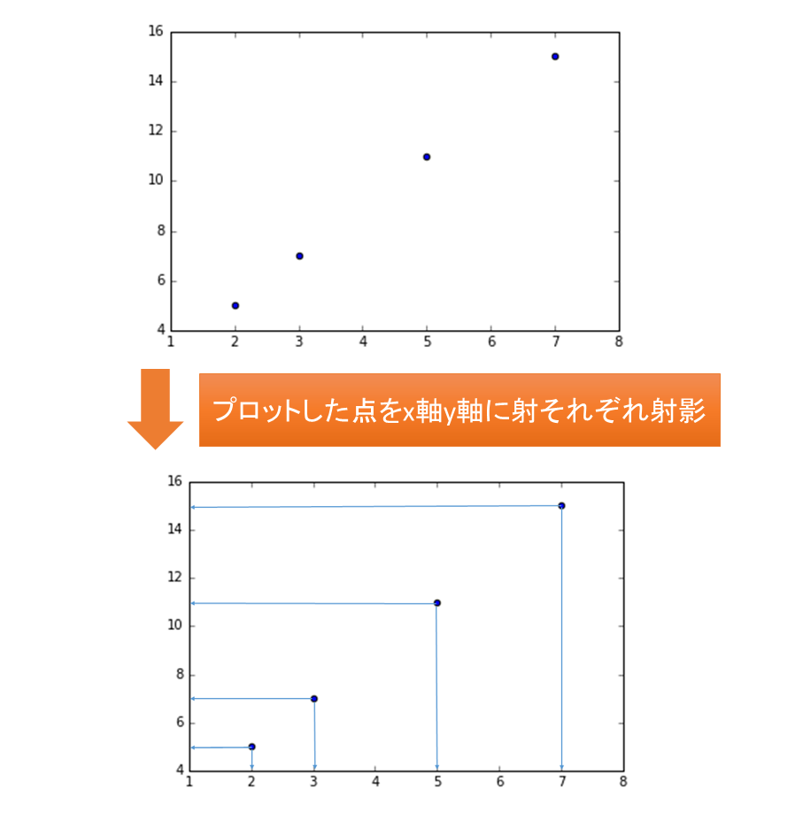

# 主成分分析（PCA）
# もくじ
- [主成分分析（PCA）](#主成分分析pca)
- [もくじ](#もくじ)
- [1. 主成分分析（PCA）とは？](#1-主成分分析pcaとは)
- [2. 主成分分析のやり方](#2-主成分分析のやり方)
  - [2.1. 次元削減のイメージ](#21-次元削減のイメージ)
  - [2.2. 次元削減のやり方](#22-次元削減のやり方)
  - [2.3. 簡単な主成分分析（PCA）の実装](#23-簡単な主成分分析pcaの実装)
- [3. 第一主成分と第二主成分](#3-第一主成分と第二主成分)
  - [3.1. 第一主成分と第二主成分について](#31-第一主成分と第二主成分について)
  - [3.2. 線形代数でひも解く](#32-線形代数でひも解く)
- [4. 主成分分析の評価方法（累積寄与率）](#4-主成分分析の評価方法累積寄与率)
  - [4.1. 累積寄与率を考える](#41-累積寄与率を考える)
  - [4.2. 寄与率をコードで確認する](#42-寄与率をコードで確認する)
- [5. 本格的な主成分分析をする](#5-本格的な主成分分析をする)
  - [5.1. データの読み込み](#51-データの読み込み)
  - [5.2. 主成分分析による次元削減](#52-主成分分析による次元削減)
  - [5.3. 主成分をプロットする](#53-主成分をプロットする)
  - [5.4. 累積寄与率を確認する](#54-累積寄与率を確認する)
- [99. 参考](#99-参考)

# 1. 主成分分析（PCA）とは？

データセットの次元が多いと、データ分析においても、機械学習においても計算コストが増え、データの様子が分かりにくくなります。

その解決策として、統計や機械学習の分野でよく使われる手法が、主成分分析（Principal Component Analysis：PCA）です。

**主成分分析では、特徴量を抽出することによって、データセット内の特徴量を削減することが出来ます。**

それによって、3次元以下に次元を削減することが出来れば、データを可視化することもできます。

主成分分析では、特徴量を「選択」するものではなく、新しい特徴量を「抽出」します。

ただし、ここでいう「抽出」とは非可逆的な（一度抽出したら、元のデータセットの特長量には戻らない）ものなので、いくらか失われる情報が出てきます。

# 2. 主成分分析のやり方

## 2.1. 次元削減のイメージ

主成分分析とは、**データセットの次元を削減するために用いる手法**ですが、主成分分析をした後の次元数を何個にしなければならない、といった規定はありません。

極論をいってしまえば、主成分分析を行った後の次元数が元のデータセットと同じ次元数でも問題は無いのです。

それでは次元削減できていないではないか、と感じる人も多くいるかもしれませんが、

イメージでいえば主成分分析では、**次元の重要でないものを消すことも、消さないこともできる**といったものです。

- 例
    - 数多くある次元数の中から、「重要な次元」のみをピックアップ ⇒ 次元数は減らせる

## 2.2. 次元削減のやり方

主成分分析は**教師なし学習**のため正解（ラベルや教師データ）がないため、**分散（＝ばらつき度合）によって**次元の重要度を決めます。

分散は、データのばらつきを表す指標の一つなので、分散が大きければ大きいだけデータのバラつきは大きく、分散が小さければ小さいだけデータのバラつきが小さいといえます。

すなわち、分散が大きければデータの値ごとの差も見つけやすく、分散が小さければ、データの値ごとの差が見つけにくいといえます。

よって、一番初めに新しく抽出する次元は、その次元に射影したデータの分散が最大になるように作成します。

**例：2次元データを考える**

たとえば、まず2次元のデータを考えるために、下のような$y=2x+1$の一次関数を考えましょう。プロットする点は $(2,5),(3,7),(5,11),(7,15)$ で、これらの点をx軸y軸に射影してそれぞれの分散を求めます。



まず、主成分分析をする前の分散について考えます。

上の図のようにデータを$x$軸に射影したときの分散は3.69、$y$軸に射影したときの分散は14.75です。

さらに、設定した関数から、$(2,5),(3,7),(5,11),(7,15)$が相関していることは明らかです。

続いて、2次元から1次元への圧縮を考えます。新しい次元Z1は、以下のようなものです。


新しく抽出した次元に射影したデータの分散は、$x$軸や$y$軸へデータを射影した時よりも間隔（バラつき）が大きいため、分散が大きいことが分かります。

さらに、この次元に**直行する新しい次元**についても考えてみましょう。


この次元では、すべてのデータの間隔（バラつき）が$0$なので、情報が全く含まれていないことが分かります。

主成分分析とは、このような作業によって、**2次元（＝多次元）を1次元（＝より低次の次元）に抽出する作業の事**をさします。

## 2.3. 簡単な主成分分析（PCA）の実装

先ほどのような主成分分析は、Pythonで実装します。

次のコードでは、$y=2x+1$上の $(2,5),(3,7),(5,11),(7,15)$ のデータを主成分分析して、分析結果したものの散布図を表示します。

- 実装例

```python
import numpy as np
from matplotlib import pyplot as plt
from sklearn.decomposition import PCA
# 標準化に関しては下記のテキストをご参考ください。
# https://aiacademy.jp/texts/show/?id=555&context=subject-ml_practice
from sklearn.preprocessing import StandardScaler

# グラフ描画サイズを設定します
plt.figure(figsize=(7, 4))

# y = 2x+1
data = np.array([[2, 5], [3, 7], [5,11],[7,15]])

# 標準化
sc = StandardScaler()

# 標準化させる値
data = sc.fit_transform(data)

# 主成分分析の実行
pca = PCA()
pca.fit(data)

# データを主成分に変換する
features = pca.transform(data)

# 主成分をプロットする
plt.scatter(features[:, 0], features[:, 1])
plt.title('principal component')
plt.xlabel('Z1')
plt.ylabel('Z2')
plt.savefig('PCA_sample1')
plt.show()
```

上記実行すると、以下のように出力されます。


# 3. 第一主成分と第二主成分

## 3.1. 第一主成分と第二主成分について

以上によって、主成分分析の概念は説明しましたが、多くのデータは$y=2x+1$のような一次関数上にあるわけではありません。

基本的にはデータセットには、分散が含まれていて一つの次元に収めることは出来ません。そういったときには幾つかの主成分を考える必要があります。

今回の主成分に最初に選ばれたZ1軸のような、**射影したデータの分散が最大になるような軸を第一主成分**といい、**第一主成分と直行する軸の中で、軸上に射影したデータの分散が最大になる軸を第二主成分**といいます。

## 3.2. 線形代数でひも解く

ここで少しだけ、どのように主成分分析がScikit-Learnの中で行われているか、線形代数を用いてざっくりと手順を説明しておきます。

なお、実装だけでも確認できる内容なので読み飛ばしても構いません。

1. .変数$x_1,x_2,x_3,…,x_p$を標準化する

$$
u_1=\frac{x_1-{\bar{x_1}}}{s_1},\frac{x_2-{\bar{x_2}}}{s_2}, ...,\frac{x_p-{\bar{x_p}}}{s_p}
$$

1. 第一主成$z_1$を以下のように定める

$$
z_1=a_{1}u_{1}+a_{2}u_{2}+...+a_{p}u_{p}
$$

1. $z_1$の分散$V_{z1}$が最大になる固有ベクトル$(a1,a2,…,ap)$を求める。

その解は各データの$x1,x2,x3,…,xp$の相関行列$R$とすると、

$$
R=
\begin{pmatrix}
   1 & r_{{x_1}{x_2}} & {...} & r_{{x_1}{x_p}} \\
   r_{{x_2}{x_1}} & 1
  & {...} & r_{{x_2} {x_p}} \\{.} & {.} & {...} & {.} \\ r_{{x_p}{x_1}} & r_{{x_p}{x_2}} & {...} & 1 \end{pmatrix}
$$

となり、第一固有値（最大固有値）λ1に対応する（長さ１の）固有ベクトルとなります。

⇒ $\lambda_1\textbf{R}=V_1\textbf{R}$のイメージ。

このとき$V_{z_1}＝{\lambda}_1$となります。

1. 第二主成分は$R$の第２固有値$\lambda_2$に対応する（長さ１の）固有ベクトルとなる。

3で考えた通りに$\lambda_2$でも同様に考えていきます。

計算過程は同様なので省きますが、計算すると$\lambda_1$同様に$V_{z_2}＝{\lambda}_2$となります。

1. 第$k$主成分は第$k$固有値に対応する（長さ1の）固有ベクトルとして求める事が出来る。

こちらも上述までと同様です。

以上で数学的な解説は終了です。

以降では主成分分析の評価方法について触れていきます。

# 4. 主成分分析の評価方法（累積寄与率）

## 4.1. 累積寄与率を考える

原理的には元のデータの次元数まで増やすことのできる主成分ですが、いくつの主成分を採用すれば良いのか考える必要があります。

一般的には累積寄与率が 80 % になるように主成分を抽出すると良いとされています。

ただし、この80％という数字はきちんと定められたものではなく、60％で良いという人もいます。

そのため、どの主成分を使うべきかについてはそれぞれの分析者によって定める必要があります。

第$k$主成分の寄与率の定義式についてここで触れます。

- 第k主成分の寄与率の定義式

$$
\frac{\lambda_{k}}{\lambda_{1}+\lambda_{2}+...+\lambda_{p}}=\frac{\lambda_{k}}{p}
$$

また、第$k$主成分までの累積寄与率を以下のように定義します。

$$
\frac{\lambda_{1}+\lambda_{2}+...+\lambda_{k}}{\lambda_{1}+\lambda_{2}+...+\lambda_{p}}=\frac{\lambda_{1}+\lambda_{2}+...+\lambda_{k}}{p}
$$

## 4.2. 寄与率をコードで確認する

実際に、先ほどのy=2x+1の一次関数上に取った点での、各成分での寄与率と累積寄与率は、explained_variance_ratio_メソッドを使うことで、計算することが出来ます。

先ほどのプログラムに以下のコード（`【追加】累積寄与率をみる`部分）を追加してください。

```python
import numpy as np
from matplotlib import pyplot as plt
from sklearn.decomposition import PCA
# 標準化に関しては下記のテキストをご参考ください。
# https://aiacademy.jp/texts/show/?id=555&context=subject-ml_practice
from sklearn.preprocessing import StandardScaler

# グラフ描画サイズを設定します
plt.figure(figsize=(7, 4))

# y = 2x+1
data = np.array([[2, 5], [3, 7], [5,11],[7,15]])

# 標準化
sc = StandardScaler()

# 標準化させる値
data = sc.fit_transform(data)

# 主成分分析の実行
pca = PCA()
pca.fit(data)

# データを主成分に変換する
features = pca.transform(data)

# 主成分をプロットする
plt.scatter(features[:, 0], features[:, 1])
plt.title('principal component')
plt.xlabel('Z1')
plt.ylabel('Z2')
plt.savefig('PCA_sample1')
plt.show()

# ================================
# 【追加】累積寄与率をみる
# ================================
print('各次元の寄与率: {0}'.format(pca.explained_variance_ratio_))
print('累積寄与率: {0}'.format(sum(pca.explained_variance_ratio_)))
# 出力結果
# 各次元の寄与率: [  1.00000000e+00   1.36861370e-33]
# 累積寄与率: 1.0
```

# 5. 本格的な主成分分析をする

実際に、どのように主成分分析が活用できるのか、今回はIrisデータセットを用いて考えてみましょう。

大まかなながれは　以下のとおりです。

1．主成分分析で次元削減を行う。

2．分析結果をもとに、データセットを主成分に変換する

3．主成分をプロットする

4．主成分の寄与率で基準を満たしているか評価する

**Iris（アヤメ）データセットについて**

Iris（アヤメ）データセットとは、“setosa”, “versicolor”, “virginica” という 3 種類の品種のアヤメのがく片 (Sepal)、花弁 (Petal) の幅および長さを計測したデータです。

150個のデータがあり、3種類のアヤメのデータがあるので、4次元のデータという事になります。

今回これら４次元のデータに関して主成分分析をすることで、2次元の第一主成分と第二主成分に抽出をし、可視化をします。

さらにそれらの累積寄与率を調べたいと思います。

## 5.1. データの読み込み

まずはデータの読み込みをします。

- データ読み込み実装

```python
import numpy as np
import matplotlib.pyplot as plt
from sklearn import datasets
from sklearn.decomposition import PCA
import matplotlib.cm as cm

# データセットの読み込み
iris = datasets.load_iris()
X = iris.data
Y = iris.target

# 主成分分析前のサイズ
print(X.shape)
```

- 出力結果

```python
(150, 4)
```

Irisデータセットは3種類の150個のデータがある4次元のデータセットなので、出力は$(150, 4)$となります。

## 5.2. 主成分分析による次元削減

続いて、主成分分析によって、2次元に変換してみます。

まさにここが先ほどまでで触れた**次元削減**部分です。

- 主成分分析による次元削減（4 ⇒ 2次元への変換）

```python
# 主成分分析による次元削減
pca = PCA(n_components = 2, whiten = False)
pca.fit(X)
X_pca = pca.fit_transform(X)
print(X_pca.shape)
```

- 出力結果

```python
(150, 2)
```

変換後にはIrisデータセットは150個のデータがある2次元のデータセットとなっているので、出力は$(150, 2)$となります。

## 5.3. 主成分をプロットする

さらに、このデータは2次元のデータなので、matplotlibを用いることで、これらを可視化することが出来ます。

- 可視化の実装

```python
# 分析結果を元にデータセットを主成分に変換する
transformed = pca.fit_transform(X)

# 主成分をプロットする
# 花の種類別で色を変える
for label in np.unique(Y):
    if label == 0:
        c = "red"
    elif label == 1:
        c = "blue"
    elif label == 2:
        c = "green"
    else:
        pass
    plt.scatter(transformed[Y == label, 0],
                transformed[Y == label, 1],
               c=c)
plt.title('principal component')
plt.xlabel('pc1')
plt.ylabel('pc2')
plt.show()
```

- 出力結果


$pc_1$と$pc_2$、2つの主成分でデータを表現できていることが確認できると思います。

## 5.4. 累積寄与率を確認する

それでは最後に主成分の累積寄与率についてみていきます。

- 主成分の累積寄与率を確認する実装

```python
# 主成分の寄与率を出力します
print('各次元の寄与率: {0}'.format(pca.explained_variance_ratio_))
print('累積寄与率: {0}'.format(sum(pca.explained_variance_ratio_)))
# 出力結果
# 各次元の寄与率: [ 0.92461621  0.05301557]
# 累積寄与率: 0.9776317750248034
```

- 出力結果

```python
各次元の寄与率: [0.92461872 0.05306648]
累積寄与率: 0.977685206318795
```

上記より、累積寄与率が80％を大幅に超えているため、主成分分析の基準を満たしていると考えられます。

# 99. 参考

- [https://aiacademy.jp/media/?p=256](https://aiacademy.jp/media/?p=256)

[https://aiacademy.jp/media/?p=256](https://aiacademy.jp/media/?p=256)

- [https://qiita.com/aya_taka/items/4d3996b3f15aa712a54f](https://qiita.com/aya_taka/items/4d3996b3f15aa712a54f)

[30分でわかる機械学習用語「次元削減(Dimensionality Reduction)」 - Qiita](https://qiita.com/aya_taka/items/4d3996b3f15aa712a54f)