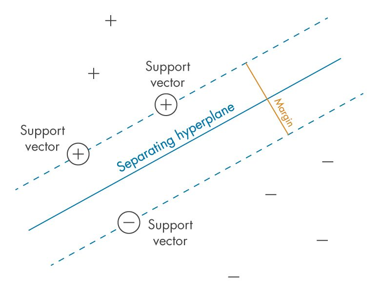
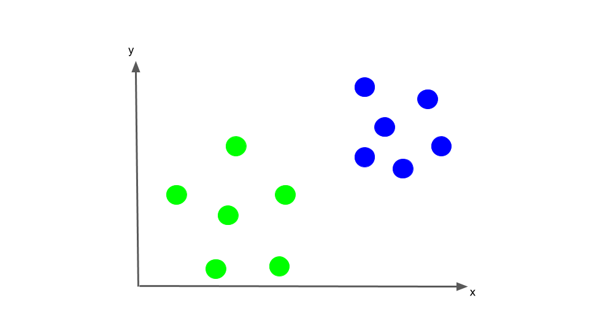
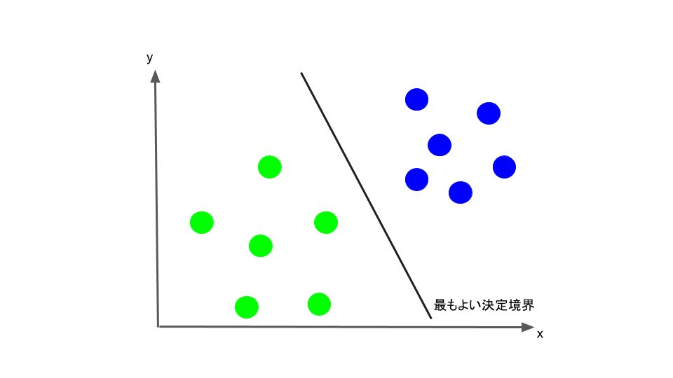
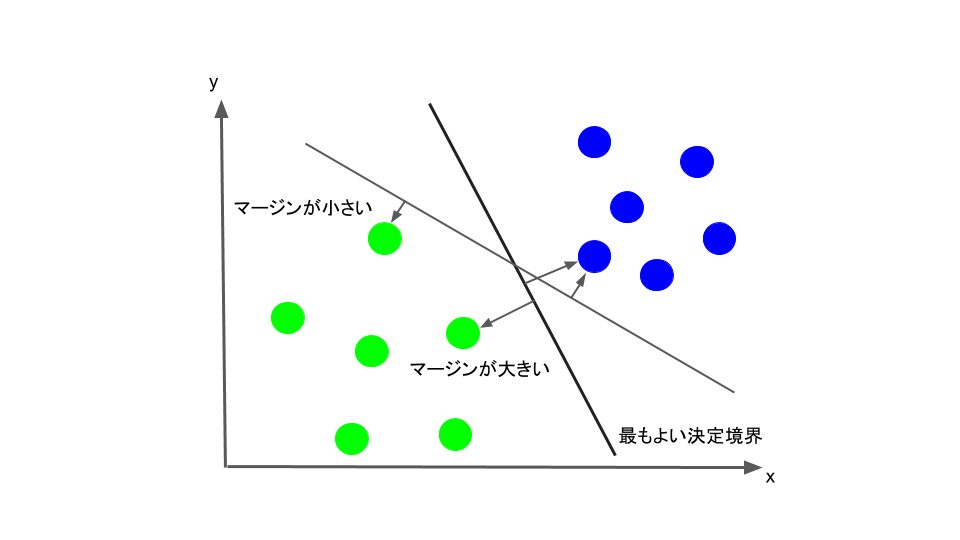
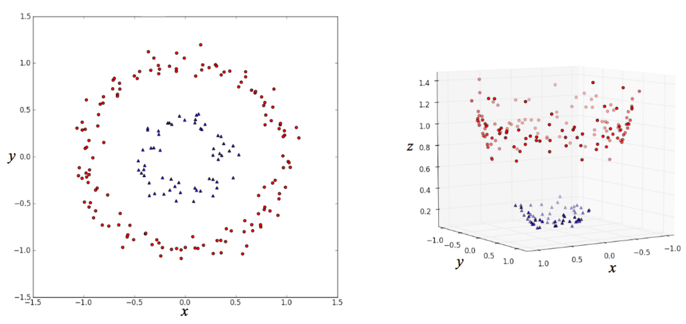
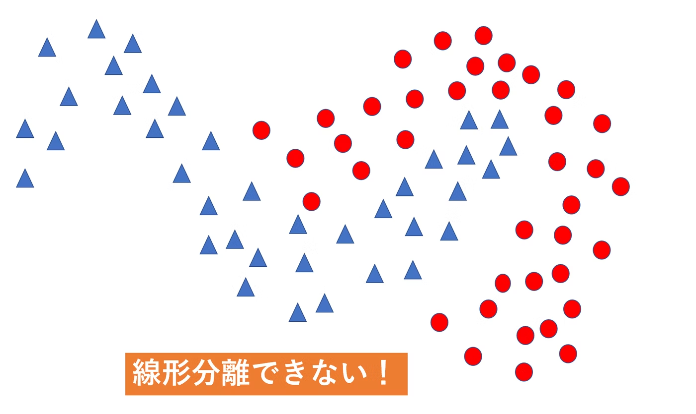

# 3. SVM

# もくじ
- [3. SVM](#3-svm)
- [もくじ](#もくじ)
- [1. サポートベクトルマシン（SVM）](#1-サポートベクトルマシンsvm)
  - [1.1. SVMとは？](#11-svmとは)
  - [2.2. メリットとデメリット](#22-メリットとデメリット)
- [2. SVMの仕組み](#2-svmの仕組み)
  - [2.1. 仕組み（一般化）](#21-仕組み一般化)
  - [2.2. 仕組み（2次元で考えたとき）](#22-仕組み2次元で考えたとき)
- [3. カーネル法](#3-カーネル法)
  - [3.1. 概要](#31-概要)
  - [2.2. SVMで利用される理由](#22-svmで利用される理由)
- [4. 実装](#4-実装)
- [99. 参考](#99-参考)

# 1. サポートベクトルマシン（SVM）

## 1.1. SVMとは？

サポートベクターマシン (SVM) は、信号処理医療アプリケーションや自然言語処理、音声および[画像認識](https://jp.mathworks.com/discovery/image-recognition.html)などの多くの分類と回帰の問題（主に分類問題で利用されます）に使用される[教師あり学習](https://jp.mathworks.com/discovery/supervised-learning.html)アルゴリズムです。

マージン最大化と呼ばれる考えに基づき、主に2値分類問題に用いられます。多クラス分類や回帰問題への応用も可能です。

線形分離可能（一つの直線で二つに分けられる※2次元のみ）なデータを前提としたマージンを`ハードマージン`、線形分離不可能なデータを前提として、誤判別を許容するマージンを`ソフトマージン`と呼びます。

なお、上述しているような線形分離可能（一つの直線で二つに分けられる）という考えは２次元平面で考えているためです。線形分離可能の概念を一般化して`n次元空間上の集合をn-1次元の超平面で分離できること`を線形分離可能と定義します。

> ❗**線形分離可能の補足**
二次元の平面上のデータを一次元の線で分類できるとき、それは線形分離可能であるといえます。また、三次元の空間上のデータを二次元の平面で分類できるときも、線形分離可能であるといえます。
> 

## 2.2. メリットとデメリット

- **SVMのメリット**
    - データの次元が大きくなっても識別精度が良い最適化すべきパラメータが少ない
- **SVMのデメリット**
    - 学習データが増えると計算量が膨大になる
    - 基本的に２クラス分類に特化している
    - スケーリングが必要
        - SVMでは距離を測定するので、大きい範囲をとる特徴量に引きずられないようにする

# 2. SVMの仕組み

## 2.1. 仕組み（一般化）

n次元のデータを分類するn-1次元の平面(厳密には平面ではない)を`分離超平面`と呼び、また分離超平面とその分離超平面に最も近いデータとの距離を`マージン`と呼び、このマージンを最大化することがこのアルゴリズムの目標になります。

図に示す`マージン（Margin）`を最大化するような`超平面（Separating hyperplane）`を作成することで精度を上昇させることができます。

> **❗Point**
図示するために今回は二次元でデータを表現しましたが、n次元空間上のデータをn-1次元の超平面で分割していると考えてください。
> 

二次元の数ベクトル空間上においては、上の図のように二つのデータを分割する直線を$ax+by+c=0$と表すことができ、パラメータ$a,b,c$を調整することで全ての直線を表すことができます。

定式化については以下をご参考ください。

- [https://qiita.com/renesisu727/items/964005bd29aa680ad82d#n次元数ベクトル空間の超平面の式](https://qiita.com/renesisu727/items/964005bd29aa680ad82d#n%E6%AC%A1%E5%85%83%E6%95%B0%E3%83%99%E3%82%AF%E3%83%88%E3%83%AB%E7%A9%BA%E9%96%93%E3%81%AE%E8%B6%85%E5%B9%B3%E9%9D%A2%E3%81%AE%E5%BC%8F)

[[Python]サポートベクトルマシン(SVM)の理論と実装を徹底解説してみた - Qiita](https://qiita.com/renesisu727/items/964005bd29aa680ad82d#n%E6%AC%A1%E5%85%83%E6%95%B0%E3%83%99%E3%82%AF%E3%83%88%E3%83%AB%E7%A9%BA%E9%96%93%E3%81%AE%E8%B6%85%E5%B9%B3%E9%9D%A2%E3%81%AE%E5%BC%8F)

## 2.2. 仕組み（2次元で考えたとき）

単純な例（＝２次元）を用いて説明します。$x, y$ 2つの特徴量をもとに、データが青と黄緑のどちらのクラスかを分類する分類器をつくりたいとします。まずはx-y平面上に、すでにクラス分けされたトレーニングデータを考えます。

SVMでは、このトレーニングデータを、各データのクラスも考慮して1番適切に分離するような直線を見つけ出します。そしてこの直線を境に、一方のサイドに位置するデータを全て青、もう一方のサイドに位置するデータを全て黄緑と分類します。このことから、この直線のことを**決定境界**と呼ぶこともあります。

では、その**最も適切に分離する直線**は具体的にどのように決められるのか考えていきます。SVMでは、それぞれのクラスで、その直線に最も近いデータ点(Support Vector)を考え、そのデータ点と直線との距離(マージン)が、できるだけ大きくなるように直線を決定します。

# 3. カーネル法

## 3.1. 概要

カーネル法とは、低次元のデータを高次元に写像して分離する方法です。

- カーネル法のイメージ

左側の (x, y) 平面上の点を分類する場合、このままだと線形分類器（直線で分類するアルゴリズム）ではうまく分類できないのが、右図のように z 軸を追加してデータを変形すると、平面できれいに分割できるようになって、線形分類器による分類がうまくいくというものです。このように、高次元空間にデータを埋め込むことでうまいこと分類するのがカーネル法の仕組みです。

- 詳細はこちら
    - [https://enakai00.hatenablog.com/entry/2017/10/13/145337](https://enakai00.hatenablog.com/entry/2017/10/13/145337)
    
    [機械学習におけるカーネル法について - めもめも](https://enakai00.hatenablog.com/entry/2017/10/13/145337)
    

このカーネル法はSVMで用いられたりします。

## 2.2. SVMで利用される理由

以下の二種類のデータを分類する場合を考えます。

このような二次元のデータの場合、一次元の直線で二つの種類のデータを分離することができません。

そのため、このように線形分離不可能な問題に対応するために、このデータを多次元のデータに拡張します。

具体的には、二次元のデータ$X=(x1,x2)$を五次元に拡張する場合には以下のような関数を通して写像します。

$$
\psi(X)=(x^{2}_{1},x^{2}_{2}, x_{1}x_{2}, x_1, x_2)
$$

このように、データの次元をより高次元に拡張したものを**高次元特徴空間**と呼び、それに対して最初の入力データの空間を**入力空間**と呼びます。

上記を一般化すると以下のようになります。

$$
\psi(X)=(\varphi_{1}(X),\varphi_{2}(X),\varphi_{3}(X),...,\varphi_{r}(X))
$$

$\varphi_{1}(X)$などの関数は、元の関数のデータを組み合わせて変化を加えるという関数です。

このような関数を用いて高次元特徴空間にデータを拡張していくと、ある段階で分離超平面により分離可能なデータになります。究極的には一つ一つのデータを全て別の次元、データがn個あればn次元まで拡張すれば、必ずn-1次元の分離超平面で分離することができます。

つまり、**線形分離可能なデータに変化します。**

後はこの分離超平面を逆写像して元のデータの分離超平面に変換することで、入力空間においてデータを分離する曲線(厳密には入力空間よりも一つ次元が小さな次元に曲線を拡張したもの)を得ることができます。

数学的な解説については以下をご参考ください。

- [https://qiita.com/renesisu727/items/964005bd29aa680ad82d#カーネル法を用いる](https://qiita.com/renesisu727/items/964005bd29aa680ad82d#%E3%82%AB%E3%83%BC%E3%83%8D%E3%83%AB%E6%B3%95%E3%82%92%E7%94%A8%E3%81%84%E3%82%8B)

[[Python]サポートベクトルマシン(SVM)の理論と実装を徹底解説してみた - Qiita](https://qiita.com/renesisu727/items/964005bd29aa680ad82d#%E3%82%AB%E3%83%BC%E3%83%8D%E3%83%AB%E6%B3%95%E3%82%92%E7%94%A8%E3%81%84%E3%82%8B)

# 4. 実装

[https://qiita.com/renesisu727/items/964005bd29aa680ad82d#サポートベクトルマシンの実装](https://qiita.com/renesisu727/items/964005bd29aa680ad82d#%E3%82%B5%E3%83%9D%E3%83%BC%E3%83%88%E3%83%99%E3%82%AF%E3%83%88%E3%83%AB%E3%83%9E%E3%82%B7%E3%83%B3%E3%81%AE%E5%AE%9F%E8%A3%85)

# 99. 参考

- [[Python]サポートベクトルマシン(SVM)の理論と実装を徹底解説してみた - Qiita](https://qiita.com/renesisu727/items/964005bd29aa680ad82d)

- [https://jp.mathworks.com/discovery/support-vector-machine.html#:~:text=サポートベクターマシン (SVM) は,平面を見つけることです。](https://jp.mathworks.com/discovery/support-vector-machine.html#:~:text=%E3%82%B5%E3%83%9D%E3%83%BC%E3%83%88%E3%83%99%E3%82%AF%E3%82%BF%E3%83%BC%E3%83%9E%E3%82%B7%E3%83%B3(SVM)%E3%81%AF,%E5%B9%B3%E9%9D%A2%E3%82%92%E8%A6%8B%E3%81%A4%E3%81%91%E3%82%8B%E3%81%93%E3%81%A8%E3%81%A7%E3%81%99%E3%80%82)

- [サポートベクターマシン (SVM)](https://jp.mathworks.com/discovery/support-vector-machine.html#:~:text=%E3%82%B5%E3%83%9D%E3%83%BC%E3%83%88%E3%83%99%E3%82%AF%E3%82%BF%E3%83%BC%E3%83%9E%E3%82%B7%E3%83%B3(SVM)%E3%81%AF,%E5%B9%B3%E9%9D%A2%E3%82%92%E8%A6%8B%E3%81%A4%E3%81%91%E3%82%8B%E3%81%93%E3%81%A8%E3%81%A7%E3%81%99%E3%80%82)

- [機械学習入門者向け Support Vector Machine (SVM) に触れてみる](https://avinton.com/academy/svm/)

- [https://aiacademy.jp/media/?p=248](https://aiacademy.jp/media/?p=248)
