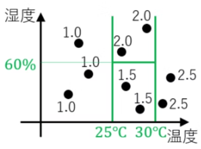

# 4. 決定木

# もくじ
- [4. 決定木](#4-決定木)
- [もくじ](#もくじ)
- [1. 決定木とは](#1-決定木とは)
- [2. 分類木と回帰木](#2-分類木と回帰木)
  - [2.1. 分類木](#21-分類木)
  - [2.2. 回帰木](#22-回帰木)
- [3. 決定木の特徴](#3-決定木の特徴)
  - [3.1. 長所](#31-長所)
  - [3.2. 短所](#32-短所)
- [4. 実装](#4-実装)
- [99. 参考](#99-参考)

# 1. 決定木とは

決定木とは木構造を用いて分類や回帰を行う機械学習の手法の一つです。

**回帰でも分類にも使えるアルゴリズム**で、以下のように木を逆さにした図がアウトプットとして出てきます。

分岐には条件が記され，その条件にそって最終的に予測値の決定を行います。

# 2. 分類木と回帰木

## 2.1. 分類木

日々の温度と湿度のデータ，その日Aさんが暑いと感じたか暑くないと感じたかかのデータが与えられた状況を考えます。

赤い点が暑いと感じた日、青い点が暑くないと感じた日です。

例えば温度が27度で湿度が40%の日は暑くないと感じています。このデータから「温度と湿度がどのようなときにどう感じるのか？」といったことを木で表現できます。

この木のことを**分類木**といいます。

この木を先程のグラフに描画すると以下のようになります。

以上が、Aさんがその日の温度と湿度によって暑いと感じるか否かを分類するモデルです。

## 2.2. 回帰木

日々の温度と湿度のデータ、その日Aさんが飲んだ水の量のデータが与えらえれた状況を考えます。

例えば温度が27度で湿度が40%の日は水を1.5L飲んでいます。

分類木のときと同様にこのデータから「温度と湿度がどのようなときに水を何L飲むか？」といったことを木で表現できます。

この木のことを**回帰木**といいます。

この図を同様にグラフに描画すると以下のようになります。

以上が、Aさんがその日の温度と湿度によって水を何L飲むのかを推定するモデルです。

# 3. 決定木の特徴

## 3.1. 長所

- 可読性が高い
    - 木が生成されるイメージからして出力結果の分析できる
- 説明変数・目的変数共に名義尺度から間隔尺度まで様々扱える
    - 質的データから量的データまで様々扱えます
- 外れ値に対して頑健

## 3.2. 短所

- 分類性能の高い手法ではない
    - SVMなどと比べると劣るようです。
- 過学習を起こしやすい
    - パラメータの調整や枝の刈り込みを上手に行う必要があります．
- 線形性のあるデータには適していない
    - このような場合はおとなしく回帰モデルを使います。
- XORなど多変数を考慮した分類はできない

# 4. 実装

# 99. 参考

- [https://datawokagaku.com/decision_tree/](https://datawokagaku.com/decision_tree/)

- [https://qiita.com/3000manJPY/items/ef7495960f472ec14377#:~:text=決定木とは木,する問題を解きます．](https://qiita.com/3000manJPY/items/ef7495960f472ec14377#:~:text=%E6%B1%BA%E5%AE%9A%E6%9C%A8%E3%81%A8%E3%81%AF%E6%9C%A8,%E3%81%99%E3%82%8B%E5%95%8F%E9%A1%8C%E3%82%92%E8%A7%A3%E3%81%8D%E3%81%BE%E3%81%99%EF%BC%8E)

- [[入門]初心者の初心者による初心者のための決定木分析 - Qiita](https://qiita.com/3000manJPY/items/ef7495960f472ec14377#:~:text=%E6%B1%BA%E5%AE%9A%E6%9C%A8%E3%81%A8%E3%81%AF%E6%9C%A8,%E3%81%99%E3%82%8B%E5%95%8F%E9%A1%8C%E3%82%92%E8%A7%A3%E3%81%8D%E3%81%BE%E3%81%99%EF%BC%8E)