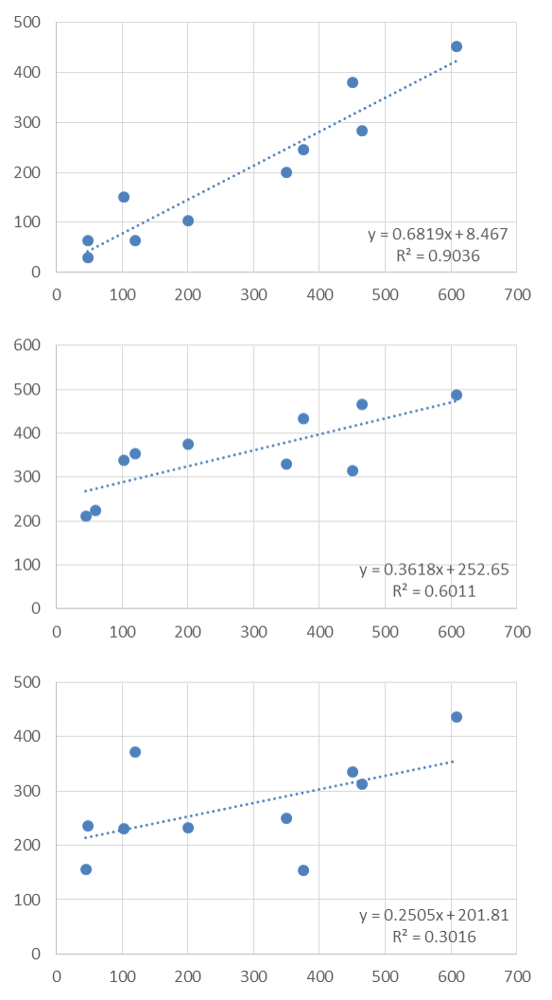
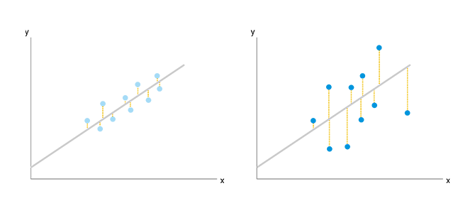
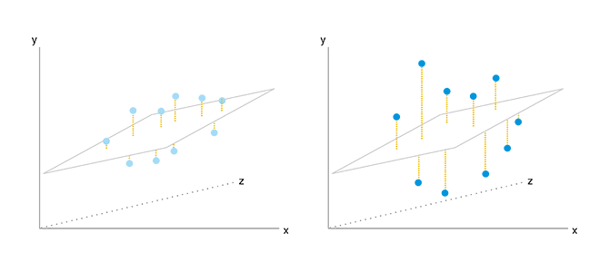
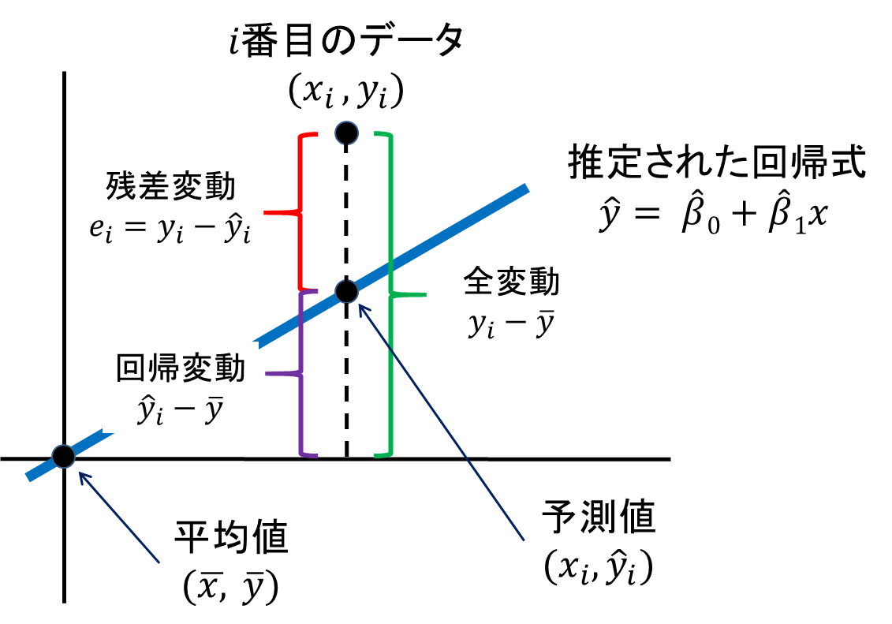

# 2. 決定係数とその落とし穴

# もくじ
- [2. 決定係数とその落とし穴](#2-決定係数とその落とし穴)
- [もくじ](#もくじ)
- [1. 概念](#1-概念)
  - [1.1. 決定係数とは](#11-決定係数とは)
  - [1.2. 単回帰分析での決定係数](#12-単回帰分析での決定係数)
  - [1.3. 重回帰分析での決定係数](#13-重回帰分析での決定係数)
- [2. 決定係数の求め方](#2-決定係数の求め方)
- [3. 自由度調整済み決定係数](#3-自由度調整済み決定係数)
- [4. 決定係数の落とし穴](#4-決定係数の落とし穴)
- [99. 参考](#99-参考)

# 1. 概念

## 1.1. 決定係数とは

決定係数は、**データに対する推定された回帰式の当てはまりの良さ**を表します。

決定係数は一般に$R^2$で示され、0から1までの値をとります。1に近いほど回帰式が実際のデータに当てはまっていることを表しており、説明変数が目的変数をよく説明していると言えます。

以下、決定係数の例です。いくつかの単回帰式とその決定係数を見てみます。決定係数は上から順に「0.9」「0.6」「0.3」です。

## 1.2. 単回帰分析での決定係数

単回帰分析では$y=ax+b$の形で目的変数（$y$）の値を予測しますが、あくまで「予測値」のため実際の目的変数の値とは完全に一致しません。 そのため、何を説明変数（$x$）とするかによって、「予測がほぼ当たっている」場合と「あまり当たっていない」場合があります。

- 左：ほぼ当たっている。右：ほぼ当たってない。

こういった2つのケースを比較するために**「予測がどのくらい当たっているか」を客観的に示す指標**が**決定係数**です。 決定係数は0から1の範囲内の値を取り、1に近ければ近いほど予測が当たっている状態で、0に近ければ近いほど予測があまり当たっていない状態を表します。この数字は、厳密には「回帰分析をした結果が目的変数のばらつき（分散）をどれくらい説明しているか」によって定義されています。

## 1.3. 重回帰分析での決定係数

続いて、重回帰分析です。説明変数が2つの場合を図示します。

2次元だった単回帰分析とは異なり、3次元の空間に点が宙に浮いている状態となりますが、基本的な考え方は変わりません。 この場合でも「（この図の場合は）xとzから求められるyの予測値が、実際のyの値とどれだけ一致しているか」を表すのが決定係数です。 先ほどの2次元の回帰分析の場合と同じように、誤差が小さくなる（予測が当たっている）ほど決定係数は大きくなります。

# 2. 決定係数の求め方

決定係数を求めるにためには、実際のデータと推定された回帰式から**”全変動”**、**”回帰変動”**、**”残差変動”**の3つを求める必要があります。ここでは実際のデータを$(x_i, y_i)$、回帰式から推定されたデータを$(x_i, \hat{y_i})$、データ全体から求められる平均値を$(\bar{x}, \bar{y})$とします。

- **全変動**
    - 実際のデータとデータ全体の平均値との差を表します（上の図の緑の部分）
- **回帰変動**
    - 推定された回帰式から得られた予測値とデータ全体の平均値の差を表します（上の図の紫の部分）
- **残差変動**
    - 実際のデータと推定された回帰式から得られた予測値との差を表します（上の図の赤の部分）

決定係数は、説明変数が目的変数をどれくらい説明しているか、つまり**「回帰変動が全変動に対してどれだけ多いか＝残差変動が全変動に対してどれだけ少ないか」**を表すものです。

したがって決定係数は、次に示すように回帰変動を全変動で割ることで求められます。

$$
R^2 = \frac{\sum^N_{i=1}{(\hat{y_i}-\bar{y})^2}}{\sum^N_{i=1}{(y_i-\bar{y})^2}}=1-\frac{\sum^N_{i=1}{(y_i-\hat{y_i})^2}}{\sum^N_{i=1}{(y_i-\bar{y})^2}}
$$

- 参考：[https://bellcurve.jp/statistics/course/9706.html](https://bellcurve.jp/statistics/course/9706.html)

# 3. 自由度調整済み決定係数

決定係数は説明変数の数が増えるほど1に近づくという性質を持っています。そのため、説明変数の数が多い場合には、この点を補正した「自由度調整済み決定係数（自由度修正済み決定係数）」を使います。自由度調整済み決定係数は次の式から求められます。N はサンプルサイズを、kは説明変数の数を表します。

$$
R^2_f = 1- \frac{\frac{\sum^N_{i=1}{(y_i-\hat{y_i})^2}}{n-k-1}}{\frac{\sum^N_{i=1}{(y_i-\bar{y})^2}}{n-1}}
$$

例えば、「日本の国民全体からランダムに1000人選んでアンケートを行う」ことを考えてみます。

このアンケートの結果にもとづいて回帰分析を行い、そこで得られた回帰係数をもとに決定係数を出したとします。しかしながら、ここで求められた回帰係数はあくまで「たまたま選ばれた1000人」に対して最も予測が当たるように求められたものです。（現実的には不可能ですが）日本の国民全員を対象に「たまたま選ばれた1000人」に最適化された結果を適用すると、一般に予測が悪くなるはずです。 決定係数は**「たまたま選ばれた1000人」への予測の当てはまりだけを見ている指標**です。そのためこれを「日本の国民全体を対象」とした決定係数と考えようとすると、予測の当てはまりの良さを課題に見積もっていることになり不適切です。

こうした問題に対処し、**あくまで「日本の国民全体を対象」とした予測値の当てはまりを評価できるよう決定係数の値を修正したもの**が**「自由度調整済み決定係数」**です。値の修正にはサンプル数と説明変数の個数から求められる「自由度」という数字を使っているため、この名前がつけられています。

決定係数や自由度調整済み決定係数を用いると、異なる回帰モデル間での良し悪しを判断することができます。特に、**説明変数の数が異なる回帰モデルどうしを比較する場合には、**自由度調整済み決定係数を使います。**決定係数や自由度調整済み決定係数の値が高いほど、元のデータに対する当てはまりが良いモデル**であると言えます。

先の例でみると、我々が明らかにしたいのは「たまたま選ばれた1000人」の性質よりも、「日本の国民全体」（あるいはマーケティングの文脈なら「ターゲットとする顧客セグメント全体」など）の性質であることがほとんどであるとみてとれます。その文脈に照らし合わせると、自由度調整済み決定係数の方が決定係数より好ましい性質を持っていると言えます。

そのため決定係数と自由度調整済み決定係数の両方が出力されている場合は、自由度調整済み決定係数の方を参照するのが良いです。

# 4. 決定係数の落とし穴

ここまで決定係数について説明してきましたが、「（自由度調整済み）決定係数さえ高ければなんでもよい」という考え方はもちろん不適切です。 分析を行うからにはその目的があり、検証したい仮説があるはずです。こうした目的や仮説とは一切関係ない変数を、決定係数が上がるからという理由だけで無秩序に分析に加えてしまうと、そのモデルは解釈が難しくなり当初の目的を果たせなります。

また、決定係数はあくまで**「予測の当てはまりの良さ」**を表す指標です。

分析の目的が「ある変数の値を予測したい」の場合には適切な指標ですが、「雨が降った日数がコンビニの月間の売上に影響があるかどうか知りたい」のように、**ある変数の影響の有無が主眼であり予測は重視しない場合**には、決定係数に注目することはあまり意味がないと言えます。この場合には「雨が降った日数」という説明変数の回帰係数や、その係数に対する検定の結果（有意かどうか）にまず注目すべきです。

決定係数は分かりやすく便利な指標であるため、分析の際にはどうしてもここだけに目が行きがちですが、本当に価値のある分析をするためには、数字の意味をしっかり理解した上で、分析の目的と照らし合わせて正しく使うことが求められます。

# 99. 参考

[27-5. 決定係数と重相関係数](https://bellcurve.jp/statistics/course/9706.html)

[https://magellan.xica.net/column/about-coefficient-of-determination/](https://magellan.xica.net/column/about-coefficient-of-determination/)