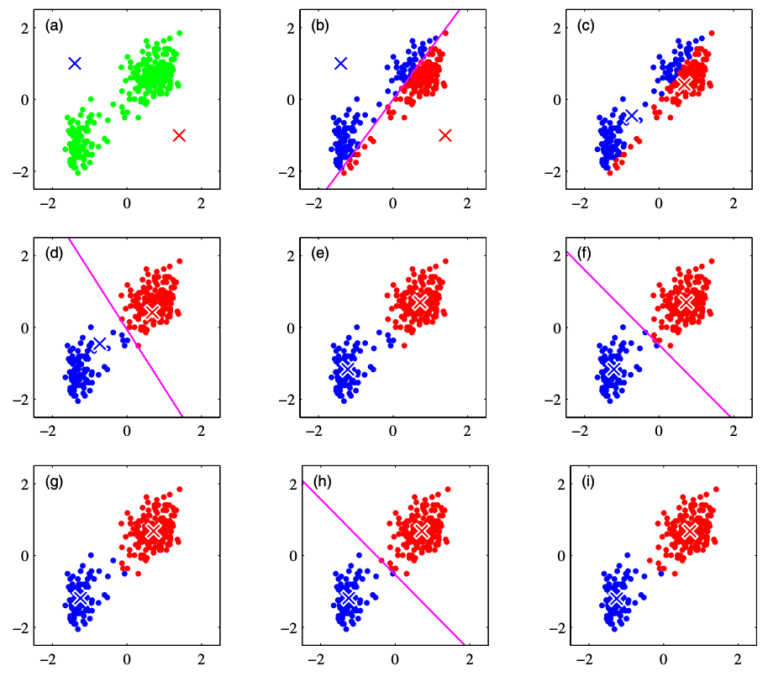

# 1. k-means法

# もくじ
- [1. k-means法](#1-k-means法)
- [もくじ](#もくじ)
- [1. k-means法とは？](#1-k-means法とは)
- [2. k-means法のアルゴリズム](#2-k-means法のアルゴリズム)
- [3. 実装](#3-実装)
  - [3.1. sklearn利用版](#31-sklearn利用版)
  - [3.2. ライブラリ利用しない版](#32-ライブラリ利用しない版)
- [99. 参考](#99-参考)

# 1. k-means法とは？

k-means法とは、データを適当なクラスタに分けた後、クラスタの平均を用いてうまい具合にデータがわかれるように調整させていくアルゴリズムです。

任意の指定のk個のクラスタを作成するアルゴリズムであることから、k-means法（k点平均法）と呼ばれています。

# 2. k-means法のアルゴリズム

k-mean法は具体的には下記のような工程を辿ります。

1. それぞれのクラスターに対して重心 $\mu_1, \mu_2$を考えます。
    
    今、あるデータがどのクラスターに属するかは正確に知り得ないので、クラスターの重心の初期値は適当に与えてしまいます。下図では赤、青のバツ印がクラスター重心を示しています。
    
2. それぞれのデータが、どちらのクラスターの重心に近いかによって、クラスターに割り当てます。
3. 割り当てられたクラスター内で、重心の計算をおこない、重心を更新します。
4. （d以降）手順(b), (c)を繰り返しおこない、クラスターを更新し続けます。
    
    繰り返し処理はクラスターの更新が無くなるか、解析者が定義したイテレーションの最大回数に達するまでおこなわれます。
    



上記を定式化すると以下のようになります。

- 定式化については以下参考
    - [https://laid-back-scientist.com/k-means](https://laid-back-scientist.com/k-means)
    

# 3. 実装

## 3.1. sklearn利用版

- 分類用のデータセットを作成

```python
import numpy as np
import pandas as pd
import matplotlib.pyplot as plt
import seaborn as sns
from sklearn.datasets import make_blobs

X, y = make_blobs(
    n_samples=150,
    centers=3,
    cluster_std=1.0,
    shuffle=True,
    random_state=42)

x1 = X[:, 0]
x2 = X[:, 1]

plt.scatter(x1, x2)
plt.xlabel('x1')
plt.ylabel('x2')
plt.show()
```

scikit-learn には、k-means法によるクラスター分析を行うクラスとして、`sklearn.cluster.KMeans`
 クラスが用意されています。実装は極めて簡単で、下記の通りです。**注意点としては、分けるクラスター数はあらかじめ決めておかないといけません。**

- k-means法でのクラスタリング

```python
from sklearn.cluster import KMeans

model = KMeans(n_clusters=3, random_state=0, init='random')  # initを省略すると、k-means++法が適応される(randomではk-means法が適応)
model.fit(X)
clusters = model.predict(X)  # データが属するクラスターのラベルを取得
print(clusters)

# model.cluster_centers_ でクラスター重心の座標を取得できる
df_cluster_centers = pd.DataFrame(model.cluster_centers_)
df_cluster_centers.columns = ['x1', 'x2']
print(df_cluster_centers)
```

- 結果の図示

```python
df = pd.DataFrame(X, columns=['x1', 'x2'])
df['class'] = clusters

# クラスタリングデータをプロット
sns.scatterplot(data=df, x='x1', y='x2', hue='class')
# クラスター重心をプロット
sns.scatterplot(data=df_cluster_centers, x='x1', y='x2', s=200, marker='*', color='gold', linewidth=0.5)
plt.show()
```

## 3.2. ライブラリ利用しない版

- k-means法の定義

```python
import numpy as np
import itertools 

class KMeans:
    def __init__(self, n_clusters, max_iter = 1000, random_seed = 0):
        self.n_clusters = n_clusters
        self.max_iter = max_iter
        self.random_state = np.random.RandomState(random_seed)

    def fit(self, X):
        #指定したクラスター数分のラベルを繰り返し作成するジェネレータを生成（0,1,2,0,1,2,0,1,2...みたいな感じ）
        cycle = itertools.cycle(range(self.n_clusters))
        #各データポイントに対してクラスタのラベルをランダムに割り振る
        self.labels_ = np.fromiter(itertools.islice(cycle, X.shape[0]), dtype = np.int)
        self.random_state.shuffle(self.labels_)
        labels_prev = np.zeros(X.shape[0])
        count = 0
        self.cluster_centers_ = np.zeros((self.n_clusters, X.shape[1]))

        #各データポイントが属しているクラスターが変化しなくなった、又は一定回数の繰り返しを越した場合は終了
        while (not (self.labels_ == labels_prev).all() and count < self.max_iter):
            #その時点での各クラスターの重心を計算する
            for i in range(self.n_clusters):
                XX = X[self.labels_ == i, :]
                self.cluster_centers_[i, :] = XX.mean(axis = 0)
            #各データポイントと各クラスターの重心間の距離を総当たりで計算する
            dist = ((X[:, :, np.newaxis] - self.cluster_centers_.T[np.newaxis, :, :]) ** 2).sum(axis = 1)
            #1つ前のクラスターラベルを覚えておく。1つ前のラベルとラベルが変化しなければプログラムは終了する。
            labels_prev = self.labels_
            #再計算した結果、最も距離の近いクラスターのラベルを割り振る
            self.labels_ = dist.argmin(axis = 1)
            count += 1

    def predict(self, X):
        dist = ((X[:, :, np.newaxis] - self.cluster_centers_.T[np.newaxis, :, :]) ** 2).sum(axis = 1)
        labels = dist.argmin(axis = 1)
        return labels
```

- クラスタリングできているか確認

```python
import matplotlib.pyplot as plt

#適当なデータセットを作成する
np.random.seed(0)
points1 = np.random.randn(80, 2)
points2 = np.random.randn(80, 2) + np.array([4,0])
points3 = np.random.randn(80, 2) + np.array([5,8])

points = np.r_[points1, points2, points3]
np.random.shuffle(points)

#3つのクラスタに分けるモデルを作成
model =  KMeans(3)
model.fit(points)

print(model.labels_)
```

- matplotlibでの図示

```python
markers = ["+", "*", "o"]
color = ['r', 'b', 'g']
for i in range(3):
    p = points[model.labels_ == i, :]
    plt.scatter(p[:, 0], p[:, 1], marker = markers[i], color = color[i])

plt.show()
```

# 99. 参考

- [k-means法を理解する - Qiita](https://qiita.com/g-k/items/0d5d22a12a4507ecbf11)

- [https://laid-back-scientist.com/k-means](https://laid-back-scientist.com/k-means)

- [https://www.microsoft.com/en-us/research/uploads/prod/2006/01/Bishop-Pattern-Recognition-and-Machine-Learning-2006.pdf](https://www.microsoft.com/en-us/research/uploads/prod/2006/01/Bishop-Pattern-Recognition-and-Machine-Learning-2006.pdf)

- [https://aiacademy.jp/media/?p=254](https://aiacademy.jp/media/?p=254)
