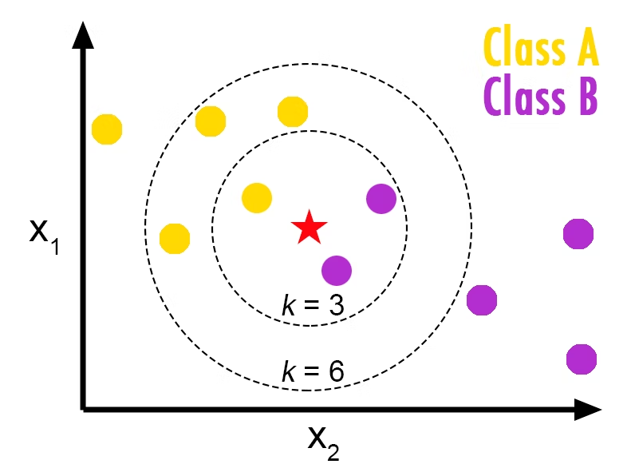
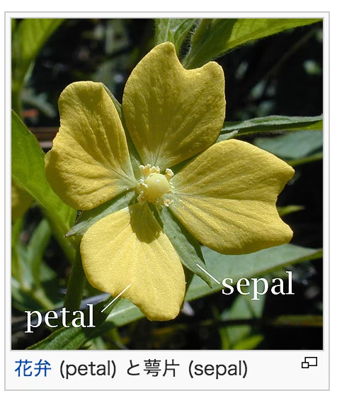
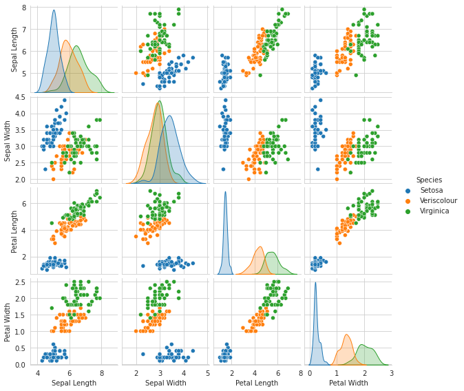
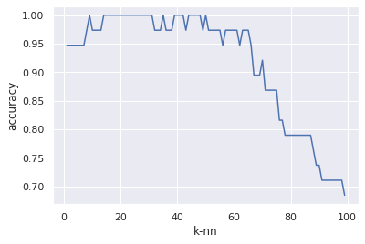
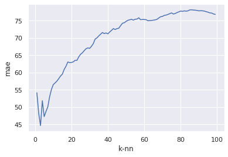

# 2. k-近傍法

# もくじ
- [2. k-近傍法](#2-k-近傍法)
- [もくじ](#もくじ)
- [1. k近傍法（KNN）](#1-k近傍法knn)
- [2. 実装](#2-実装)
  - [2.1. 分類の実装](#21-分類の実装)
    - [2.1.1. データセットの用意](#211-データセットの用意)
    - [2.2.2. KNNの実行](#222-knnの実行)
  - [2.2. 回帰の実装](#22-回帰の実装)
    - [2.2.1. データ取得](#221-データ取得)
    - [2.2.2. 学習モデルの作成](#222-学習モデルの作成)
- [99. 参考](#99-参考)

# 1. k近傍法（KNN）

学習データをベクトル空間上にプロットしておき、未知のデータが得られたら、そこから距離が近い順に任意のK個を取得し、多数決でデータが属するクラスを推定します。

例えば下図の場合、クラス判別の流れは以下となります。

1. 既知のデータ(学習データ)を黄色と紫の丸としてプロットしておく。
2. Kの数を決めておく（K=3など）。
3. 未知のデータとして赤い星が得られたら、近い点から３つ取得する。
4. その３つのクラスの多数決で、属するクラスを推定。

今回は、未知の赤い星はClass Bに属すると推定する。



なお、上記の通りkの数によって結果が変わります。

# 2. 実装

## 2.1. 分類の実装

### 2.1.1. データセットの用意

irisデータは、アヤメという花の品種のデータです。

アヤメの品種であるSetosa、Virginica、Virginicaの3品種に関するデータが50個ずつ、全部で150個のデータです。

sklearnでirisのデータセットを用意してどのように分類できるか見ていきます。

- データの取得

```python
from sklearn.datasets import load_iris
import pandas as pd

iris = load_iris()
iris_df = pd.DataFrame(iris.data, columns=iris.feature_names)

print(iris_df.head())
```

- 結果の出力

```
sepal length (cm)  sepal width (cm)  petal length (cm)  petal width (cm)
0                5.1               3.5                1.4               0.2
1                4.9               3.0                1.4               0.2
2                4.7               3.2                1.3               0.2
3                4.6               3.1                1.5               0.2
4                5.0               3.6                1.4               0.2
```



`iris.feature_names`に各々のカラム名が格納されているので、それをpandasのDataframeの引数に渡すことで上のようなデータを出力できます。

データセットの準備をしていきます。

- データセットの準備

```python
from sklearn.datasets import load_iris
import pandas as pd
import seaborn as sns
from sklearn.model_selection import train_test_split
from sklearn import metrics
import matplotlib.pyplot as plt
from sklearn.neighbors import KNeighborsClassifier

iris = load_iris()
iris_target_data = pd.DataFrame(iris.target, columns=['Species'])
iris_df = pd.DataFrame(iris.data, columns=iris.feature_names)

X_train, X_test, Y_train, Y_test = train_test_split(iris_df, iris_target_data)
print(iris_df)
print(iris_target_data)
```

- 出力

```python
sepal length (cm)  sepal width (cm)  petal length (cm)  petal width (cm)
0                  5.1               3.5                1.4               0.2
1                  4.9               3.0                1.4               0.2
2                  4.7               3.2                1.3               0.2
3                  4.6               3.1                1.5               0.2
4                  5.0               3.6                1.4               0.2
..                 ...               ...                ...               ...
145                6.7               3.0                5.2               2.3
146                6.3               2.5                5.0               1.9
147                6.5               3.0                5.2               2.0
148                6.2               3.4                5.4               2.3
149                5.9               3.0                5.1               1.8

[150 rows x 4 columns]
     Species
0          0
1          0
2          0
3          0
4          0
..       ...
145        2
146        2
147        2
148        2
149        2

[150 rows x 1 columns]
```

`train_test_split`を用いて、訓練用とテスト用にデータを分けました。

なお、以下のように

seaboanでpairplotして、クラス別に概要を見てみると以下のようになります。

- グラフ別に確認

```python
import matplotlib.pyplot as plt
import seaborn as sns
sns.set_style('whitegrid')
%matplotlib inline

sns.pairplot(iris, hue = 'Species', size =2) # hue:指定したデータで分割
```

- 出力結果



Setosa（青の点）は分類しやすそうなことがわかります。Veriscolour（緑の点）とVirginica（赤の点）はPetal Lengthあたりで分類できる可能性がありそうです。

### 2.2.2. KNNの実行

k-近傍法のモデルを作成します。

```python
knn = KNeighborsClassifier(n_neighbors=6)
knn.fit(X_train, Y_train)
```

`n_neighbors`により、近傍として取り扱うデータの数を指定しています。今回は、近傍の6個のデータに対して多数決をとることにします。

```python
Y_pred = knn.predict(X_test)
print(metrics.accuracy_score(Y_test, Y_pred))
```

次のコードで精度を評価します。

```python
0.9473684210526315
```

次のコードで、近傍とするデータの数を変更していき、精度がどれくらいに変化するかを図示していきます。

```python
from sklearn.neighbors import KNeighborsClassifier
from sklearn.model_selection import train_test_split # trainとtest分割用

# train用とtest用のデータ用意。test_sizeでテスト用データの割合を指定。random_stateはseed値を適当にセット。
X_train, X_test, Y_train, Y_test = train_test_split(X, Y, test_size = 0.4, random_state=3) 

knn = KNeighborsClassifier(n_neighbors=6) # インスタンス生成。n_neighbors:Kの数
knn.fit(X_train, Y_train)                 # モデル作成実行
Y_pred = knn.predict(X_test)              # 予測実行

# 精度確認用のライブラリインポートと実行
from sklearn import metrics
metrics.accuracy_score(Y_test, Y_pred)    # 予測精度計測
```



上図をみると、kが60を超えたあたりで急激に精度が落ちています。これは、もともとアヤメのデータセットには一つの種類のデータが50個しかないためであり、一定以上の`n_neighbors`においては精度が落ちるのは当然といえます。

## 2.2. 回帰の実装

### 2.2.1. データ取得

ボストンデータセットで見ていきます。

- データの確認

```python
import pandas as pd
import seaborn as sns
from pandas import DataFrame
from sklearn.model_selection import train_test_split
from sklearn import metrics
import matplotlib.pyplot as plt
from sklearn.neighbors import KNeighborsRegressor
from sklearn.datasets import load_boston
from sklearn.metrics import mean_squared_error
from sklearn.metrics import mean_absolute_error

boston = load_boston()
boston_df = DataFrame(boston.data)
boston_df.columns = boston.feature_names
print(boston_df)
X_train, X_test, Y_train, Y_test = train_test_split(boston_df, boston.target)
```

### 2.2.2. 学習モデルの作成

学習モデルの作成を行います。

```python
knr = KNeighborsRegressor()
knr.fit(X_train, Y_train)
Y_pred = knr.predict(X_test)

mae = mean_absolute_error(Y_test, Y_pred)
rmse = np.sqrt(mean_squared_error(Y_test, Y_pred))

print('平均絶対誤差: ', mae)
print('二乗平均平方根誤差:', rmse)
```

- 出力

```python
平均絶対誤差:  4.76755905511811
二乗平均平方根誤差: 6.873455044733217
```

このようにしてモデルを評価することができました。今回、`n_neighbors`に値を設定していないのでデフォルトの5となっています。

`平均絶対誤差`は誤差の絶対値を平均したものであり、`二乗平均平方根誤差`は誤差の二乗を平均して平方根をとったものとなっています。

次のコードで、`平均絶対誤差`を`n_neighbors`に対してプロットしていきます。

```python
mae_list = []
sns.set()
k_range = range(1, 100)
for k in k_range:
    knn = KNeighborsRegressor(n_neighbors=k)
    knn.fit(X_train, Y_train)
    Y_pred = knn.predict(X_test)
    mae_list.append(mean_squared_error(Y_test, Y_pred))

figure = plt.figure()
ax = figure.add_subplot(111)
ax.plot(k_range, mae_list)
ax.set_xlabel('k-nn')
ax.set_ylabel('mae')
plt.show()
```



# 99. 参考

- [https://qiita.com/renesisu727/items/e5191a97d3f16a14ebd0](https://qiita.com/renesisu727/items/e5191a97d3f16a14ebd0)

[[機械学習] k-近傍法をpythonのsklearnで実装してみる - Qiita](https://qiita.com/renesisu727/items/e5191a97d3f16a14ebd0)

- [https://qiita.com/yshi12/items/26771139672d40a0be32](https://qiita.com/yshi12/items/26771139672d40a0be32)

[K近傍法(多クラス分類) - Qiita](https://qiita.com/yshi12/items/26771139672d40a0be32)

- [https://www.haya-programming.com/entry/2018/12/04/052713](https://www.haya-programming.com/entry/2018/12/04/052713)

[ImportError: No module named 'sklearn.cross_validation'の対処 - 静かなる名辞](https://www.haya-programming.com/entry/2018/12/04/052713)

- [https://qiita.com/NoriakiOshita/items/698056cb74819624461f](https://qiita.com/NoriakiOshita/items/698056cb74819624461f)[

[k近傍法とk平均法の違いと詳細． - Qiita](https://qiita.com/NoriakiOshita/items/698056cb74819624461f)

- [https://qiita.com/renesisu727/items/e5191a97d3f16a14ebd0](https://qiita.com/renesisu727/items/e5191a97d3f16a14ebd0)

[[機械学習] k-近傍法をpythonのsklearnで実装してみる - Qiita](https://qiita.com/renesisu727/items/e5191a97d3f16a14ebd0)