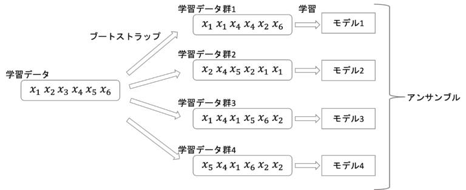
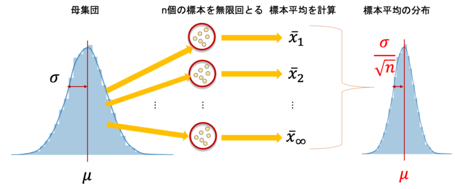
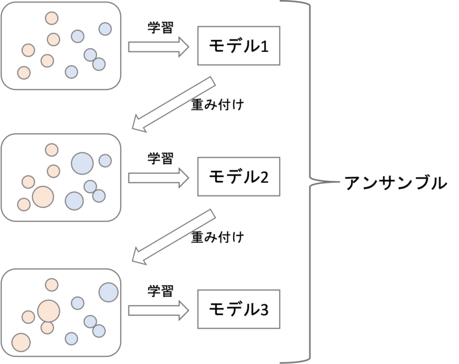
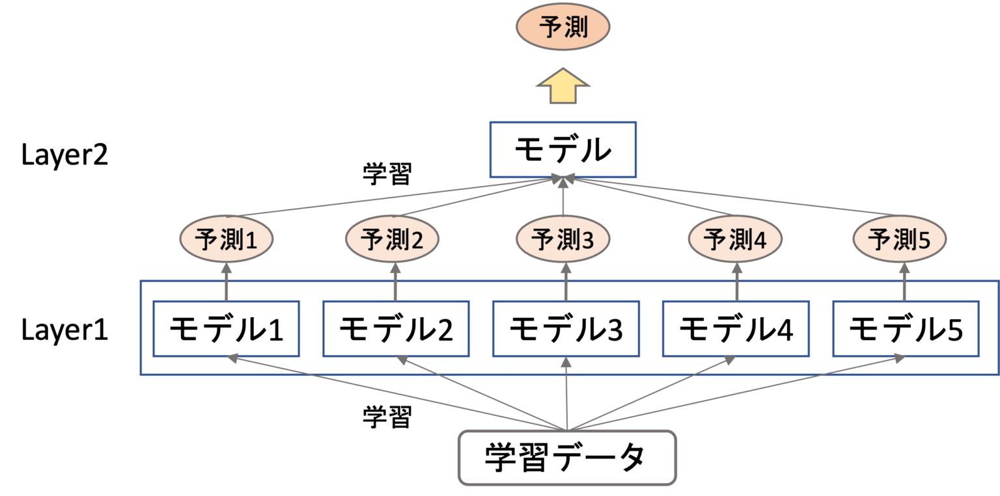

# 1. アンサンブル学習の仕組み

# もくじ
- [1. アンサンブル学習の仕組み](#1-アンサンブル学習の仕組み)
- [もくじ](#もくじ)
- [1. アンサンブル学習](#1-アンサンブル学習)
  - [1.1. アンサンブル学習とは](#11-アンサンブル学習とは)
- [2. アンサンブル学習の手法](#2-アンサンブル学習の手法)
  - [2.1. バギング](#21-バギング)
  - [2.2. ブースティング](#22-ブースティング)
  - [2.3. スタッキング](#23-スタッキング)
- [3. アンサンブル学習の注意点](#3-アンサンブル学習の注意点)
  - [3.1. 何でもかんでもアンサンブル学習すれば精度が上がるわけではない](#31-何でもかんでもアンサンブル学習すれば精度が上がるわけではない)
  - [3.2. 学習に時間がかかる](#32-学習に時間がかかる)
  - [3.3. バリアンスとバイアスのバランスに注意](#33-バリアンスとバイアスのバランスに注意)
- [99. 参考](#99-参考)

# 1. アンサンブル学習

## 1.1. アンサンブル学習とは

アンサンブル学習とは、個々に別々の学習器として学習させたものを、融合させる事によって、未学習のデータに対しての予測能力を向上させるための学習です。

より簡単に言えば、多数決を取りその結果を信用して利用するような方法です。

以下のような特徴があります。

- 多数決に基づく予測
- バギングを使って訓練データセットのランダムな組み合わせを繰り返し抽出することによる過学習の抑制
- ブースティングの適応により、誤答から学習する**「弱学習器」**による強力なモデルの構築

このアンサンブル学習により、分類気を個別に利用するよりも高い予測精度が得られるとされています。

なお、アンサンブル学習に使うモデルは**「弱学習器(weak learner)」**である必要があります。

アンサンブルを行う場合は**それぞれのモデルの相関が少ない方が良い**とされています。

> **❓弱学習器とは**
弱学習器というのはその名の通り，単独で使うと精度が低い学習器のことであり，**「ランダムよりも多少はいい」くらいのイメージ**です。
過学習していない単純なモデルのようなものです。
> 

アンサンブルにはいくつか種類があります。以降では有名な**バギング・ブースティング・スタッキング**という３つのやり方に触れていきます。

# 2. アンサンブル学習の手法

## 2.1. バギング

バギング(bagging)はbootstrap aggregatingの略です。

ブートストラップ(bootstrap)というのは，母集団からのサンプリング(標本抽出)手法の一種で、**重複を許してランダムにデータを取ってきて標本にするやり方**です。

例えば$x1,x2,x3,x4,x5$という5つのデータから３つの標本を複数回ブートストラップ法でサンプリングする場合、以下のようなサンプル群が出来上がります。

サンプル群1: $x1,x2,x2$
サンプル群2: $x4,x3,x3$
サンプル群3: $x2,x5,x1$
サンプル群4: $x1,x4,x1$

それぞれのサンプル群でデータが重複し、同一サンプル群の中でもデータが重複していることがわかります。

この手法によって**全ての学習データから新たに学習データ群を複数作ってそれぞれの学習データ群でモデルを学習させる**のがバギングです。

最終的な出力結果は，回帰なら平均値，分類なら多数決をとるのが一般的です。

また、バギングはvarianceを下げる効果があり，過学習を抑えることができます。

これは標本分布の分散は，母集団の分散$\sigma^2$の$\frac{1}{n}$であることからもわかります。

それぞれのモデル（弱学習器）が、母集団から抽出された一つのデータだと考えると、これら各モデルの分散を$\sigma^2$とし平均をとることで最終的なモデルの分散は$\frac{\sigma^2}{n}(n>0)$となり元の分散$\sigma^2$よりも小さくなります。

そのため、バギングはvarianceを下げるとされ、**varianceが高い弱学習器である決定木**によく使われます**。**

これを応用したものにランダムフォレストという決定木の応用アルゴリズムが存在します。

## 2.2. ブースティング

ブースティング(boosting)は、バギングのように並列に複数のモデルを学習するのではなく、**直列にモデルを学習していきます。**

以下のように学習したモデルがうまく予測できなかった学習データに重みをつけてさらにモデルを学習するというのを繰り返していくイメージです。

そうしてできた複数のモデルを組み合わせて最終的な予測をします。

まさに**モデルを”ブースト”していくイメージ**です。

バギングと異なりそれぞれの学習時にブートストラップはせず、基本的には全ての学習データを使いますが、重みが付いているため学習データをそのまま使うわけではありません。

ブースティングにも色々アルゴリズムがあり、どのように重みを変更していくのか、どのようにエラーを定義するのかは、アルゴリズムによって変わります。

> ⚠️**ブースティングの注意点**
ブースティングは直列にモデルを処理していくので，学習時間が長くなることがあるので注意が必要です。
> 

ただし、ブースティングは一般的にvarianceとbiasの両方を下げることができるので、その分**バギングよりも精度が高くなる傾向にあります。**

ブースティングは，データサイエンスのコンペ上位によく登場するモデルに使われているほど高精度であることが知られています。

## 2.3. スタッキング

スタッキング(stacking)もよく使われるアンサンブル手法です。色々と応用例がありますが、ここでは最もシンプルな例を紹介します。

スタッキングは複数段階に分けて学習・予測をしていきます。今回はシンプルに2段階のもので解説をします。

まず、1段階目には普通に学習データを作ってモデルを複数構築します。

> 🔑**ここで利用するモデル**
この時点でのモデルが既にバギングやブースティングを用いたアンサンブル学習のモデルであることもよくあります
> 

そして2段階目では，それぞれのモデルの予測値(出力結果)を学習データとしてさらにモデルを作ります。

- スタッキングのイメージ

上記のように例えば5つの別々のモデルを作って、それぞれのモデルの出力結果をさらに学習データ(特徴量)として最終的なモデルを作ります。

こうすることでそれぞれのモデルがが**high variance**だったり**high bias**だったりするのを最終的に調整し、非常に高い精度を出すことができます。

# 3. アンサンブル学習の注意点

アンサンブル学習の注意点を以下に挙げます。

## 3.1. 何でもかんでもアンサンブル学習すれば精度が上がるわけではない

当たり前ですが、なんでもかんでもアンサンブル学習をすれば精度が上がるわけではありません。

基本的には、既に確立されているXgboostやランダムフォレストなどの手法を使えるようになっておけばよいです。

Kaggleでは、複雑なアンサンブル学習を行い多数のモデル構築から最終結果を算出することもありますが、全てXgboostを使っているわけではなくk近傍法などの単独の推定精度は低いモデルを投入している例もあります。

基本的には、アプローチが違う手法をアンサンブル学習した方が良く、決定木モデル（XgboostやLightgbmやランダムフォレスト）と深層学習（CNN）などを組み合わせるとよいと言われています。

## 3.2. 学習に時間がかかる

複雑なアンサンブル学習は実務では**よっぽどのことがない限り行いません。**

Kaggleでは精度を少しでも上げることが目的なので、多数のモデルでアンサンブル学習を行いますが実務では精度を上げる労力とそこから得られるビジネスインパクトを天秤にかけた時にやらないことが多いです。

また、精度を上げる上ではアンサンブル学習にこだわるよりも新たな特徴量を作り出した方が良い可能性が高いです。

実務での複雑なアンサンブル学習はコストパフォーマンスの観点からやめておいたほうが良いです。

## 3.3. バリアンスとバイアスのバランスに注意

当たり前ですが、いくらXgboostなどを使ったとしてもデータセットを何も考えず使っていると過学習が起きる可能性があります。

[交差検証法（クロスバリデーション）](https://toukei-lab.com/cross-validation)などを行い過学習しないように注意が必要です。

# 99. 参考

- [https://datawokagaku.com/ensemble/](https://datawokagaku.com/ensemble/)

- [https://toukei-lab.com/ensemble](https://toukei-lab.com/ensemble)

- [https://spjai.com/ensemble-learning/#:~:text=アンサンブル学習とは、その,させるための学習です。](https://spjai.com/ensemble-learning/#:~:text=%E3%82%A2%E3%83%B3%E3%82%B5%E3%83%B3%E3%83%96%E3%83%AB%E5%AD%A6%E7%BF%92%E3%81%A8%E3%81%AF%E3%80%81%E3%81%9D%E3%81%AE,%E3%81%95%E3%81%9B%E3%82%8B%E3%81%9F%E3%82%81%E3%81%AE%E5%AD%A6%E7%BF%92%E3%81%A7%E3%81%99%E3%80%82)

- [https://www.codexa.net/what-is-ensemble-learning/](https://www.codexa.net/what-is-ensemble-learning/)

- [https://qiita.com/tomoxxx/items/ada67e4e8b27627e8f18](https://qiita.com/tomoxxx/items/ada67e4e8b27627e8f18)

- [アンサンブル学習とは？ - Qiita](https://qiita.com/tomoxxx/items/ada67e4e8b27627e8f18)

- [https://datawokagaku.com/bias_variance_tradeoff/](https://datawokagaku.com/bias_variance_tradeoff/)
