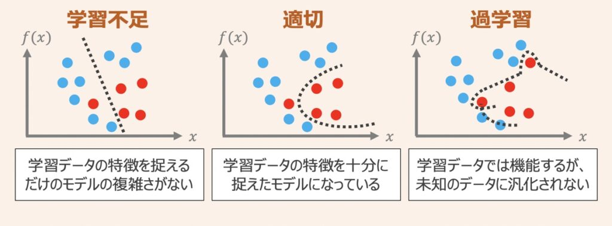

# 1. 過学習

# 1. 過学習とは

上図のように機械学習モデルを作成し、学習データに対してモデルパラメータがうまくフィッティングするよう学習したとします。この時、**学習データに対するモデルの表現力が高ければ高いほど，学習データに対してのみ過剰に当てはまりが良くなる状態になってしまい、テストデータへの当てはまりが悪くなる「過学習」の状態に陥ってしまいます。**

この対策として正則化が関わってきます。

# 99. 参考

- [https://qiita.com/kenta1984/items/91ab29fae8cd3920cf2b](https://qiita.com/kenta1984/items/91ab29fae8cd3920cf2b)

[機械学習における正則化の意味を分かりやすく説明する - Qiita](https://qiita.com/kenta1984/items/91ab29fae8cd3920cf2b)