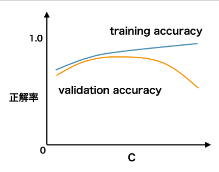

# 検証曲線
# もくじ
- [検証曲線](#検証曲線)
- [もくじ](#もくじ)
- [1. 検証曲線とは](#1-検証曲線とは)
- [99. 参考](#99-参考)

# 1. 検証曲線とは

検証曲線は、ハイパーパラメーターの値と予測性能の関係を示した折れ線グラフのことです。

以下のように、検証曲線の横軸は、ハイパーパラメーターの値であり、縦軸は評価指標となっています。

訓練データを使った時の評価指標と検証データを使った時の評価指標の両方をプロットします。

両者の指標で描かれた曲線の離れ具合で、最適なハイパーパラメーターの取りうる値を大まかに把握することができます。

# 99. 参考

[https://axa.biopapyrus.jp/machine-learning/model-evaluation/validation-curve.html](https://axa.biopapyrus.jp/machine-learning/model-evaluation/validation-curve.html)

[https://python.atelierkobato.com/curve/](https://python.atelierkobato.com/curve/)

正則化パラメータについて

[機械学習のパラメータチューニングを「これでもか！」というくらい丁寧に解説 - Qiita](https://qiita.com/c60evaporator/items/ca7eb70e1508d2ba5359#c%E3%82%92%E5%A4%89%E5%8C%96%E3%81%95%E3%81%9B%E3%81%9F%E3%81%A8%E3%81%8D)