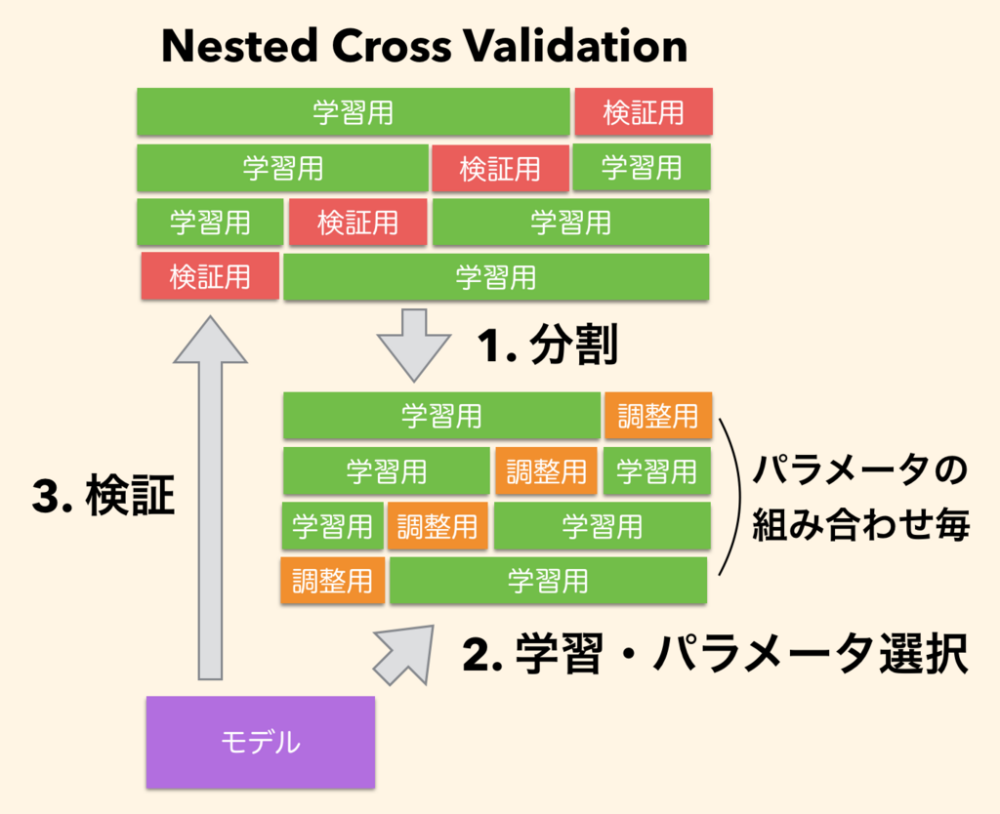

# 入れ子の交差検証
# もくじ
- [入れ子の交差検証](#入れ子の交差検証)
- [もくじ](#もくじ)
- [1. 入れ子の交差検証とは](#1-入れ子の交差検証とは)
- [2. 利用例](#2-利用例)
- [99. 参考](#99-参考)

# 1. 入れ子の交差検証とは

入れ子構造の交差検証（nested k-fold cross validation）とは、**複数のアルゴリズムを比較して、最適なアルゴリズムを決定したいとき**に使用する手法です。

一つのアルゴリズムの中で、最適なハイパーパラメータを決めるようなことも一例として挙げられます。

入れ子の交差検証は以下のように行います。

1. まずデータセット全体をk1分割する
2. そのうち1つをテストデータセットとし、残りのデータをトレーニングデータセットとする
3. k2分割交差検証を行う(トレーニングデータセットをk2等分して1つを検証データセットとする×k2回)
4. 1~3をk1回繰り返す

# 2. 利用例

例えば、SVM を使って予測器を作るならば、交差検証により最適なカーネル関数およびカーネル関数に必要なハイパーパラメータ gamma や C などを決定し、最後に、最適なハイパーパラメータを持つ SVM(gamma, C) に、これまでに使っていなかったテストデータを与えて、汎化性能を評価することになります。

これに対して、入れ子構造の交差検証は、**複数のアルゴリズムを比較して、その中から最適なアルゴリズムを決定する際に利用します**。例えば、SVM とランダムフォレストを比較して、この中から予測精度が最も高いアルゴリズムを決定し、その汎化性能を評価するための交差検証の方法として利用するなどです。

アルゴリズム間の比較において、入れ子構造の交差検証を必要とされるのは、比較を 2 回行う必要があるためです。

1 回目の比較は、各アルゴリズムのハイパーパラメータを決める際に必要で、SVM とランダムフォレストを比較して最適なアルゴリズムを決める際に、まず最適な SVM と最適なランダムフォレストを決める必要もあります。最適な SVM を決めるためには、SVM のハイパーパラメータ gamma や C を交差検証により決める必要もあります。この 1 回目の交差検証で決定された最適な SVM(gamma, C) を決めていきます。

また、同様な交差検証データセットを使用して、ランダムフォレストの最適なハイパーパラメータ n_estimators や max_depth を決めることができます。これにより最適なランダムフォレスト RF(n_estimators, max_depth) が決定されます。

# 99. 参考

- [https://blog.amedama.jp/entry/2018/07/23/084500](https://blog.amedama.jp/entry/2018/07/23/084500)

[Python: パラメータ選択を伴う機械学習モデルの交差検証について - CUBE SUGAR CONTAINER](https://blog.amedama.jp/entry/2018/07/23/084500)

- [https://axa.biopapyrus.jp/machine-learning/model-evaluation/nested-k-fold-cross-validation.html](https://axa.biopapyrus.jp/machine-learning/model-evaluation/nested-k-fold-cross-validation.html)

[https://axa.biopapyrus.jp/machine-learning/model-evaluation/nested-k-fold-cross-validation.html](https://axa.biopapyrus.jp/machine-learning/model-evaluation/nested-k-fold-cross-validation.html)

- [https://qiita.com/shugo256/items/52f6ad33560d7c37535c](https://qiita.com/shugo256/items/52f6ad33560d7c37535c)

[Python機械学習プログラミング 第6章 まとめ - Qiita](https://qiita.com/shugo256/items/52f6ad33560d7c37535c)