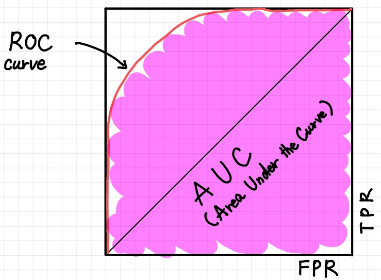

# ROC 曲線・AUC
# もくじ
- [ROC 曲線・AUC](#roc-曲線auc)
- [もくじ](#もくじ)
- [1. ROC(Receiver Operating Characteristic) 曲線・AUC(Area Under the Curve) とは](#1-rocreceiver-operating-characteristic-曲線aucarea-under-the-curve-とは)
- [2. 具体的な判別モデルで考えてみる](#2-具体的な判別モデルで考えてみる)
  - [2.1. 2 値分類の機械学習モデル](#21-2-値分類の機械学習モデル)
  - [2.2. 閾値を変更してみる](#22-閾値を変更してみる)
  - [2.3. 閾値をいじることの問題点](#23-閾値をいじることの問題点)
- [3. 特殊なROC 曲線・AUC](#3-特殊なroc-曲線auc)
  - [3.1. 究極のROC 曲線・AUC](#31-究極のroc-曲線auc)
  - [3.2. 対角線となってしまっているROC 曲線](#32-対角線となってしまっているroc-曲線)
  - [3.3. 右側と下側が沿うようになっているROC 曲線](#33-右側と下側が沿うようになっているroc-曲線)
- [4. 現実世界でのROC 曲線・AUC](#4-現実世界でのroc-曲線auc)
  - [4.1. 現実的なROC 曲線・AUC を参考に閾値を調整する](#41-現実的なroc-曲線auc-を参考に閾値を調整する)
- [99. 参考](#99-参考)

# 1. ROC(Receiver Operating Characteristic) 曲線・AUC(Area Under the Curve) とは

2 値分類で一般的に利用されているパフォーマンスを計測するための可視化手法です。

ROC は推測曲線と呼ばれ縦軸にTPR(True Positive Rate)、横軸にFPR(False Positive Rate) の割合をプロットしたものです。 AUC(Area Under the Curve) はその曲線の下部分の面のことで、**AUC の面積が大きいほど**一般的に機械学習の性能が良い事を意味します。

面積が大きいということはすなわち機械学習モデルがNegative と推測すべきものを間違えてPositive と推測している傾向が少なく、Positive と推測すべきものをしっかりとPositive と推測できている状態です。



ここでは前の記事の内容にも沿って猫を判別する機械学習を例に話を進めていきます。

上記のROC 曲線とAUC の状態をTP(True Positive)、TN(True Negative)、FP(False Positive)、FN(False Negative) といった情報もすべて含めて分布図で表すと以下のようになります。

青い線で囲まれた山形(やまなり)の曲線領域は教師データとしてNegative である(猫ではない)と指定されているデータ、赤い線で囲まれた山形の曲線領域は教師データとしてPositiveである(猫である)と指定されているデータです。

そして中央の閾値の線を境に、右側の赤い線の下側のピンクで塗りつぶされている部分がTP なデータの領域で、右側の葵線の下側の赤い縞模様で塗りつぶされている部分がFP なデータの領域となります。


機械学習モデルは猫である(Positive)か猫でない(Negative)かの判定をするときに、内部的には

0か1かの両極端で出しているのではなく、「物体が猫である確率はいくつか？」という予測可能性として0 ～ 1 の間の値(例えば0.7, 0.22, 0.95 等)で出し、それを0.5 等の**閾値**を境に、それより大きい値は猫である、小さい値は猫ではないとして結果を出しています。これが2 値分類機械学習の正体です。

# 2. 具体的な判別モデルで考えてみる

## 2.1. 2 値分類の機械学習モデル

前回に引き続きお店の前を通った物体が猫かどうかを判別する2 値分類の機械学習モデルで考えてみましょう。ただし前回とは異なる比率のデータを使って考えてみます。

[Untitled](https://www.notion.so/d1121ea450a743f395b6c3ecd0e26b2e)

これを2 値分類で推測すると以下のような結果が出力されました。以下の図は猫である/猫ではないの2 値だけでなく機械学習の内部で出されている推測値(0.0 〜 1.0) も含めてあらわしています。


大部分は正しく推測できていできていますが、一部機械学習の推測値が閾値より低いため実際には猫であるのに猫ではないと結果(FN)が出されていたり、一方で機械学習の推測値が閾値より高いため実際には猫ではないのに猫であると結果(FP)が出されていたりします。

これらのデータをROC 曲線に落とし込むために**True Positive Rate(再現率: Recall)**と**False Positive Rate** の値を計算してみましょう。

- 再現率(Recall, True Positive Rate)

$$
Recall,TruePositiveRate=\frac{TP}{TP+FN}=\frac{TP}{TP+FN}=\frac{450}{450+50}=0.9
$$

- False Positive Rate

$$
False Positive Rate=\frac{FP}{FP+TN}=\frac{60}{60+440}=0.12
$$

これをもとにROC 曲線をプロットしてみましょう。すると以下のようになります。


すると上記のように綺麗なROC 曲線ができ、AUC も広々と大きくなっています。

また図の左上を見ると閾値0.5 の点があり、それを境にTPR(y 軸の値): 0.90、FPR:(x 軸の値): 0.12 が記録されています。 そして閾値0.5 の点が図の左上方向に位置しているということは高TPR且つ低FPR であることを意味し、実際の猫を正しく猫と推測できている割合が高く、実際は猫でないものを誤って猫であると推測している割合が低いことをあらわし、性能の良い2 値分類の機械学習モデルであることがわかります。

## 2.2. 閾値を変更してみる

猫ではないものを誤って猫と推測しないようにすることはできないものでしょうか？

中には実際に猫ではないのに誤って猫と推測されているもの(FP) なものがあります。具体的には以下のクラスです。


これらのクラスを誤って猫と推測しないようにするには**閾値を上げること**で解消されます。

それでは実際に閾値を0.7 に上げてみましょう。


閾値を0.7 まで上げた結果、閾値の線が右へ移動しました。閾値付近の分布を拡大してみます。


誤って猫と推測されていたクラス(FP)が正しく猫ではないと推測されるクラス(TN)となりました。これで猫ではないものを猫ではない(TN)と正しく推測できるようになりました。

しかしその一方で残念な変化もあります。実際の猫を正しく猫と推測できていたクラス(TP)が誤って猫ではないと推測されるクラス(FN)となってしまいました。要するに本物の猫を誤って推測するようになってしまったわけです。

このように閾値を変更するということは、改善される点もありますがそれに伴う副作用も伴ってくるのです。

では次に閾値0.7 の時のROC 曲線を見てみましょう。


曲線の形自体は変わりませんが、閾値の点の位置が変わります。

結果としてはFPR が下がり、それに伴いTPR 下がります。

図としては閾値の点の右下の縦と横の長さがだいぶ変わっていることに気付くでしょう。

このように

**ROC 曲線・AUC は閾値の調整によって機械学習の性能がどのように変化するかということも視覚的に理解できるので、2 値分類機械学習モデルの性能を測るにはとても役にたつのです**。

## 2.3. 閾値をいじることの問題点

このように閾値を調整することで必ずしも良い影響を与えるわけではなく、ビジネスモデルや戦略を考慮して閾値を調整するようにする必要があります。

虎猫鮮魚店にて魚の万引きを防ぐために監視カメラで猫が出てきたらそれを検知するようなシステムを導入する場合は以下のように、ビジネス戦略をたてて閾値を調整する必要があります。

- お客さんが多く、接客に集中するため、猫でないものを誤って猫と推測する量を減らしたい
    - 閾値をあげる。
    - ただし、実際の猫を猫でないと推測して取りこぼしが多く発生し、魚がいっぱい盗まれてしまうかもしれない。
- 今日は特別に高い魚を仕入れ、猫がきたら取りこぼしなく猫であると推測するようにしたい
    - 閾値をさげる。
    - ただし猫ではないものを猫であると判定して、無駄な対応に追われ接客が回らなくなるかもしれない。

このように戦略を考慮して閾値を選択し、2 値分類機械学習モデルの特徴と付き合っていく必要があるのです。

# 3. 特殊なROC 曲線・AUC

## 3.1. 究極のROC 曲線・AUC

現実的にはほぼありえないのですが、全ての猫を正しく猫と推測して全ての猫ではないものを正しく猫ではないと推測する機械学習モデルのROC 曲線・AUC を図示すると以下のようになります。


この機械学習モデルが推測したクラスを分布に表すと以下のようにFP とFN が一切存在しないグラフになりますが、繰り返しになりますがこれは現実的にほぼありえない分布です。


万が一このようなROC 曲線・AUC (もしくはとてもそれに非常に近いもの)が描けてしまった場合は、間違えて**学習用データとテスト用データとして同じものを使っていないか**、且つ**過学習な状態になっていないか**といったことを疑って良いと思います。

## 3.2. 対角線となってしまっているROC 曲線

以下のようにROC 曲線が単なる対角線になっている場合、これは**ほぼランダムに**猫か猫じゃないかの推測をしている状態になり機械学習モデルとしては不十分となります。

毎回コイントスをして表か裏かで猫かそうでないかを推測しているのとたいして変わりがない状態です。

実際機械学習モデルを作成してこのようなROC 曲線・AUC が出てしまった場合は、一般的には機械学習失敗とみて良いでしょう。


## 3.3. 右側と下側が沿うようになっているROC 曲線

**Positive とNegative なクラスが完全に逆転**してしまっているケースです。

この状態ではROC 曲線は左上ではなく右下の辺に沿うような形になり、AUC は0 となります。

全ての猫を猫ではないと判定し、全ての猫ではないものを猫であると判定している状態です。

ある意味、逆に究極の状態です。


# 4. 現実世界でのROC 曲線・AUC

実際の機械学習では質の良いデータが集められなかった、教師データも完璧であるとは限らない、モデルも適切であるとは限らない等の要因により最初に示したような綺麗なROC 曲線になることはそうそうありません。 

では実際どのようなROC 曲線が出てくるのか…例えば以下のようなROC 曲線と分布が出てきたりします。


先程の閾値を境に、左右に綺麗に山形な曲線は見る影もありません。これをROC 曲線でプロットしてみると次のようになります。


上記のようになり最初に示したROC 曲線とは、だいぶ違う曲線となっています。

では2 値分類の機械学習モデルとして不十分なものなのか…というと必ずしもそうではありません。機械学習モデルをビジネス戦略モデルを元に**チューニングして**実際に使えるものへと改良していきましょう。

## 4.1. 現実的なROC 曲線・AUC を参考に閾値を調整する

それでは最後にこの現実で出くわすことのあるROC 曲線・AUC を見ながら閾値を調整していきましょう。

閾値を上げればよいのか下げればよいのか、それは先程も述べたとおり**ビジネス戦略によって変わってきます**。

例えば虎猫鮮魚店では、この機械学習モデルを導入するうえで以下のようなビジネス戦略をたてたとします。

```markdown
お客さんが多く、接客に集中するため、**猫でないものを誤って猫と推測する量を減らしたい**
```

では、そのような場合に閾値をどのように調整すればよいのでしょうか？上げればよいのです！

まずは閾値を調整する前のROC 曲線を見てみましょう。


False Positive Rate とTrue Positive Rate がほぼ`1:1` くらいの比率(厳密にはTrue Positive Rate の方がほんの少し多い状態です)で分布しています。

この状態から、例えば閾値を0.75 まで上げて見ましょう。

閾値を上げるということは、具体的に、ROC 曲線のグラフを用いて説明すると以下のように閾値の点を左へ移動することになります。


移動した後のFalse Positive Rate とTrue Positive Rate はROC曲線で表すと以下のようになります。


閾値を上げることでFalse Positive Rate とTrue Positive Rate の比率が約1:2くらいに変わりました。 このROC 曲線が何を表しているかと言うと、2 値分類の機械学習が「猫である」と判定したもののうち「実際は猫でなかった」という**誤検知が起きる確率を下げている**のです。
ただ副作用として「猫ではない」と判定したもののうち「実際は猫であった」という誤検知が起きる確率を高めることにもなるのです。

# 99. 参考

- [https://qiita.com/TsutomuNakamura/items/ef963381e5d2768791d4](https://qiita.com/TsutomuNakamura/items/ef963381e5d2768791d4)

[ROC 曲線とAUC を用いて2値分類機械学習モデルの性能を計測・チューニングする - Qiita](https://qiita.com/TsutomuNakamura/items/ef963381e5d2768791d4)