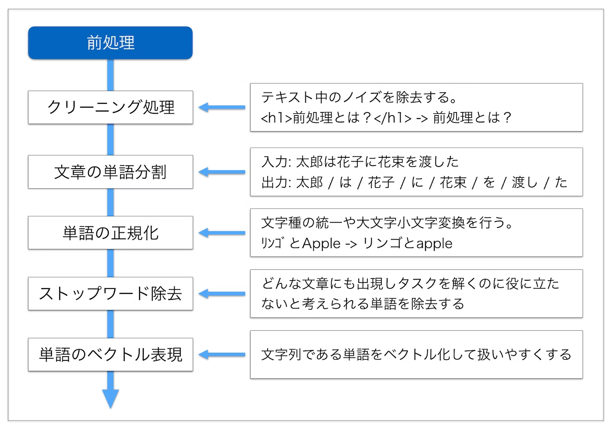
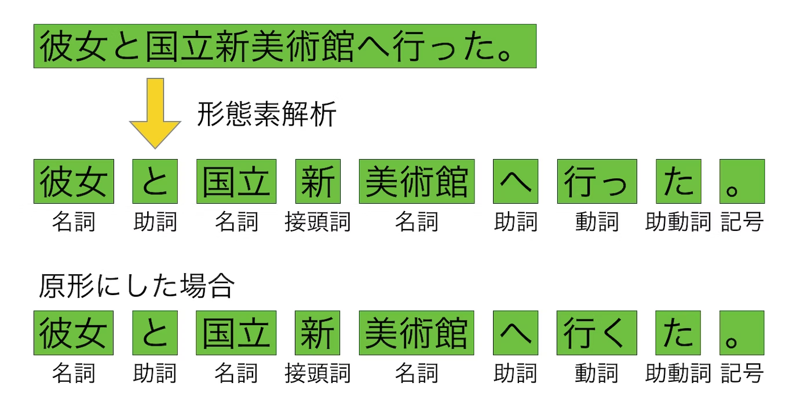
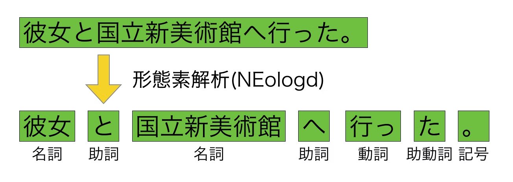
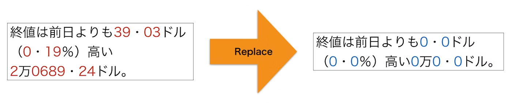
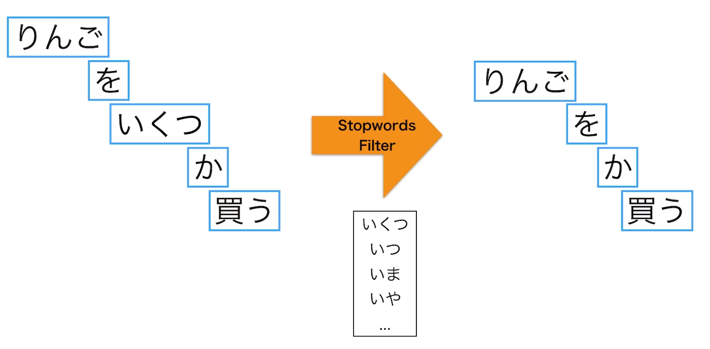
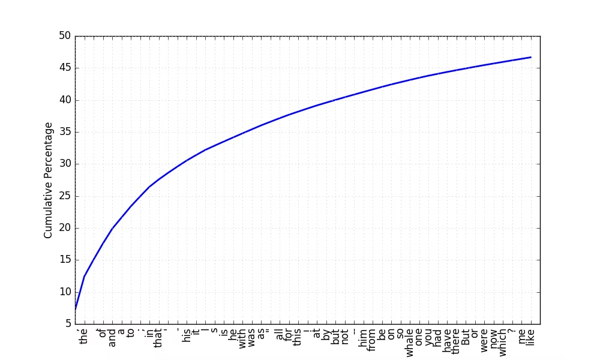

# 1. 単語のベクトル表現前にやること


# もくじ
- [1. 単語のベクトル表現前にやること](#1-単語のベクトル表現前にやること)
- [もくじ](#もくじ)
- [0. 自然言語処理の一般的な流れ](#0-自然言語処理の一般的な流れ)
- [1. テキストのクリーニング処理](#1-テキストのクリーニング処理)
- [2. 単語の分割](#2-単語の分割)
- [3. 単語の正規化](#3-単語の正規化)
  - [3.1. 文字種の統一](#31-文字種の統一)
  - [3.2. 数字の置き換え](#32-数字の置き換え)
  - [3.3. 辞書を用いた単語の統一](#33-辞書を用いた単語の統一)
- [4. ストップワードの除去](#4-ストップワードの除去)
  - [4.1. 辞書による方式](#41-辞書による方式)
  - [4.2. 出現頻度による方式](#42-出現頻度による方式)
- [99. 参考](#99-参考)

# 0. 自然言語処理の一般的な流れ

単語のベクトル表現化をする前に、以下のような処理をしていきます。

単語のベクトル表現についても前処理の最後に入っていますが、ここについては実装面なども深く関わってくるため別で触れていきます。

- 参考：

[自然言語処理における前処理の種類とその威力 - Qiita](https://qiita.com/Hironsan/items/2466fe0f344115aff177)



# 1. テキストのクリーニング処理

テキストのクリーニングでは、テキスト内に含まれるノイズを除去します。

よくあるノイズとして、JavaScriptのコードやHTMLタグが挙げられます。これらのノイズを除去することで、ノイズがタスクの結果に及ぼす悪影響を抑えることができます。

以下のようなイメージです。


JavaScriptやHTMLタグの除去はよく行われますが、実際にはデータに応じて除去したいノイズは変わります。そのような場合に使える手として**正規表現**があります。正規表現を書く際には以下のようなオンラインエディタを使ってリアルタイムにパターンマッチを確認しながら行うと、作業が捗ります。

- [https://regex101.com/](https://regex101.com/)

また、Pythonには [Beautiful Soup](https://www.crummy.com/software/BeautifulSoup/bs4/doc/) や [lxml](http://lxml.de/) のようなクリーニングを行うのに便利なライブラリがあります。

- BeautifulSoupを用いたテキストのクリーニング例。

```python
# -*- coding: utf-8 -*-
import re

from bs4 import BeautifulSoup

def clean_text(text):
    replaced_text = '\n'.join(s.strip() for s in text.splitlines()[2:] if s != '')  # skip header by [2:]
    replaced_text = replaced_text.lower()
    replaced_text = re.sub(r'[【】]', ' ', replaced_text)       # 【】の除去
    replaced_text = re.sub(r'[（）()]', ' ', replaced_text)     # （）の除去
    replaced_text = re.sub(r'[［］\[\]]', ' ', replaced_text)   # ［］の除去
    replaced_text = re.sub(r'[@＠]\w+', '', replaced_text)  # メンションの除去
    replaced_text = re.sub(r'https?:\/\/.*?[\r\n ]', '', replaced_text)  # URLの除去
    replaced_text = re.sub(r'　', ' ', replaced_text)  # 全角空白の除去
    return replaced_text

def clean_html_tags(html_text):
    soup = BeautifulSoup(html_text, 'html.parser')
    cleaned_text = soup.get_text()
    cleaned_text = ''.join(cleaned_text.splitlines())
    return cleaned_text

def clean_html_and_js_tags(html_text):
    soup = BeautifulSoup(html_text, 'html.parser')
    [x.extract() for x in soup.findAll(['script', 'style'])]
    cleaned_text = soup.get_text()
    cleaned_text = ''.join(cleaned_text.splitlines())
    return cleaned_text

def clean_url(html_text):
    """
    \S+ matches all non-whitespace characters (the end of the url)
    :param html_text:
    :return:
    """
    clean_text = re.sub(r'http\S+', '', html_text)
    return clean_text

def clean_code(html_text):
    """Qiitaのコードを取り除きます
    :param html_text:
    :return:
    """
    soup = BeautifulSoup(html_text, 'html.parser')
    [x.extract() for x in soup.findAll(class_="code-frame")]
    cleaned_text = soup.get_text()
    cleaned_text = ''.join(cleaned_text.splitlines())
    return
```

# 2. 単語の分割

日本語のように単語の区切りが明らかでない言語に対してまず行われるのが単語の分割処理です。単語を分割する理由として、ほとんどの自然言語処理システムでは入力を単語レベルで扱うことが挙げられます。分割は主に形態素解析器を用いて行います。主な形態素解析器として [MeCab](http://taku910.github.io/mecab/)　や [Juman++](http://nlp.ist.i.kyoto-u.ac.jp/index.php?JUMAN++)、 [Janome](http://mocobeta.github.io/janome/) が挙げられます。

- 単語分割のイメージ



形態素解析する際に問題となるのがデフォルトでは新語の解析に強くない点です。上の例を見ると**「国立新美術館」**を**「国立」「新」「美術館」**の3つに分割しています。このような結果になる原因として、**解析に使っている辞書に「国立新美術館」が含まれていないこと**が挙げられます。特にWebには新語が多数含まれているのでこの問題はさらに深刻になります。

この問題は [NEologd](https://github.com/neologd/mecab-ipadic-neologd/blob/master/README.ja.md) と呼ばれる辞書を追加することでことである程度解決できます。NEologd には通常の辞書と比べて多くの新語が含まれています。したがって、NEologdを使用することで新語の解析に強くなります。

- 同じ文をNEologdを使って解析した結果



# 3. 単語の正規化

単語の正規化では単語の文字種の統一、つづりや表記揺れの吸収といった単語を置き換える処理をします。この処理を行うことで、全角の「ネコ」と半角の「ﾈｺ」やひらがなの「ねこ」を同じ単語として処理できるようになります。後続の処理における計算量やメモリ使用量の観点から見ても重要な処理です。

単語の正規化には様々な処理がありますが、ここでは以下の3つの処理を紹介します。

- 文字種の統一
- 数字の置き換え
- 辞書を用いた単語の統一

## 3.1. 文字種の統一

文字種の統一ではアルファベットの大文字を小文字に変換する、半角文字を全角文字に変換するといった処理を行います。たとえば「Natural」の大文字部分を小文字に変換して「natural」にしたり、「ﾈｺ」を全角に変換して「ネコ」にします。このような処理をすることで、単語を文字種の区別なく同一の単語として扱えるようになります。


## 3.2. 数字の置き換え

数字の置き換えではテキスト中に出現する数字を別の記号（たとえば0）に置き換えます。

たとえば、あるテキスト中に「2017年1月1日」のような数字が含まれる文字列が出現したとしましょう。数字の置き換えではこの文字列中の数字を「0年0月0日」のように変換してしまいます。



数字の置き換えを行う理由は、**数値表現が多様で出現頻度が高い割には自然言語処理のタスクに役に立たないことが多いから**です。

たとえば、ニュース記事を「スポーツ」や「政治」のようなカテゴリに分類するタスクを考えます。この時、記事中には多様な数字表現が出現する可能性がありますが、カテゴリの分類にはほとんど役に立たないと考えられます。そのため、**数字を別の記号に置き換えて**語彙数を減らしてしまいます。

なお当然ですが、数値表現が重要なタスク（情報抽出など）では数字の置き換えは行いません。

## 3.3. 辞書を用いた単語の統一

辞書を用いた単語の統一では**単語を代表的な表現に置き換えます。**

たとえば、「ソニー」と「Sony」という表記が入り混じった文章を扱う時に「ソニー」を「Sony」に置き換えてしまいます。これにより、これ以降の処理で2つの単語を同じ単語として扱えるようになります。置き換える際には**文脈を考慮して置き換える必要があること**には注意する必要があります。


単語正規化の世界は奥深く、以上で説明した正規化以外にもつづりの揺れ吸収(loooooooooooool -> lol)、省略語の処理(4eva -> forever)、口語表現の代表化(っす -> です)といった正規化もあります。データが大量にあれば後述する単語の分散表現である程度対応できる処理もあるとは思いますが、自分の解きたいタスクに必要な処理をするのが一番良いです。

- 単語の正規化実装例

```python
# -*- coding: utf-8 -*-
import re
import unicodedata

import nltk
from nltk.corpus import wordnet

def normalize(text):
    normalized_text = normalize_unicode(text)
    normalized_text = normalize_number(normalized_text)
    normalized_text = lower_text(normalized_text)
    return normalized_text

def lower_text(text):
    return text.lower()

def normalize_unicode(text, form='NFKC'):
    normalized_text = unicodedata.normalize(form, text)
    return normalized_text

def lemmatize_term(term, pos=None):
    if pos is None:
        synsets = wordnet.synsets(term)
        if not synsets:
            return term
        pos = synsets[0].pos()
        if pos == wordnet.ADJ_SAT:
            pos = wordnet.ADJ
    return nltk.WordNetLemmatizer().lemmatize(term, pos=pos)

def normalize_number(text):
    """
    pattern = r'\d+'
    replacer = re.compile(pattern)
    result = replacer.sub('0', text)
    """
    # 連続した数字を0で置換
    replaced_text = re.sub(r'\d+', '0', text)
    return replaced_text
```

# 4. ストップワードの除去

ストップワードというのは**自然言語処理する際に一般的で役に立たない等の理由で処理対象外とする単語のこと**です。

たとえば、助詞や助動詞などの機能語(「は」「の」「です」「ます」など)が挙げられます。これらの単語は出現頻度が高い割に役に立たず、計算量や性能に悪影響を及ぼすため除去されます。

ストップワードの除去には[様々な方式](http://www.ijcscn.com/Documents/Volumes/vol5issue1/ijcscn2015050102.pdf)がありますが、ここでは以下の2つの方式を紹介します。

- 辞書による方式
- 出現頻度による方式

## 4.1. 辞書による方式

辞書による方式では、**あらかじめストップワードを辞書に定義しておき、辞書内に含まれる単語をテキストから除去します。**辞書は自分で作成してもいいのですが、既に定義済みの辞書が存在しています。ここでは日本語のストップワード辞書の一つである [Slothlib](http://svn.sourceforge.jp/svnroot/slothlib/CSharp/Version1/SlothLib/NLP/Filter/StopWord/word/Japanese.txt)の中身を見てみましょう。300語ほどの単語が一行ごとに定義されています。

```python
あそこ
あたり
あちら
あっち
あと
あな
あなた
あれ
いくつ
いつ
いま
いや
いろいろ
...
```

この辞書内に定義された単語をストップワードとして読み込み、使用します。具体的には読み込んだストップワードが単語に分割されたテキスト内に含まれていれば除去してしまいます。

- 辞書を利用したストップワード除去の例



辞書による方法は素朴な方法で簡単ですがいくつか欠点もあります。

一つ目は辞書を作るためのコストがかかる点です。もう一つはドメインによっては役に立たない場合がある点です。

そのため、自分の対象としているコーパスによって作り変える必要があります。

## 4.2. 出現頻度による方式

出現頻度による方式では、テキスト内の単語頻度をカウントし、高頻度（時には低頻度）の単語をテキストから除去します。**高頻度の単語を除去するのは、それらの単語がテキスト中で占める割合が高い一方、役に立たないからです。**

- ある英語の本の最も頻出する50単語の累計頻度をプロットしたもの



50単語を見てみると、the や of、カンマのような文書分類等に役に立たなさそうな単語がテキストの50%近くを占めていることがわかります。出現頻度による方式ではこれら高頻度語をストップワードとしてテキストから取り除きます。

- 実装例

```python
# -*- coding: utf-8 -*-
import os
import urllib.request
from collections import Counter

from gensim import corpora

def maybe_download(path):
    url = 'http://svn.sourceforge.jp/svnroot/slothlib/CSharp/Version1/SlothLib/NLP/Filter/StopWord/word/Japanese.txt'
    if os.path.exists(path):
        print('File already exists.')
    else:
        print('Downloading...')
        # Download the file from `url` and save it locally under `file_name`:
        urllib.request.urlretrieve(url, path)

def create_dictionary(texts):
    dictionary = corpora.Dictionary(texts)
    return dictionary

def remove_stopwords(words, stopwords):
    words = [word for word in words if word not in stopwords]
    return words

def most_common(docs, n=100):
    fdist = Counter()
    for doc in docs:
        for word in doc:
            fdist[word] += 1
    common_words = {word for word, freq in fdist.most_common(n)}
    print('{}/{}'.format(n, len(fdist)))
    return common_words

def get_stop_words(docs, n=100, min_freq=1):
    fdist = Counter()
    for doc in docs:
        for word in doc:
            fdist[word] += 1
    common_words = {word for word, freq in fdist.most_common(n)}
    rare_words = {word for word, freq in fdist.items() if freq <= min_freq}
    stopwords = common_words.union(rare_words)
    print('{}/{}'.format(len(stopwords), len(fdist)))
    return stopwords
```

# 99. 参考

- [自然言語処理における前処理の種類とその威力 - Qiita](https://qiita.com/Hironsan/items/2466fe0f344115aff177)