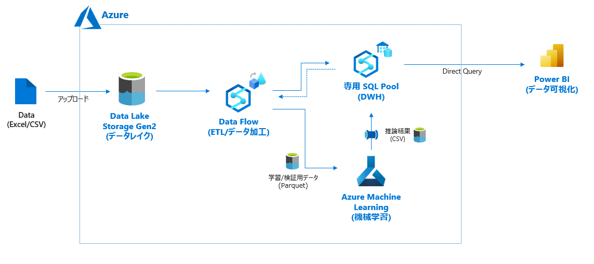

# 4. Azureデータ分析基盤構築

# もくじ
- [4. Azureデータ分析基盤構築](#4-azureデータ分析基盤構築)
- [もくじ](#もくじ)
- [1. データ分析基盤構成](#1-データ分析基盤構成)
- [2. データ分析関連のサービス概要](#2-データ分析関連のサービス概要)
  - [2.1. Azure Synapse Analytics](#21-azure-synapse-analytics)
  - [2.2. Azure Data Factory](#22-azure-data-factory)
  - [2.3. Azure SQL](#23-azure-sql)
  - [2.4. Azure Machine Learning](#24-azure-machine-learning)
  - [2.5. Power BI](#25-power-bi)
- [99. 参考](#99-参考)

# 1. データ分析基盤構成

Azure でデータ分析基盤を構築するにあたり、以下のような構成となります。

大まかな流れは以下のとおりです。

1. 分析対象のデータを Data Lake Storege に流し込む。
2. Data Flow（Synapse Pipeline）で ETL/データ加工をする。
3. 加工したデータを SQL Pool に配置&学習/検証用データを Azure Machine Learning で分析し、分析結果を SQL Pool に配置する。
4. 分析結果および元データを PowerBI で可視化（=データ可視化）する。

特に、Data Flow と Data Pool については **Data Factory** や **Synapse Analysis** で代替可能なので、本資料ではそのように構成を変えて必要なサービスについて触れていきます。

データの準備・基礎集計・データ加工・モデル作成/評価・分析結果の可視化を行えれば問題ありません。

- 参考：[自動化されたエンタープライズ BI - Azure Architecture Center](https://docs.microsoft.com/ja-jp/azure/architecture/reference-architectures/data/enterprise-bi-adf)

以降では **Synapse Analytics** や **Azure Machine Learning** などの Azure 上でのデータ分析で必要なサービスに触れていきます。

なお、ここでは簡潔に触れていきます。

# 2. データ分析関連のサービス概要

## 2.1. Azure Synapse Analytics

[Azure Synapse Analytics](https://azure.microsoft.com/ja-jp/services/synapse-analytics/#overview)とはデータ統合、エンタープライズ データ ウェアハウス、ビッグデータ分析が 1 つになった分析サービスです。

- [https://www.slideshare.net/jamserra/azure-synapse-analytics-overview](https://www.slideshare.net/jamserra/azure-synapse-analytics-overview)

Azure Synapse Analytics は、以下の要素で構成されています。

- Synapse SQL Pools
- Synapse Spark Pools
- Synapse Pipeline
- Synapse Link
- Synapse Studio

詳細は[こちら](https://www.notion.so/5-Azure-Synapse-Analytics-d60fa65c30e147129df0c8faa5cb6b17)

## 2.2. Azure Data Factory

Azure Data Factory とは、さまざまなデータを収集して連携できるデータ統合管理のクラウドサービスです。

クラウドのデータ結合だけでなく、オンプレミスとクラウドを利用するハイブリッド運用でもデータの統合ができます。オンプレミスや SaaS などのクラウドサービスに利用しているデータを一元管理したり、データの変換や管理画面の設定・管理を GUI 操作のみで実現できます。

また、さまざまなシステムに連携して、データ分析に必要な情報を抽出するための一連の処理を自動化し、**ETL**や**ELT**といったデータ統合にも活用できます。

> **📝ETL・ELTとは？**  
ETL・ELT とは、データの Extract（抽出）、Transform（変換・加工）、Load（格納）の頭文字をとった用語で、これらの処理の順番に頭文字を並べたものです。  
従来は一般的なストレージの容量も少なく、一度に集められるデータが少なかったため、データ抽出→変換・加工→格納の順序で処理をするのが一般的で、ETL が使われてきました。しかし、現在は、大容量のストレージが利用できるようになったため、加工・変換前の生データを保管できるようになったため、データの抽出→格納→変換・加工という ELT の手法も使われるようになってきています。
> 

Azure Data Factory は、従来の ETL はもちろん、柔軟なスケールアウトスケールアップが可能なため ELT も数回のマウスクリックで利用できます。

- 詳細は[こちら](https://www.notion.so/6-Azure-Data-Factory-73e7239281d9487fa7f53a4fbefdc44e)

## 2.3. Azure SQL

Azure SQL とは、Microsoft SQL データベースを提供する Azure の PaaS サービスです。利用者が Windows サーバへ Microsoft SQL のソフトウェアをインストールし設定する必要はなく、必要に応じてすぐに使い始められるのが特徴です。Microsfot SQL サーバなので、Microsoft SQL Management Studio といった使い慣れた既存のデータベース管理ツールからの接続も可能です（一部対応していないものも存在します）。

AWS での Amazon RDS のようなサービスです。

## 2.4. Azure Machine Learning

[Azure Machine Learning](https://azure.microsoft.com/ja-jp/services/machine-learning/)　とは Azure のサービスの 1 つで、Azure で機械学習モデルを構築、運用できるプラットフォームです。

Azure 上で **ノートブック**（Python）を用いたモデル構築だけでなく、データ投入するだけで自動的に最適なモデル/パラメータ探索してくれる **AutoML** や GUI ベースでパイプラインを構築できる **デザイナ** 機能もあり、幅広いユーザにとって活用場面のあるサービスです。

- 詳細は[こちら](https://www.notion.so/7-Azure-Machine-Learning-6414a23c3e3746a2aa9d0a0df2a25288)

## 2.5. Power BI

Power BI は BI（ビジネスインテリジェンス）ツールとして Microsoft から提供されている製品です。

> 📝**BIツール**  
BI ツールとは企業が蓄積しているデータを分析し、その結果から得られた知見をあらゆる活動に生かすためのものです。データそのものが蓄積されるデータベースとは違い、別のツールとしてレポートを表示したり、データ分析に関するさまざまな機能を持ったソフトウェアのことです。
> 

Power BI でできることを簡単にまとめると、次のようになります。

- 各種データ処理（抽出、変換、統合など）の作成と実行
- 視覚化された分かりやすいレポートを作成
- 作成したレポートを組織内の人と共有
- 作成したレポートを定期的に自動更新

これらの機能を基本的にノンプログラミングで実行できます。

細かな利用方法については以下 Udemy 講座がまとまっています。

- [https://www.udemy.com/course/masukawa_015/](https://www.udemy.com/course/masukawa_015/)

- [https://www.udemy.com/course/masukawa_027/](https://www.udemy.com/course/masukawa_027/)

# 99. 参考

- [Azureデータ分析入門 #1 【はじめに】 - Qiita](https://qiita.com/Catetin0310/items/a7ab83069fec5352b535)

- [Azure Sypanse Analyticsを一通り触ってみた | 煎茶](https://www.simpletraveler.jp/2022/03/17/microsoftazure-synapseanalytics-tutorials/)

- [Azure Synapse Analytics を試してみた - ROMANCE DAWN for the new world](https://gooner.hateblo.jp/entry/2020/12/01/090437)

- [https://www.simpletraveler.jp/2021/11/07/microsoftazure-synapseanalytics-overview/](https://www.simpletraveler.jp/2021/11/07/microsoftazure-synapseanalytics-overview/)

- [https://www.mssqltips.com/sqlservertip/6678/azure-synapse-analytics-vs-azure-data-factory-building-synapse-pipeline/](https://www.mssqltips.com/sqlservertip/6678/azure-synapse-analytics-vs-azure-data-factory-building-synapse-pipeline/)
