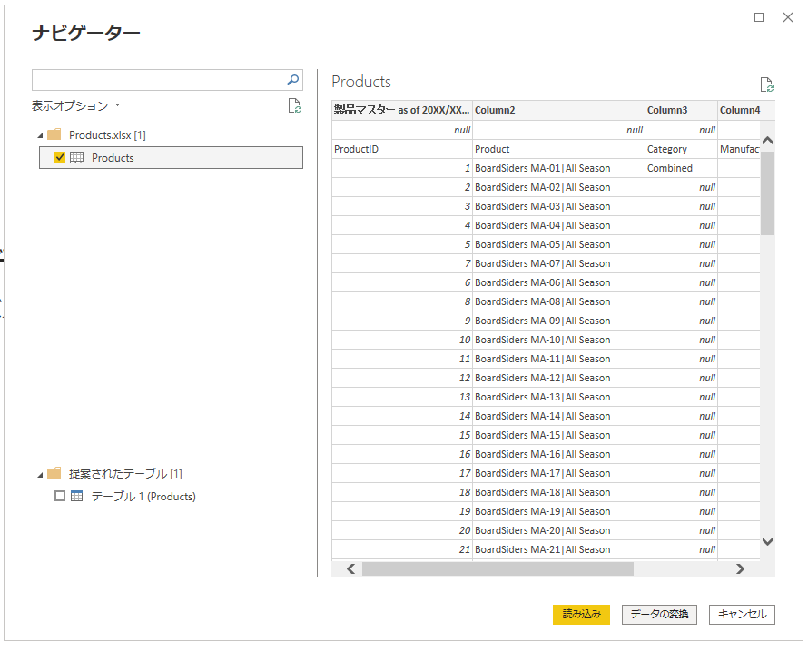

# 1. データの読み込み（Excel）

# もくじ
- [1. データの読み込み（Excel）](#1-データの読み込みexcel)
- [もくじ](#もくじ)
- [0. 前提](#0-前提)
- [1. データの読み込み方](#1-データの読み込み方)
  - [1.1. データの読み込み方法](#11-データの読み込み方法)
  - [1.2. データ読み込み時にやること](#12-データ読み込み時にやること)
    - [1.2.1. データ型の確認](#121-データ型の確認)
    - [1.2.2. プロパティのクエリ確認](#122-プロパティのクエリ確認)
    - [1.2.3．不要な行の削除](#123不要な行の削除)
    - [1.2.4. 1行目をヘッダーとして使う](#124-1行目をヘッダーとして使う)
    - [1.2.5. データを任意の文字列でわける](#125-データを任意の文字列でわける)
    - [1.2.6. 列から一部の情報を抜く](#126-列から一部の情報を抜く)
    - [1.2.7. 間違えて列を削除した時](#127-間違えて列を削除した時)
    - [1.2.8. セルの結合か何かでnullの項目が出てしまっている場合](#128-セルの結合か何かでnullの項目が出てしまっている場合)
    - [1.2.9. 横のテーブルを縦にしたい](#129-横のテーブルを縦にしたい)
    - [1.2.10. 同形式のデータをフォルダ単位で取得したい場合](#1210-同形式のデータをフォルダ単位で取得したい場合)
    - [1.2.11. フィルターをかけたとき](#1211-フィルターをかけたとき)
  - [1.3. PowerBIへのデータ読み込み](#13-powerbiへのデータ読み込み)
  - [1.4. 🥔Tips](#14-tips)
    - [1.4.1. 同形式のテーブルを縦方向にひとつにまとめる](#141-同形式のテーブルを縦方向にひとつにまとめる)
    - [1.4.2. 他のクエリから任意の情報をマージする](#142-他のクエリから任意の情報をマージする)
    - [1.4.3. 複数の列の計算結果を表示させる（カスタム列）](#143-複数の列の計算結果を表示させるカスタム列)

# 0. 前提

- Power BI Desctopをインストールしていること
    - インストールリンク
        - Microsoft Store：[https://powerbi.microsoft.com/ja-jp/downloads/](https://powerbi.microsoft.com/ja-jp/downloads/)
        - exeファイルのダウンロード：[https://www.microsoft.com/en-us/download/details.aspx?id=58494](https://www.microsoft.com/en-us/download/details.aspx?id=58494)

# 1. データの読み込み方

## 1.1. データの読み込み方法

以下のように、データを取得から任意のファイル形式を選択し、指定したファイルからのデータ読み込みをしてください。

- Excelからの読み込みの場合

任意のExcelを選択すると、以下のようにナビゲータウィンドウが表示されるため、読み込みたいデータが入っているシートを選択し、「データの変換」を押下してPower Query Editorを表示させてください。

いきなり読み込みでもデータの読み込みは出来ますが、後述しているようにデータの確認を読み込み前にすることをおすすめします。

## 1.2. データ読み込み時にやること

データを読み込んだら、まず初めに以下を実施してください。

- データ型の確認
- プロパティのクエリの確認

### 1.2.1. データ型の確認

大体はPowerBIで指定しているデータ型であっていることが多いですが、以下のようにIDや郵便番号などはそれぞれ文字列型で定義した方が利用しやすいため、そのように都度変換する必要があります。※ 特に郵便番号などの計算しないような数字については、数値型にするとはじめの0が省略されてしまうなどの問題もあるため、なるべくテキスト型に変換しておくのがおすすめです。

以下のようにPower Query Editor 上で変更したいデータ型を選択することでデータ型を変更することができます。

### 1.2.2. プロパティのクエリ確認

データ量が少ない場合は特に問題ないかもしれませんが、データが今後増えてきた場合や見返すときにどのデータがどんなことを表しているのか理解できないと困るケースがあります。

そのため、以下のようにプロパティのクエリを確認し、あとから見返してもどんなデータか判断できるように命名する必要があります。

上記のように、適宜、適切に命名するようにしてください。

### 1.2.3．不要な行の削除

以下のように、データによっては不要な行が混同している場合があります。

そのため、このような場合は、ホーム > 行の削除 から削除対象の行を選択し、行を削除します。

- 行削除後

### 1.2.4. 1行目をヘッダーとして使う

以下のように、**ホーム > 1行目をヘッダーとして使用** を選択することで1行目をヘッダーとして使用することができます。

### 1.2.5. データを任意の文字列でわける

以下のようにパイプ記号（|）でデータが分かれているようなものに対して列を分割するには、**ホーム > 列の分割** から **区切り記号による分割** を選択し、以下のように区切り文字を設定すると区切られるようになります。

問題なく分割されれば以下のようになるため、あとは列名の設定など適宜実施してください。

### 1.2.6. 列から一部の情報を抜く

USD 366.79 のように、場合によってはセル一つで情報が格納されている場合があります。

そのような場合は、データを抜きたい列を選択したうえで **列の追加 > 例から列** を選択し、抜きたい情報を入力⇒Enter を押下することでPowerBI側で自動で予測し その他各行についても情報を抜き出してくれます。

なお、**例から列**において「すべての列から」と「選択範囲から」の2種類を選択することができますが、これは上記の抜きだす文字列の対象範囲を表すものなので、余計なものをとってこないためにも、**抜きだしたい列を選択 ⇒ 選択範囲から例から列を選択すること**をオススメします。

- 情報抜き出した時の例

### 1.2.7. 間違えて列を削除した時

以下のように、「削除された列」として表示されるので、そこを×をクリックしもとに戻してください。

### 1.2.8. セルの結合か何かでnullの項目が出てしまっている場合

Excelを読み込んだ際にセルの結合などがされており、以下のようにExcelシート状にはデータが設定されているにもかかわらずnullが設定されているようなことがあります。

このような場合は、**変換 > フィル** より下（一番上のものを下に続ける）/上（一番下のものを上に続ける）を選択し、値を埋めてください。

- 下フィル選択時の結果

### 1.2.9. 横のテーブルを縦にしたい

以下のように、横のテーブル表示でデータが格納されている場合があります。

そのような場合は、**変換 > 入れ替え（テーブル）** を選択してください。

- 入れ替え後

### 1.2.10. 同形式のデータをフォルダ単位で取得したい場合

**ホーム > データを取得 > 詳細 > フォルダ** を選択し、読み込み対象のデータが配置されているディレクトリを指定します。

その後、以下のようにウィンドウが表示されるため、**結合 > データの結合と変換** を選択し、その後シートを選択してOKを押下します。

以下のようにクエリが取り込まれるため、あとは各データの処理など実施してください。

なお、以下画像の「International …」などと表示されているフォルダは今回読み込んだフォルダですが特段利用しないの手無視して問題ありません。

### 1.2.11. フィルターをかけたとき

フィルタをかけたままで **閉じて適応** させてしまうと、そのフィルタがかかったままデータが反映されてしまうので、利用する際は気を付けてください。

## 1.3. PowerBIへのデータ読み込み

データの確認を終えたら、ウィンドウ左上の「閉じて適応」をクリックし、適応させてください。

問題なく適応されると、以下のようにPowerBI側に適応されます。

## 1.4. 🥔Tips

### 1.4.1. 同形式のテーブルを縦方向にひとつにまとめる

同形式のテーブルをひとつにまとめるには、以下のようにする必要があります。

- 各テーブル定義の確認
- 追加したいクエリを選択して、 ホーム > クエリの追加 でクエリを追加する

以下のように簡単に追加が可能です。

- クエリの追加例

以下のように、全データが結合されていることがわかります。

なお、取り込んだ元データは以下のように右クリックをして「読みこみを無効化」してください。

### 1.4.2. 他のクエリから任意の情報をマージする

**ホーム > クエリのマージ** から以下の画面に遷移します。

マージにあたり「そのキーに対してどのクエリのどのキーを紐づけるか」設定する必要がありますので、利用する際はご検討下さい。

上記のように設定したら、OKを押下し、以下のようにマージしたい項目を選択します。

以上でマージは終了です。

### 1.4.3. 複数の列の計算結果を表示させる（カスタム列）

**列の追加 > カスタム列** を押下し、表示させたい列の定義をしてOKボタンを押下してください。

