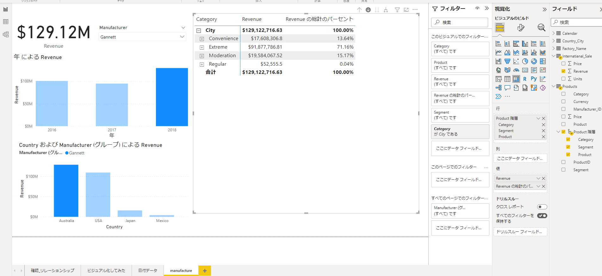

# 3. ビジュアライゼーション

# もくじ
- [3. ビジュアライゼーション](#3-ビジュアライゼーション)
- [もくじ](#もくじ)
- [1. フィルターの適応](#1-フィルターの適応)
- [2. グループ化](#2-グループ化)
- [3. クロスフィルター](#3-クロスフィルター)
- [4. 日付データを取り扱うとき](#4-日付データを取り扱うとき)
- [5. 数値データも見たいとき](#5-数値データも見たいとき)
- [6. DAXを使い新しいメジャーをつくる](#6-daxを使い新しいメジャーをつくる)
- [7. 条件付き書式を使う](#7-条件付き書式を使う)
- [🥔Tips](#tips)
  - [ホバーさせた値（ヒント）を表形式で見たいとき](#ホバーさせた値ヒントを表形式で見たいとき)
  - [ツリーマップの使い方](#ツリーマップの使い方)
  - [フィルターで複数条件絞りたいとき](#フィルターで複数条件絞りたいとき)

# 1. フィルターの適応

# 2. グループ化

以下のように「新しいグループの作成」からグループを作成できます。

グループ化したいものをCtrlを押下しつつ選択し、「グループ化」を押下してグループ化できます。

# 3. クロスフィルター

以下のようにクロスレポートを選択することで以下のようにデータを絞って確認することが出来ます。

データ分析時に有用です。

また、フィルターからページ単位でのフィルター設定も可能です。

あらかじめグループ化しておくことをお勧めします。

# 4. 日付データを取り扱うとき

日付データが入っている場合は、以下のように年・四半期・月・日で表示されてしまいます。

そのため、日付表示にしたい場合は、以下のようにDateトグルからDateを選択してください。

- Date選択後

# 5. 数値データも見たいとき

グラフビジュアルだけでなく数値データも同時に確認したいときはマトリクスを利用することをお勧めします。

以下のようにドリルダウンを利用してその項目のみ表示させることも出来ます。

- ドリルダウンで絞ったうえでフィルターで絞った時の例

なお、項目の並び替え（降順/昇順）については以下のように列クリックなどで出来るようになっています。

# 6. DAXを使い新しいメジャーをつくる

新しいメジャーを作成するにあたって、DAXを利用しする方法をここに記載します。

1. 右クリック > 新しいメジャー から新しいメジャーを作成

まずは以下のように、新しいメジャーを作成します。

1. DAX式を定義し反映させる

以下のようにDAX式を定義し、新しいメジャーを作成します。

DAX定義時にはExcelのようにコード保管されるため、操作はExcelと大差ありません。

候補で出ていたものをTabキーで反映させてください。

以下のように対策ねん成長率を確認するなども可能です。

また、以下のようにアイコンよりも背景色で見分ける方が見やすいためこちら利用するのがおススメです。

# 7. 条件付き書式を使う

以下のように条件付き書式を利用することでデータのビジュアル化が可能となります。

以下例では**vs.LastYear_Grouth%**について条件付き書式を適応させてます。

# 🥔Tips

## ホバーさせた値（ヒント）を表形式で見たいとき

以下のように、グラフ内で右クリック > 「テーブルとして表示」をクリックすることでホバーした際に出てきた値を表形式でも確認できるようになります。

また、「データポイントをテーブルとして表示」から以下のようにデータのエクスポート（csv形式）も行えます。

## ツリーマップの使い方

割合を見たい場合は、ツリーマップを利用するのがおすすめです。

## フィルターで複数条件絞りたいとき

以下のように、Ctrl を推しつつ選択することでそのフィルタでデータがどのようになっているか確認できるようになっています。

以下はAustraliaの2018年のSegment状態を確認したときの例です。

なお、ドリルダウン（グラフ右上の⇩マーククリックで利用開始）やクロスフィルターを利用することで詳細な分析も可能となります。

- Australia配下のCity単位で確認した際の例

