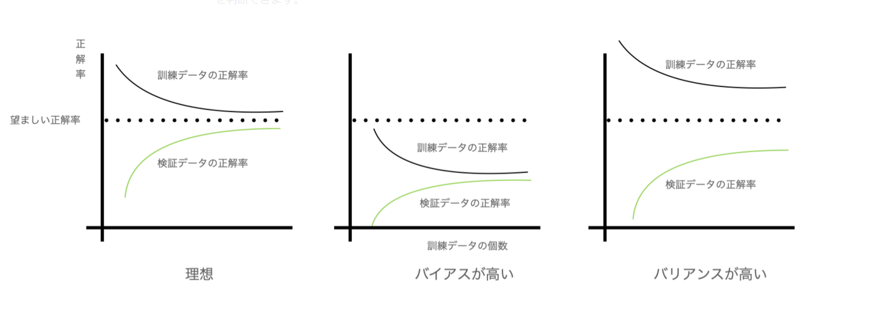

# 学習曲線
# もくじ
- [学習曲線](#学習曲線)
- [もくじ](#もくじ)
- [1. 学習曲線とは](#1-学習曲線とは)
- [2. 学習曲線の使いどころ](#2-学習曲線の使いどころ)
- [99. 参考](#99-参考)

# 1. 学習曲線とは

学習曲線は訓練と検証データのそれぞれの正解率をプロットした線のことです。

# 2. 学習曲線の使いどころ

モデルの自由度や、パラメータが多すぎたりすると、モデルが複雑になりやすく訓練データに過剰に適合してしまう問題が発生します。

そこで、その対処法として、「データをもっと集める」というアプローチがありますが、収集にかかるコストなども含めるとあまり現実的な対処とはいえません。

そこで、**学習曲線**を使います。

これにより、以下を判断できます。

- ① **モデルのBias（＝ゆらぎ） やVariance（＝ばらつき）が高いかどうか**
- ② **データを追加回収することが良いアプローチといえるかどうか**

②について説明すると、学習曲線をみて、データの個数不足により学習ができてないのか、そもそも頭打ちなのか？を判断できます。

- 一般的な学習曲線の例

真ん中のバイアスが高いということは過小学習が起こっています。つまりパラメータの個数が不足していたりするため、特徴量の生成・追加などが対処法としてあります。

右はバリアンスが高く、過学習をしています。特徴量の個数削減や、正則化による対処などがあります。

このように、学習曲線を利用することで検証データと訓練データの評価を容易に出来るようになります。

# 99. 参考

[Pythonで機械学習②〜学習曲線・検証曲線やらなんやら〜｜ミニマリズムを意識しているやつの日常｜note](https://note.com/yutomini/n/n3c7d431ab544)

[Pythonで学習曲線と検証曲線を描く - Qiita](https://qiita.com/kogay/items/a0284c49ddeb38bf0c3f)