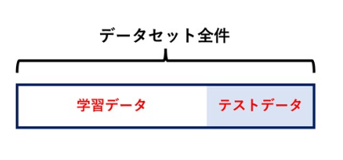

# k-分割交差検証
# もくじ
- [k-分割交差検証](#k-分割交差検証)
- [もくじ](#もくじ)
- [1. k-分割交差検証とは](#1-k-分割交差検証とは)
- [99. 参考](#99-参考)

# 1. k-分割交差検証とは

k-分割交差検証とは、データセットの分割を複数のパターンで行い、それぞれで実験（学習とテスト）を行う方法です。

一般的に機械学習モデルのテストでは、任意のデータに対して予測を行い、その予測がどの程度正しいかを調べます。

テストを行う際、モデルの学習に使用したデータは使用することができません。

何故ならモデルは学習データに対して正しい予測ができるように学習を進めるため、学習の完了したモデルに学習データを入力すればほぼ必ず正しい予測が得られるからです。

既に答えを知っている問題でテストをしても適切な性能評価は行えません。

そのため、機械学習モデルを構築する際は、**元のデータセットを学習用とテスト用に分割して使用する**
のが一般的です。

複数のパターンで学習とテストを行うことでより正確な性能評価が可能です。

# 99. 参考

[https://schlaf.ltd/programming/python/scikit-learn-k-fold-cross-validation/](https://schlaf.ltd/programming/python/scikit-learn-k-fold-cross-validation/)

層化についてはこれ

[Python: 層化抽出法を使ったK-分割交差検証 (Stratified K-Fold CV) - CUBE SUGAR CONTAINER](https://blog.amedama.jp/entry/2018/08/25/174530)

層化抽出法

[https://kotodori.jp/user-research/analytics/stratified-extraction/](https://kotodori.jp/user-research/analytics/stratified-extraction/)