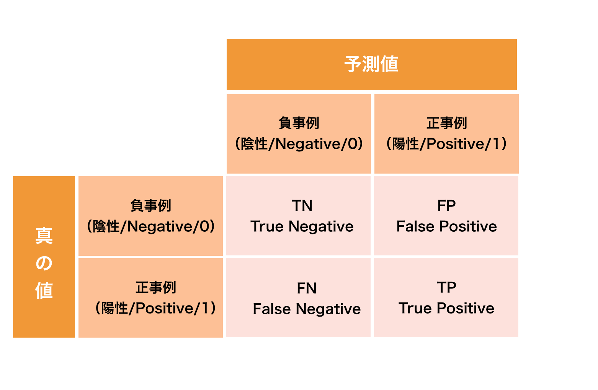

# 混同行列
# もくじ
- [混同行列](#混同行列)
- [もくじ](#もくじ)
- [1. 混同行列](#1-混同行列)
  - [1.1. 混同行列とは](#11-混同行列とは)
  - [1.2. 混同行列の評価](#12-混同行列の評価)
    - [1.2.1. ****正解率・正確さ(Accuracy)****](#121-正解率正確さaccuracy)
    - [1.2.2. ****精度・適合率(Precision)****](#122-精度適合率precision)
    - [1.2.3. ****再現率・真陽性率(Recall, True Positive Rate)****](#123-再現率真陽性率recall-true-positive-rate)
    - [1.2.4. ****真陰性率(True Negative Rate)****](#124-真陰性率true-negative-rate)
    - [1.2.5. ****偽陰性率(False Negative Rate)****](#125-偽陰性率false-negative-rate)
    - [1.2.6. ****偽陽性率(False Positive Rate)****](#126-偽陽性率false-positive-rate)
- [99. 参考](#99-参考)

# 1. 混同行列

## 1.1. 混同行列とは

混同行列(Confusion Matrix) とは2 値分類問題で出力されたクラス分類の結果をまとめたマトリックス(行列≒表)のことで、2 値分類機械学習モデルの性能を測る指標として使われます。

分類結果を表形式にまとめることでどのラベルを正しく分類でき、どのラベルを誤って分類したかを調べることが出来ます。

混同行列に登場する用語として、以下4つがあります。

- True Positive(TP) ・・・真の値が正事例のものに対して、正事例と予測したもの (真陽性)
- False Positive(FP) ・・・真の値が負事例のものに対して、正事例と予測したもの(偽陽性)
- False Negative(FN) ・・・真の値が正事例のものに対して、負事例と予測したもの(偽陰性)
- True Negative(TN) ・・・真の値が負事例のものに対して、負事例と予測したもの(真陰性)

このTP、FP、FN、TNの値を可視化したものが混同行列です。

2値分類の機械学習例と混同行列のかかわりについては、[https://qiita.com/TsutomuNakamura/items/a1a6a02cb9bb0dcbb37f](https://qiita.com/TsutomuNakamura/items/a1a6a02cb9bb0dcbb37f)をご参考ください。

## 1.2. 混同行列の評価

### 1.2.1. ****正解率・正確さ(Accuracy)****

全体のデータの中で正しく分類できたTP とTNがどれだけあるかという指標です。高いほど性能が良いとされます。

- 正解率（ACC）

$$
ACC(Accuracy)=\frac{TP+TN}{TP+FP+FN+TN}=1-ERR
$$

- 誤分類率（ERR）

$$
ERR=\frac{FP+FN}{FP+FN+TP+TN}
$$

### 1.2.2. ****精度・適合率(Precision)****

Positive と分類されたデータ(TP + FP)の中で実際にPositiveだったデータ(TP)数の割合です。

この値が高いほど性能が良く、間違った分類が少ないということを意味します。

- 適合率（PRE）

$$
PRE(Presision)=\frac{TP}{TP+FP}
$$

### 1.2.3. ****再現率・真陽性率(Recall, True Positive Rate)****

取りこぼし無くPositive なデータを正しくPositiveと推測できているかどうかを表す指標です。

この値が高いほど性能がよく、間違ったPositiveの判断が少ないということ、別の言い方をすれば本来Positiveと推測すべき全データの内、どれほど回収できたかということを表しています。

- 再現率（REC）

$$
REC=TPR=\frac{TP}{P}=\frac{TP}{FN+TP}
$$

### 1.2.4. ****真陰性率(True Negative Rate)****

取りこぼし無くNegative なデータを正しくNegativeと推測できているかどうか表す指標です。

この値が高いほど性能がよく、間違ったNegativeの判断が少ないということを表しています。

本来Negativeと推測すべき全データの内、どれほど回収できたかという指標とも言えます。

$$
True Negative Rate=\frac{TN}{FP+TN}
$$

### 1.2.5. ****偽陰性率(False Negative Rate)****

実際にはNegative であるサンプルの内、Positiveであると判定されたクラスの割合です。

この値が**低いほど**性能が良いとされます。

$$
False Positive Rate=\frac{FP}{FP+TN}
$$

### 1.2.6. ****偽陽性率(False Positive Rate)****

実際にはNegative であるサンプルの内、Positiveであると判定されたクラスの割合です。

この値が**低いほど**性能が良いとされます。

$$
False Positive Rate=\frac{FP}{FP+TN}
$$

# 99. 参考

- [https://qiita.com/TsutomuNakamura/items/a1a6a02cb9bb0dcbb37f](https://qiita.com/TsutomuNakamura/items/a1a6a02cb9bb0dcbb37f)

[混同行列(Confusion Matrix) とは 〜 2 値分類の機械学習のクラス分類について - Qiita](https://qiita.com/TsutomuNakamura/items/a1a6a02cb9bb0dcbb37f)

- [https://aiacademy.jp/media/?p=2442](https://aiacademy.jp/media/?p=2442)

[https://aiacademy.jp/media/?p=2442](https://aiacademy.jp/media/?p=2442)