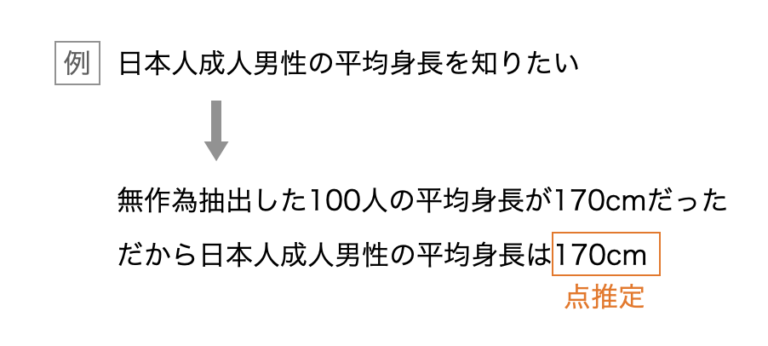
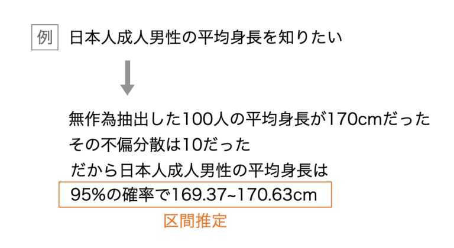
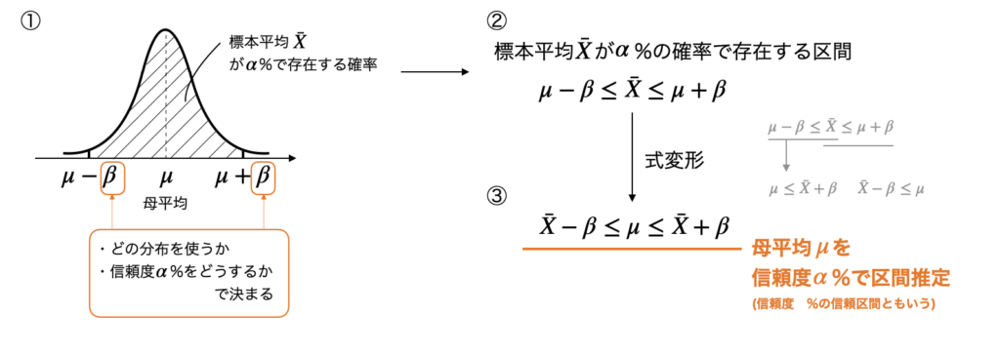
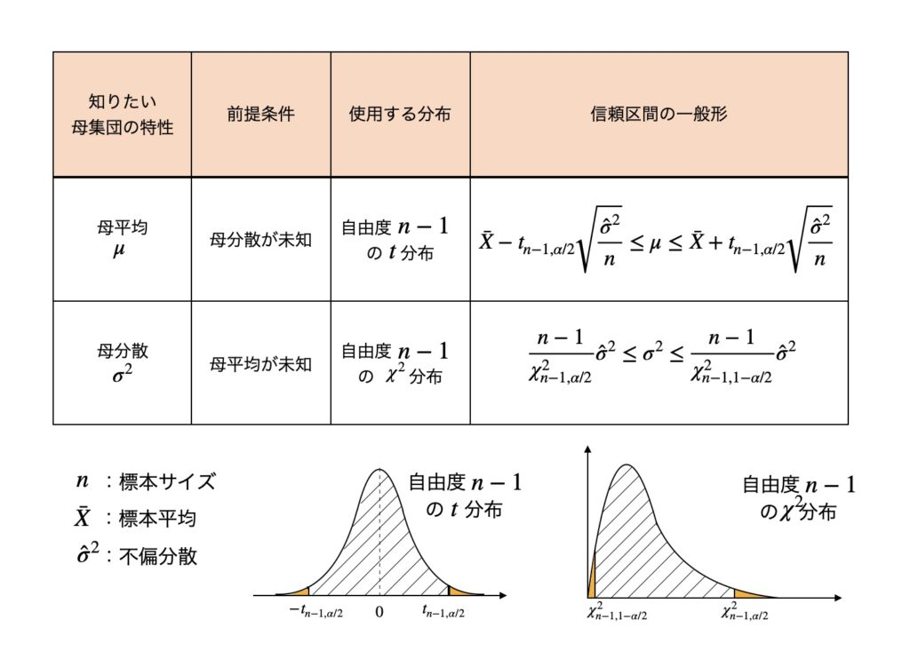

# 1. 点推定と区間推定

# もくじ
- [1. 点推定と区間推定](#1-点推定と区間推定)
- [もくじ](#もくじ)
- [1. 点推定](#1-点推定)
- [2. 区間推定](#2-区間推定)
- [3. 区間推定の一般形](#3-区間推定の一般形)
- [99. 参考](#99-参考)

# 1. 点推定

点推定とは、母平均や母分散など、母集団のパラメーターを**一つの値で**推定する方法です。

点推定には、このような平均値のほかに、最頻値、中央値、最尤推定などが用いられます。

# 2. 区間推定

対して、区間推定とは、平均値などの統計量の母数をある程度の**幅を持たせて推定する**方法です。

区間推定は自分で勝手に範囲を指定するのではなく、確率分布を使って求めます。

**区間推定の原理**

1. 母集団から抽出した標本の平均（=標本平均）は、正規分布のような釣鐘状の確率分布を持つとする。（※）
    1. ※ 一般的に、大数の法則により正規分布に寄るとされている分布は多いものも、このように分布しないものもある。データの構造を捉えつつ適切に区間推定を行うこと。
2. このとき、標本平均$\bar{X}$が存在する確率を$\alpha$（信頼度という）としそれを決め、標本平均が$\alpha$%の確率で存在する区間を決める。
3. 上2.を数式化し、母平均$\mu$に関する式へ変形する。
4. 母平均$\mu$に関して、信頼度$\alpha$%の区間推定の式(信頼区間)が求まる。
5. これをもとに第一種の過誤や第二種の過誤について見ていくなどする。

この$\alpha$には、$95 ％$や$90 ％$といった値がよく使われます。もちろんですが、その値確率で平均値が存在することを表現しています。

ただし、残りの$5 ％$の確率で外れていることも表現しているので第一種の過誤など注意が必要です。

# 3. 区間推定の一般形

区間推定でよく使用する一般形についてここで触れます。

求めたいものが母平均か母分散で使用する分布と信頼区間が変わってきます。

前提条件で母分散・母平均があらかじめわかっている場合、使用する分布と信頼区間は上図で示したものとは変わりますが、実際にはそのようなケースはほぼないためここでは触れていません。

また、母平均$\mu$について「$n$が大きくなると正規分布に近似できる（=大数の法則）のでt分布は使わない」という記載する教科書もあるようですが、あくまで近似できるのであるので基本的にはt分布で計算します。

計算スピードやt分布だけでは困るような場合についてなどそのような状況では大数の法則に従い正規分布で考えるのが良いです。

# 99. 参考

- [https://okigaru-data-science.com/about-estimation/](https://okigaru-data-science.com/about-estimation/)

- [18-1. 点推定とは](https://bellcurve.jp/statistics/course/8608.html#:~:text=%E7%82%B9%E6%8E%A8%E5%AE%9A%EF%BC%9A%E5%B9%B3%E5%9D%87%E5%80%A4%E3%81%AA%E3%81%A9,%E3%81%A7%E3%82%82%E3%81%A3%E3%81%A6%E6%8E%A8%E5%AE%9A%E3%81%99%E3%82%8B%E3%81%93%E3%81%A8%E3%80%82)