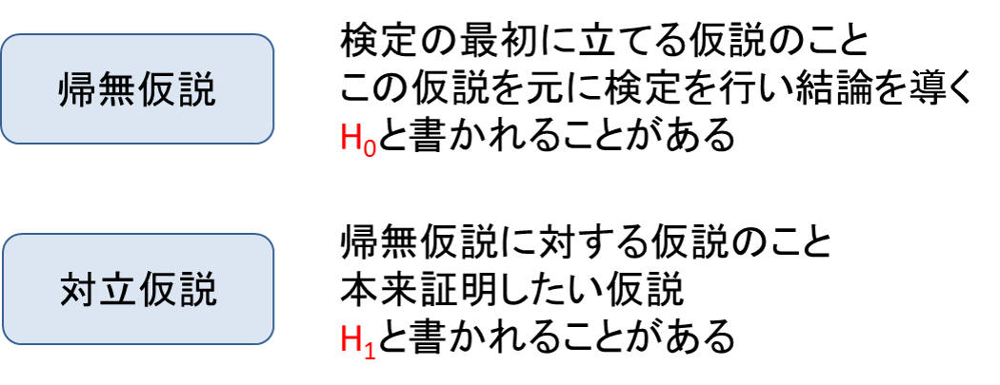
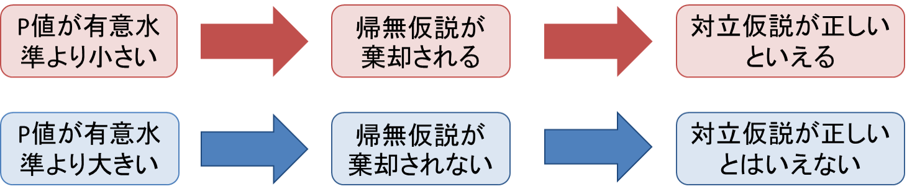

# 2. 帰無仮説と対立仮説

# もくじ
- [2. 帰無仮説と対立仮説](#2-帰無仮説と対立仮説)
- [もくじ](#もくじ)
- [1. 帰無仮説と対立仮説](#1-帰無仮説と対立仮説)
- [2. 【例】コインの不正を考える](#2-例コインの不正を考える)
  - [2.1. 導入](#21-導入)
  - [2.2. 帰無仮説と対立仮説の設定](#22-帰無仮説と対立仮説の設定)
  - [2.3. 検定統計量からP値を導出](#23-検定統計量からp値を導出)
  - [2.4. 有意水準と棄却域を考える](#24-有意水準と棄却域を考える)
- [99. 参考](#99-参考)

# 1. 帰無仮説と対立仮説

検定を行うため立てる仮説のことを**帰無仮説**といいます。

より広義に表現すると、**「有意差がない」**という仮説です。「無に帰すことも予定している」仮説であり、通常は否定したい仮説を設定します。

反対に、帰無仮説に対する仮説のことを**対立仮説**といいます。

一般に**「有意差がある」**という仮説を表しており、帰無仮説が間違っていると確信されたとき（棄却されたとき）に採用されます。

また、これらの仮説に用いられる$H$は「hypothesis」の頭文字です。

# 2. 【例】コインの不正を考える

## 2.1. 導入

これらを紹介するためにコインに不正が疑われる例で考えていきます。

50%の確率で表が出る普通のコインと、10%の確率でしか表が出ない不正なコインがどちらも2枚ずつあり、「普通のコインだよ」と言ってどちらかのコイン2枚組を渡されたとします。渡された2枚のコインを投げる試行を2回繰り返したところ、2回ともすべて裏でした。

「“滅多にない”と判断する確率の基準」を10%とした場合、この結果を元に検定を行うと「渡されたコインは普通のコインであるとは考えられない」という結論になります。すなわち、「渡されたコインは普通のコイン」が正しいと仮定したとき、観測した事象が起こる確率は6.25%であり、6.25%は10%より小さいためです。

## 2.2. 帰無仮説と対立仮説の設定

ここで、「コインが普通のものか不正のものか」を検証するために、仮説を次のように設定しています。

- 帰無仮説$H_0$：「渡されたのは普通のコインである」
- 対立仮説$H_1$：「渡されたのは不正なコインである」

## 2.3. 検定統計量からP値を導出

検定統計量から算出された**P値**を元に検定の結論を導きます。

- 検定統計量
    - 帰無仮説が正しいと仮定したときに、**観測した事象よりも稀なことが起こる確率**を計算するための値です。簡単に「統計量」とよばれる場合もあります。
- P値
    - 帰無仮説が正しいとした仮定とき、**観測した事象よりも極端なことが起こる確率**のことです。「観測した事象よりも極端な事象が起こる確率」であることから、これは累積確率となっています。コインの問題では、「6.25%」がP値になります。

P値はその大小を比較するものではないため、例えばP値が小さいほど差が大きいといったことを意味するわけではありません。ある事象が起こる「確率」を表すものであり、あくまでも事前に設定した有意水準（次項で説明）と比較するためのものにすぎません。

## 2.4. 有意水準と棄却域を考える

帰無仮説を棄却する基準を有意水準といいます。

- 有意水準
    - **帰無仮説を棄却するための基準となる確率**です。
    - この数値は**検定を行う前に**決めておく必要があります。危険率と呼ばれることもあります。
    - コインの問題では、「“滅多にない”と判断する確率の基準」がこの有意水準です。
- 棄却
    - **仮説を捨てること**です。
    - P値が有意水準よりも小さい時は、帰無仮説を捨て対立仮説を採択します。すなわち、**対立仮説が正しい**と結論付けられます。
    - コインの問題では、基準である「10％」と観測した事象の起こる確率「6.25％」を比べた結果、「6.25％」が「10%」より小さいことが分かりました。このとき、帰無仮説「渡されたコインは普通のものである」を「棄却」し、対立仮説「渡されたのは不正なコインである」を採択します。

**P値が有意水準よりも大きい時は、帰無仮説は棄却されません。**これは帰無仮説が正しいと結論づけて良いということを意味しません。検定で用いられる方法は「背理法」なので、「帰無仮説が棄却されない」ことは「帰無仮説が正しいと結論づけて良い」ということにはなりません。

この場合、**「対立仮説が正しいと結論づけることはできない」**ということしか言えないので注意が必要です。

# 99. 参考

- [https://bellcurve.jp/statistics/course/9311.html](https://bellcurve.jp/statistics/course/9311.html)

- [有意差とは？帰無仮説／対立仮説の考え方とビジネスでの活用を解説](https://gmo-research.jp/research-column/significant-difference)

- [https://ai-trend.jp/basic-study/hypothesis-testing/about-2/](https://ai-trend.jp/basic-study/hypothesis-testing/about-2/)