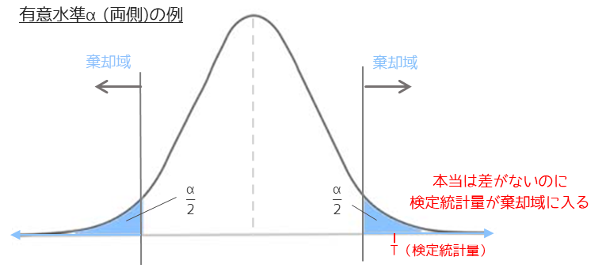
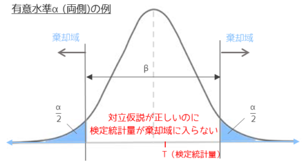

# 3. 第一種/第二種の過誤とp値・有意水準の関係

# もくじ
- [3. 第一種/第二種の過誤とp値・有意水準の関係](#3-第一種第二種の過誤とp値有意水準の関係)
- [もくじ](#もくじ)
- [1. 第一種の過誤**（Type Ⅰ error）**](#1-第一種の過誤type-ⅰ-error)
- [2. 第二種の過誤**（Type Ⅱ error）**](#2-第二種の過誤type-ⅱ-error)
- [3. 第一種/第二種のトレードオフ](#3-第一種第二種のトレードオフ)
- [99. 参考](#99-参考)

# 1. 第一種の過誤**（Type Ⅰ error）**

第一種の過誤とは、仮説検定において本当は差がないのに「差がある」と判定してしまうことです。

第一種の過誤が起きる確率を危険率$\alpha$で表します。$\alpha$は仮説検定における有意水準αと同じ値になります。

また、誤って対立仮説を選択することを偽陽性とも言います。

具体例としては「新薬に効果があるか」という検定を行った場合、本当は効果がない場合に「新薬に効果がある」という間違った判定することになります。

# 2. 第二種の過誤**（Type Ⅱ error）**

第二種の過誤とは、仮説検定において本当は差があるのに「差がない」と判定してしまうことです。

第二種の過誤が起きる確率はβで表します。危険率$\alpha$と$\beta$はトレードオフの関係にあり、$\beta$が大きくなると危険率$\alpha$が小さくなります。

本当に差がある場合に正しく「差がある」と判定する検定の能力を検出力と言います。検出力は第二種の過誤が起きない確率であるため$1-\beta$で求められます。

また、誤って帰無仮説を選択することを偽陰性と言います。

「新薬に効果があるか」という検定を行った場合、本当は効果がある場合に「新薬に効果がない」という間違った判定することになります。

# 3. 第一種/第二種のトレードオフ

第一種の過誤と第二種の過誤が起きる確率はどちらも小さくなるに越したことはありません。

しかし、既に説明したように危険率$\alpha$と$\beta$はトレードオフの関係にあるため**両方とも小さくすることは不可能**です。

社会的には第一種の過誤を犯す方が深刻な問題となることが多いです。

新薬の例では本当は効果がないことに対して効果があるという判定から臨床で使われる方が問題となります。

仮説検定では**事前に許容できる危険率$\alpha$（=有意水準）を定めてから、**その中で最も検出力$(1-\beta)$が高い検定方法を選択するというのが正しい手順になります。

# 99. 参考

- [https://corvus-window.com/whats_type1_and_type2_error/](https://corvus-window.com/whats_type1_and_type2_error/)

- [23-4. 第1種の過誤と第2種の過誤](https://bellcurve.jp/statistics/course/9315.html)