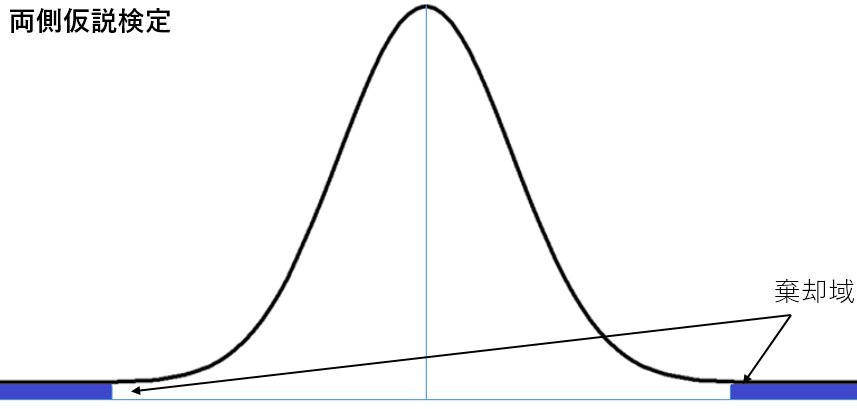
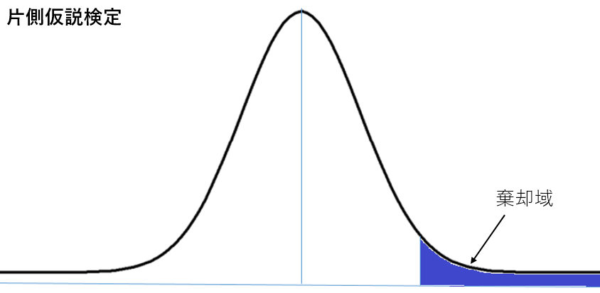
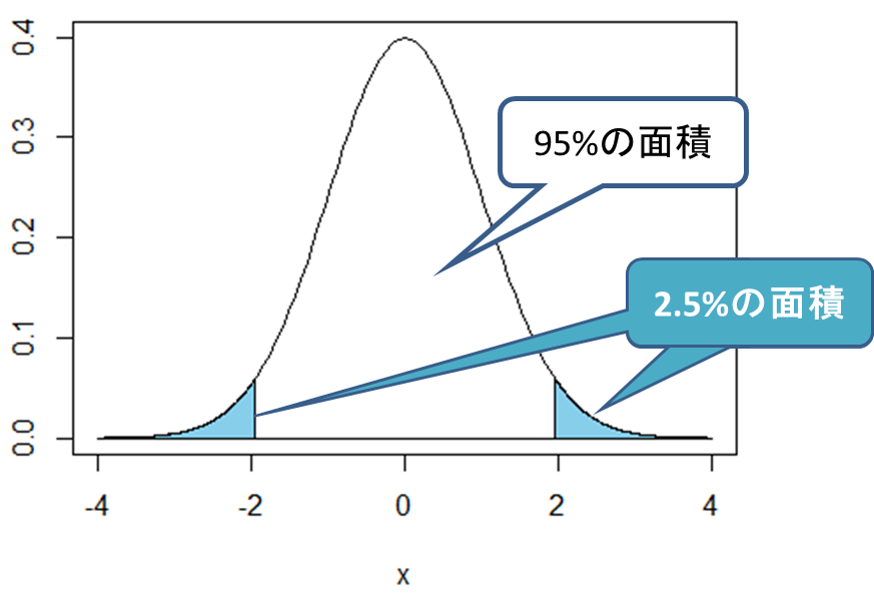
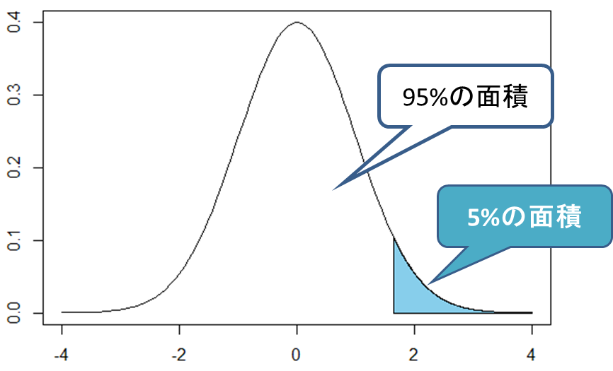
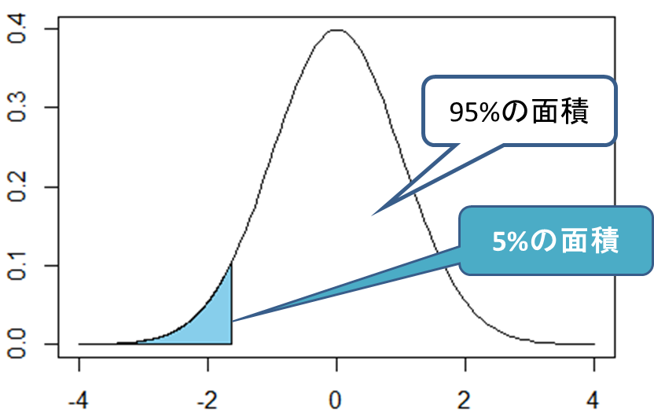

# 4. 片側検定と両側検定

# もくじ
- [4. 片側検定と両側検定](#4-片側検定と両側検定)
- [もくじ](#もくじ)
- [1. 両側検定（**two sided test）**](#1-両側検定two-sided-test)
- [2. 片側検定（one sided test）](#2-片側検定one-sided-test)
- [3. 利用例](#3-利用例)
- [99. 参考](#99-参考)

# 1. 両側検定（**two sided test）**

両側対立仮説に対する、仮説検定を両側検定といいます。

例えば、帰無仮説*[Math Processing Error]*に対して、*[Math Processing Error]*を両側対立仮説といいます。この対立仮説を用いた検定が両側検定です。

正規分布やt分布を用いた検定の場合、棄却域は以下のようになります。

# 2. 片側検定（one sided test）

片側対立仮説に対する、仮説検定を片側検定といいます。

例えば、帰無仮説*[Math Processing Error]*に対して、*[Math Processing Error]*や*[Math Processing Error]*を片側対立仮説とよびます。この対立仮説を用いた検定が片側検定です。

正規分布やt分布を用いた検定の場合、棄却域は以下のようになります。

# 3. 利用例

薬Aに含まれるある成分Bについての分析を行うことを考えます。

成分Bの含有量を調べるため、生産された薬Aの中からランダムに25粒を抜き取り、成分Bの量を測定しました。その結果平均が$\bar{x}=98 mg$、不偏分散$s^2=1$がでした。

この問題では帰無仮説を「薬A中の成分Bの含有量は100mgである」としたときに、3通りの対立仮説$H_1$が考えられます。

1. 薬A中の成分Bの含有量は100mgではない
2. 薬A中の成分Bの含有量は100mgより多い
3. 薬A中の成分Bの含有量は100mgより少ない

1.は成分Bの含有量が**100mgかどうか**を調べるための検定です。

2.は成分Bの含有量が**100mgより多いかどうか**を調べるための検定です。この場合、成分Bの含有量が100mgより少ないかどうかについては考慮しません。

3.は成分Bの含有量が**100mgより少ないかどうか**を調べるための検定です。この場合、成分Bの含有量が100mgより多いかどうかについては考慮しません。

この場合、1のような検定方法を「両側検定」、2と3のような検定方法を「片側検定」といいます。有意水準を5%とした場合、両側検定と片側検定の有意水準を図示すると以下のようになります。

- ****両側検定（対立仮説：薬A中の成分Bの含有量は100mgではない）****

- ****片側検定の図（対立仮説：薬A中の成分Bの含有量は100mgより多い）****

- ****片側検定の図（対立仮説：薬A中の成分Bの含有量は100mgより少ない）****

両側検定では棄却域が分布の両端にあります。つまり、成分Bの含有量が100mgよりも極端に大きくなった時と小さくなったときに帰無仮説$H_0$は棄却されます。

一方、片側検定では棄却域が分布の片方にしかありません。つまり、成分Bの含有量が100mgよりも極端に多い（もしくは少ない）場合にだけ帰無仮説$H_0$は棄却されます。

逆に成分Bの含有量が100mよりどれだけ少なく（もしくは多く）なっても、帰無仮説$H_0$は棄却されません。

実験の目的に応じて利用する検定方法を考える必要があります。

# 99. 参考

- [https://ai-trend.jp/basic-study/hypothesis-testing/sided-test/](https://ai-trend.jp/basic-study/hypothesis-testing/sided-test/)

- [23-6. 両側検定と片側検定](https://bellcurve.jp/statistics/course/9319.html)