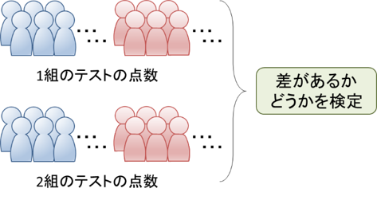

# 5. t検定とz検定の選び方

# もくじ
- [5. t検定とz検定の選び方](#5-t検定とz検定の選び方)
- [もくじ](#もくじ)
- [1. t検定](#1-t検定)
  - [1.1. 概要](#11-概要)
  - [1.2. 検定の流れ](#12-検定の流れ)
  - [1.3. ２標本検定](#13-２標本検定)
    - [1.3.1. 概要](#131-概要)
    - [1.3.2. 対応がない場合の2標本t検定の方法（=t検定）](#132-対応がない場合の2標本t検定の方法t検定)
    - [1.3.3. 対応がある場合の2標本t検定の方法](#133-対応がある場合の2標本t検定の方法)
- [2. z検定](#2-z検定)
- [99. 参考](#99-参考)

# 1. t検定

## 1.1. 概要

t検定とは、上述した仮説検定で用いられる方法のひとつです。「t分布」を使った検定は **「t検定」** と総称されています。

t分布は「最も一般的な分布」である **「正規分布」** の母集団に関して、データの散らばり方「母分散」がわからない場合に用いられます。母分散がわかれば母集団の平均である「母平均」もわかるため、大量の要素で構成された標本のデータを分析するために頻繁に用いられる分布です。

- 参考：[https://bellcurve.jp/statistics/course/9427.html](https://bellcurve.jp/statistics/course/9427.html)

## 1.2. 検定の流れ

検定の流れは以下の通りです。両側検定・片側検定で触れたような流れとほとんど変わりません。

1. **「帰無仮説」を立てる**

帰無仮説$H_0$を設定します。帰無仮説なので、「知りたい事実と反対の主張」と帰無仮説として設定することになります。

2. **「有意水準」を設定する**

帰無仮説を棄却する判断基準となる確率として**「有意水準」**を設定します。

特に決まりはないですが、一般的には$0.05（5 ％）$を用います。

3. **t値を算出**

「比較するデータに意味がある差があるかどうか」を示す値「t値」を算出します（後述します）。

4. **p値を算出**

t値が算出されると、「得られたデータの希少性」を示す**p値**が定まります。

**t分布表**を用いると算出できますが、統計ソフトを使うのが一般的です。

5. **p値と有意水準を比較**

算出されたp値と事前に決めておいた有意水準を比較します。

有意水準はデータの希少性を判断する基準のため、有意水準よりp値が小さければそのデータは極めて起こりづらいと言えます。

6. **帰無仮説を棄却するか検討**

p値が棄却域を出ていれば帰無仮説を棄却します。

帰無仮説は「示した事象と反対の事実」なので、帰無仮説が棄却できれば示したい結果が示せたことを意味します。

以上が大まかな流れです。以降で具体例を交えてt検定について触れていきます。

## 1.3. ２標本検定

### 1.3.1. 概要

2つの独立した母集団があり、それぞれの母集団から抽出した標本の平均に差があるかどうかを検定することを**「2標本t検定」**といいます。

例えば、ある学校で行ったテストの点数が1組と2組とで差があるかどうかの検定や、被験者に対してある薬を投与する前後で血圧がどう変化したかの検定に使います。ただし、2つのデータが「対応のあるデータ」か「対応のないデータ」かによって検定統計量の算出方法が異なります。

### 1.3.2. 対応がない場合の2標本t検定の方法（=t検定）

異なる対象から抽出された2つの標本は「対応のないデータ（対応なし）」です。 例えば、1組と2組の生徒は異なるので、それぞれのクラスから抽出された2つの標本は「対応のないデータ」となります。

対応がない場合の2標本t検定では、2つの標本に対応がないことを加味した検定統計量を用いる必要があります。

母分散が分からない場合、1群目の標本平均$\bar{x_1}$を、母平均$\mu_1$を、サンプルサイズ$n_1$を、2群目の標本平均$\bar{x_2}$を、母平均$\mu_2$を、サンプルサイズ$n_2$をとしたときに、次の式から算出される統計量$t$を使います。検定で用いるのは自由度$(n_1+n_2-2)$のt分布です。

$$
t = \frac{\bar{x_1}-\bar{x_2}-(\mu_1-\mu_2)}{\sqrt{s^2(\frac{1}{n_1}+\frac{1}{n_2})}} = \frac{\bar{x_1}-\bar{x_2}-(\mu_1-\mu_2)}{s\sqrt{\frac{1}{n_1}+\frac{1}{n_2}}}
$$

ただし、帰無仮説である「母平均が等しい」という仮説が正しいとすると、$\mu_1-\mu_2=0$になります。したがって、

$$
t = \frac{\bar{x_1}-\bar{x_2}}{\sqrt{s^2(\frac{1}{n_1}+\frac{1}{n_2})}} = \frac{\bar{x_1}-\bar{x_2}}{s\sqrt{\frac{1}{n_1}+\frac{1}{n_2}}}
$$

となります。

この式には2つの標本の不偏分散を用いて算出した**「プールした分散」**を使っています。プールした分散とは、2つの標本の不偏分散を1つにまとめたもので、1群目の不偏分散を$s^2_1$、2群目の不偏分散を$s^2_2$とした場合、下の式から求めることができます。

2つの標本のデータを1つにまとめることで、分散の推定精度を高めることができます。

$$
s^2 = \frac{(n_1-1)s^2_1+(n_2-1)s^2_2}{n_1+n_2-2}
$$

あとはここで得られたt値からt分布表をもとにp値を導出し、p値と有意水準を比較し帰無仮説$H_0$を棄却するか検討します。

流れとしては両側・片側検定で来なった流れとほぼ同じです。

### 1.3.3. 対応がある場合の2標本t検定の方法

一方、同一の対象から抽出された「対」となる2つの標本は「対応のあるデータ（対応あり）」です。

例えば、数人の被験者に対して投薬実験を行った場合に、投薬前後で得られる同一被験者由来の対となる標本は「対応のあるデータ」となります。

対応がある場合の2標本t検定では、「対応のあるデータの差」を用いて検定を行います。差を用いると実質は1標本の検定となるので、**母平均に対して**両側・片側での検定と同様に行います。

帰無仮説$H_0$は「対応のあるデータの差の平均は0である」となります。

# 2. z検定

z検定とは、母分散が既知の場合に、2つのデータの平均値に差があるかどうかを検定する場合に使う検定です。

ここでいうzとは、標準正規化する際に利用するzのことを表しています。

$$
z=\frac{μ-μ_0}{\sqrt{\frac{\sigma^2}{n}}}
$$

いわば、両側検定・片側検定で触れた正規分布による検定で実施していることを変わりません。

母分散が既知である状況は現実的には無いため、z検定を使う機会は殆どありません。

# 99. 参考

- [24-3. 2標本t検定とは](https://bellcurve.jp/statistics/course/9427.html)

- [統計の中でも最重要分野のひとつ、t検定について徹底...｜Udemy メディア](https://udemy.benesse.co.jp/data-science/data-analysis/t-test_statistics.html)

- [2-1. 分析ツール　t検定・z検定](https://bellcurve.jp/statistics/course/23310.html#q6)