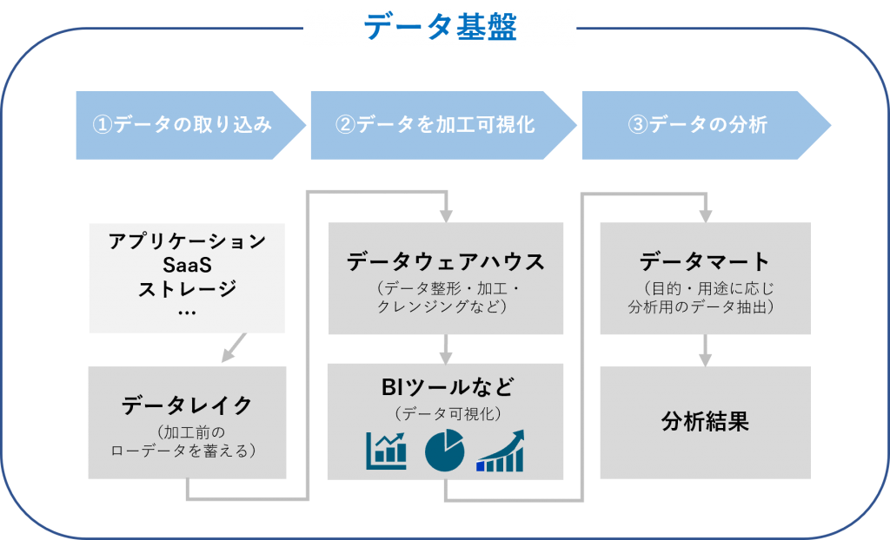
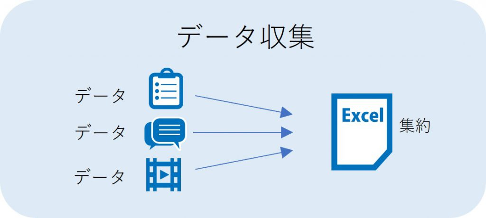
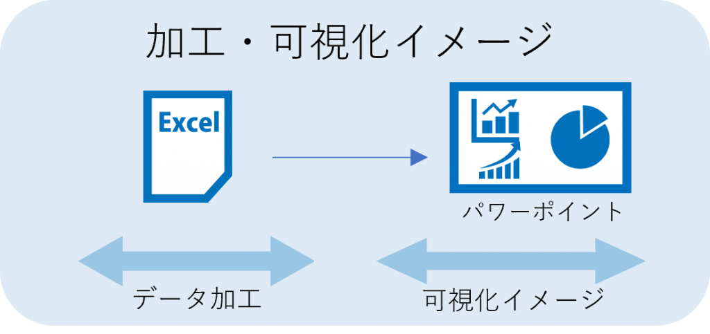
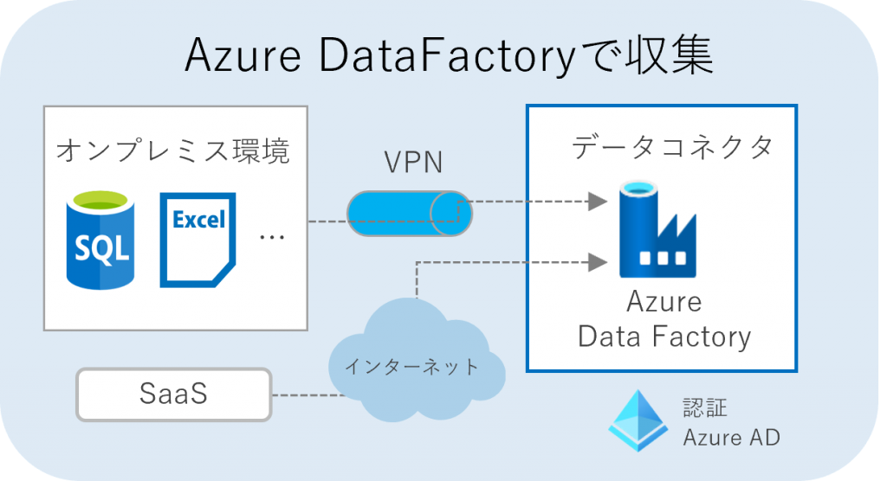
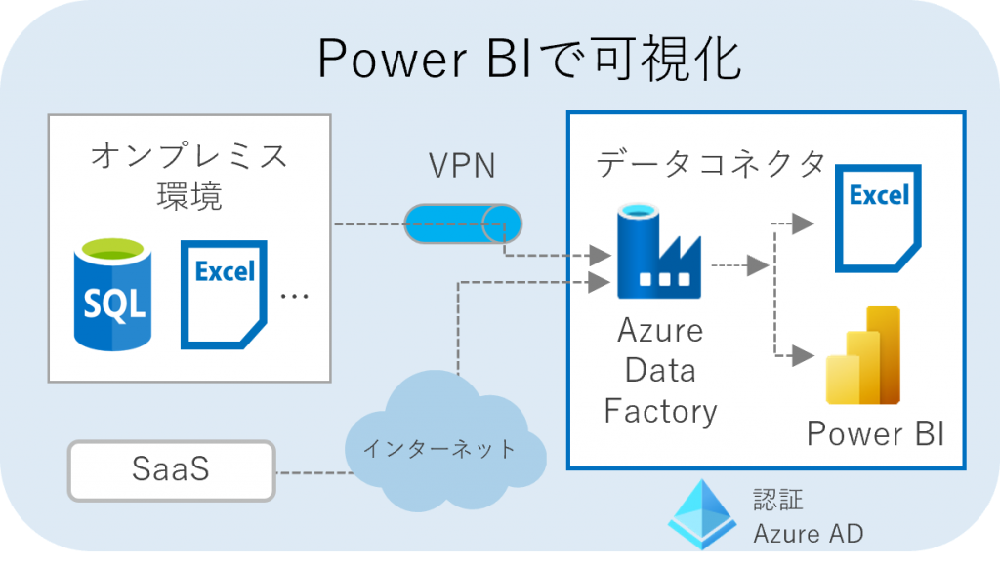
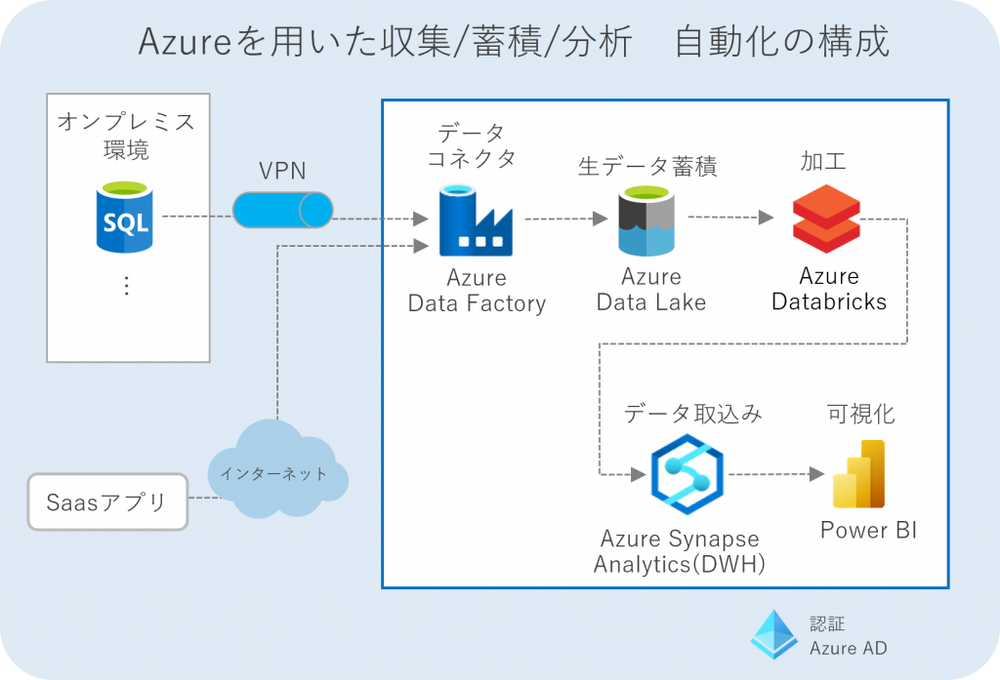
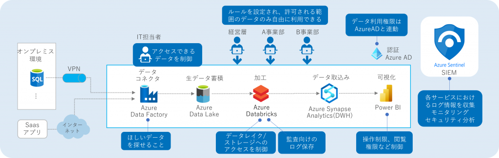

# 3. データ分析基盤として利用するために

# 1. データ分析基盤構築する上で重要なこと

## 1.1. IT担当者の視点

社内でデータ活用を成功させるための体制や仕組みを考えた時、IT 担当者が認知しておかないと行けないことについて触れます。IT 担当者は主にデータ活用を考える経営層や事業部/ユーザ部門に、データを収集、加工・可視化して提供する役割を担うことが考えられます。その際に、把握しておくべきこととして、下記の 4 つのポイントが挙げられます。

1. **データ分析により得られるメリットを把握する**
2. **データ分析の「目的」を、経営層、事業部と共有・合意する**
3. **分析に活用できるでデータを特定できる**
4. **データの「可触性」「信頼性」「保守性」「機密性」について社内で先導する**

特にデータは貴重な資源であるだけに IT 担当者は利便性のみならず、セキュリティ面や統制が効いたデータ利用など、ガバナンスの観点をもつことも求められます。このように、データを確実に管理することから、安全かつ便利に活用してもらうための基盤を整えることが重要な役割といえます。

## 1.2. データ基盤に求められる3つの要素

データ基盤を構成する要素としては、データ分析のプロセスに対応する次の 3 つの要素が考えられます。

**（1）データの取り込み**

オンプレミス、クラウド上のアプリケーションやデータベース、ストレージなどに散在するデータを収集し保存します。

- 活用する Azure サービス
    - [Azure DataFactory](https://cloud.nissho-ele.co.jp/product/azure-data-factory/)
    - Azure DataLake Storage

**（2）データを加工可視化**

ローデータを分析しやすいように整形、加工、クレンジングします。加工したデータはグラフ化するなど可視化されます。

- 活用する Azure サービス
    - Azure Databricks
    - Azure Synapse Analytics
    - Azure DataLake Analytics
    - [Power BI](https://cloud.nissho-ele.co.jp/product/powerbi/)
    

**（3）データ分析とガバナンス**

目的に合った結果が出せるよう分析手法を定めて、分析ツールを活用するなどして分析結果を導き出します。

- 活用する Azure サービス
    - Azure Machine Learning
    - [Azure AD](https://cloud.nissho-ele.co.jp/product/azure-active-directory/)
    - Azure Sentinel

# 2. Azureで導入するデータ基盤 3つのステップ

データ基盤を活用した分析の始め方とゴールについて触れていきます。

## 2.1. ステップ 1 スモールスタート（過去のデータで把握）

データ基盤を活用するためには、スモールスタートでも目的設定・データ収集・加工・分析をし、手応えをつかみながら、少しずつ拡張していくことが重要になってきます。

そして、その中でも特に重要なのは以下の 3 点となります。

- 社内に蓄積した過去のデータから、この手順を実施すること。
- 分析前に設定した仮説を検証し、改善のプロセスを回すこと
- 必要なデータ、不足しているデータなどがないか検証すること

ここでは「過去のデータを用いて検証できること」をゴールに、上記 3 つについて触れていきます。

### 2.1.1. 手順 1：Excel でデータを集める

まず、データ分析に用いる「素材」を集めます。

分析に利用するデータはアプリケーション（SaaS なども含む）、データベース、ストレージ、Web サイトなどから収集し、まとめることになります。集めるデータは、ログを書き出す、CSV 等で出力するなどするほか、データ収集ツールを用いて集めるなどして集めていきます。

### 2.1.2. 手順 2：Excelデータを手動で加工、可視化イメージをパワーポイントで作成

データを分析するためには、集めたデータをそのまま用いるのではなく、分析できる形に加工したり、形式を整えたりする必要があります。またその際には、不要なデータの排除、重複情報の統合などを行い分析に使用するデータのみを取りだすことも必要です。加工されたデータを読み解くためには、グラフや表組みを用いて、情報を可視化していきます。

### 2.1.3. 手順 2 ：Azure Data Factoryによるデータ収集

手順 1,2 で形が固まったら、実際に Azure を活用してデータを収集します。

ここではデータの抽出・読み込み・変換、データ統合などを行う機能をもつ、**Azure Data Factory** を活用する想定でみていきます。

下記の構成では、社内のオンプレミス環境のデータベースやストレージ、SaaS などクラウド上のアプリケーションなどに散在する企業データを**Azure Data Factory**を活用して収集する例です。

なお、Azure 上に収集したデータを蓄積する場合、Azure Data Lake（もしくは Azure Synapse Analytics の Pipeline など）という大容量ストレージを活用も可能です。

### 2.1.4. 手順 4 ：Power BIで可視化

データ量があまり多くない場合には、加工したデータを Excel にまとめるのも手ですが、大量データの場合はデータ加工には工数がかかる点課題として出てきてしまいます。

そういったことが考えられる場合は、**Microsoft Power BI（以下、PowerBI）**での可視化を推奨します。

PowerBI では Excel では扱いきれないような大量データに対して即時に加工、グラフなどのビジュアル化が可能となっているためデータ分析においては現状 Excel よりも利便性が高いです。

### 2.1.5. 手順 5：利用部門との連携 ⇒ データ分析、検証

表やグラフなどの形に可視化されたデータを元に分析します。

データの分析手法は多種多様ですが、代表的な分析手法を知っておくことで分析を進めやすくなります。

- グラフの使い方
    - [https://bellcurve.jp/statistics/course/5409.html](https://bellcurve.jp/statistics/course/5409.html)
    
    [5-1. データの集計について](https://bellcurve.jp/statistics/course/5409.html)
    

しかし、分析で重要なのは、**当初に定めた目的へ向かってデータを分析すること** です。可視化された情報や分析手法にとらわれず、**「何を見たいのか、何を知りたいのか」を明確に** もつことで、仮説に対する評価や次のアクションに効果的につなげることができます。

## 2.2. ステップ 2 リアルタイムデータを分析する

下記の Azure サービスを活用することで、リアルタイムのデータを自動で収集、可視化が可能です。

なお、ステップ 2 のスモールスタート/検証した内容で各部門と合意できていることが前提となります。

 

**Azure DataFactory**

多様なソースからデータを統合し、それを分析可能な状態に変換するなどの作業を自動化します。

**Azure Data Lake**

Azure Date Factory との連携で、データの入出力・ジョブの実行などを自動化をします。

**Azure Databricks**

構造データ/非構造ともに、データ集計・加工などを行い、データウェアハウスへ引き渡せる。バッチ分析も可能なので、大量データも加工可能です。

**Azure Synapse Analytics**

最新の「Azure SQL Data Warehouse」を使用しているため、ペタバイト規模でリレーショナルデータと非リレーショナルデータの両方をクエリすることが可能。構造化データ、ファイル形式、クエリ形式などを変換し Power BI に連携し分析へとつなげます。

**Power BI**

「各種データの抽出、変換、統合などの処理の実行と作成」「視覚化されたレポートの作成」「作成したレポートを組織内で共有」「作成したレポートを定期的に更新する」ことができ、これら機能をほぼノンプログラミングで実行可能です。

また、リアルタイムデータを使った分析を実施する場合、データの追加、データにノイズが入る場合など、改善のためのメンテナンスが求められます。

**必要なメンテナンス例**

- データ分析の頻度が変更になる場合、データ同期スケジュールを変更
- データの追加がある場合、そのデータに合わせてソースの仕様　変更、データ属性に伴い、連携するツールの設定を変
- データ収集元の状態が変わる場合は、ファイル名/カラム/置き場所/アクセス権など、SaaS であれば　API 仕様などを変更

## 2.3. ステップ 3 ガバナンスを効かせた運用の実現

自社内でのデータ利活用を進めるためのデータの管理方法、データに関するセキュリティ対策、データの品質基準、責任の所在などさまざまなルールを定めと統制するのが「データガバナンス」です。そのため、データガバナンスが企業にもたらす効果を把握する必要があります。

たとえば、以下のような効果があります。

- **データを利活用する企業活動を統制できる**
    - データ利活用を全社規模で行っていきたい場合に、社内の部署ごとの見解などが異なる場合でも、データガバナンスを徹底することで、統一的な見解でデータのか使い方を管理・統制できます。
- **データの品質を担保や正確性などを担保できる**
    - データの収集・保管・分析などの体制に一貫性をもたせることで、品質を一定に保つことができます。

Azure サービスを活用することで強化できる例を見ていきます。

**Azure AD**

ワークフロー機能によりアカウント管理を自動化し、安全な環境を維持できます。ポリシーを設定することで、アカウントのプロビジョニングの自動化、権限状況のモニタリングなどを実現しています。

**Azure Sentinel**

Azure が提供している セキュリティ情報イベント管理（SIEM）および セキュリティ オーケストレーション自動応答（SOAR）のサービスです。AI を利用した脅威の検出・アラートの削減などログを一元管理し、分析、検知、自動対応など行います。

# 99. 参考

- [https://cloud.nissho-ele.co.jp/blog/azuredata_3step/](https://cloud.nissho-ele.co.jp/blog/azuredata_3step/)

[https://cloud.nissho-ele.co.jp/blog/azuredata_3step/](https://cloud.nissho-ele.co.jp/blog/azuredata_3step/)

- [https://bellcurve.jp/statistics/course/5409.html](https://bellcurve.jp/statistics/course/5409.html)

[5-1. データの集計について](https://bellcurve.jp/statistics/course/5409.html)