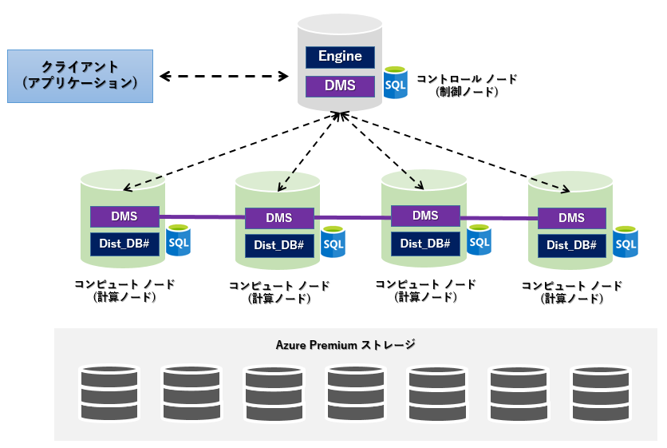
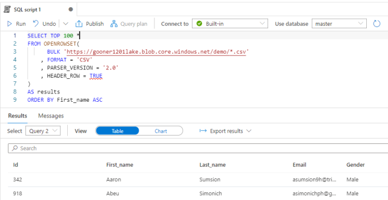
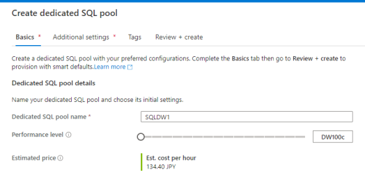
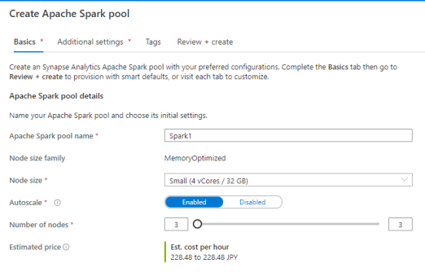
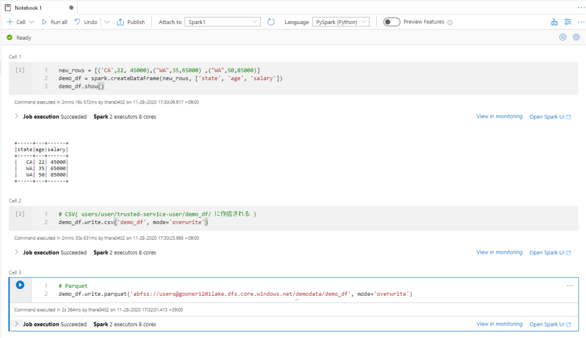
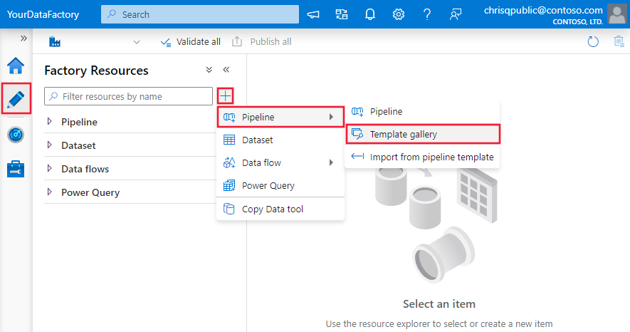

# 5. Azure Synapse Analyticsでのデータ分析基盤構築

# もくじ
- [5. Azure Synapse Analyticsでのデータ分析基盤構築](#5-azure-synapse-analyticsでのデータ分析基盤構築)
- [もくじ](#もくじ)
- [1. Azure Synapse Analytics の概要](#1-azure-synapse-analytics-の概要)
- [2. Synapse SQL Poolで複数DBをまとめ分析する](#2-synapse-sql-poolで複数dbをまとめ分析する)
  - [2.1. Synapse SQL Poolとは](#21-synapse-sql-poolとは)
  - [2.2. データの準備](#22-データの準備)
  - [2.3. Synapse Analytics を作成する](#23-synapse-analytics-を作成する)
  - [2.4. SQL Poolsでのデータ確認&分析](#24-sql-poolsでのデータ確認分析)
    - [2.4.1. Serverless SQL Poolsの利用](#241-serverless-sql-poolsの利用)
    - [2.4.2. Dedicated SQL poolsの利用](#242-dedicated-sql-poolsの利用)
- [3. Synapse Spark Poolsで分析する](#3-synapse-spark-poolsで分析する)
- [4. Synapse Pipeline でデータ前処理をする](#4-synapse-pipeline-でデータ前処理をする)
  - [4.1. 概要](#41-概要)
  - [4.2. データ準備](#42-データ準備)
  - [4.3. パイプラインの作成と基本的な使い方](#43-パイプラインの作成と基本的な使い方)
  - [4.4. パイプライン内でデータの加工をする](#44-パイプライン内でデータの加工をする)
  - [4.5. 加工フローを関数化する](#45-加工フローを関数化する)
- [90. Tips](#90-tips)
  - [90.1. Data Factory と Synapse Pipelineの違い](#901-data-factory-と-synapse-pipelineの違い)
- [99. 参考](#99-参考)
# 1. Azure Synapse Analytics の概要

[Azure Synapse Analytics](https://azure.microsoft.com/ja-jp/services/synapse-analytics/#overview)とはデータ統合、エンタープライズ データ ウェアハウス、ビッグ データ分析が 1 つになった分析サービスです。

- [https://www.slideshare.net/jamserra/azure-synapse-analytics-overview](https://www.slideshare.net/jamserra/azure-synapse-analytics-overview)

Azure Synapse Analytics は、以下の要素で構成されています。

- Synapse SQL Pool
- Synapse Spark Pool
- Synapse Pipeline
- Synapse Link
- Synapse Studio

参考：[チュートリアル:Azure Synapse Analytics の使用を開始する - Azure Synapse Analytics](https://docs.microsoft.com/ja-jp/azure/synapse-analytics/get-started)

以降では、各機能について少々掘り下げて触れていきます。

# 2. Synapse SQL Poolで複数DBをまとめ分析する

## 2.1. Synapse SQL Poolとは

Synapse SQL Pool とは、データと処理機能を複数のノード（コンピュータ）に分散し、１つのデータベースとして扱うサービスです。

- SQL Pool のイメージ



非常に大量のデータであったとしても分割し、処理をすることで、高速に処理が行えるようになります。  
以降では非常に簡単な 1 つのデータストアからデータを取得し Synapse SQL Pool でまとめる例を記載しています。  

より細かな設定や Synapse SQL Pool から SQL Database へとデータを取り込む際は以下ご参考ください。

- Synapse SQL Pool について
    - [https://www.nobtak.com/entry/dsp01](https://www.nobtak.com/entry/dsp01)
- Synapse SQL Pool から SQL Database へとデータを入れ込むパイプライン実装について
    - [https://gooner.hateblo.jp/entry/2021/01/12/091928](https://gooner.hateblo.jp/entry/2021/01/12/091928)

## 2.2. データの準備
以降では、 Microsoft が提供しているオープンデータを利用した例で触れていきます。もう少しお手軽にデータを作りたいときには、[mockaroo](https://www.mockaroo.com/) というサイトがお勧めです。

## 2.3. Synapse Analytics を作成する

Azure Portal で Synapse Analytics（workspaces preview）を作成します。  

Data Lake Storage の BLOB データ共同作成者ロールを自分へと割り当てるかどうかのチェックボックスは、ON にします。その他の項目は、以下公式ドキュメントを参照してください。

- [クイックスタート: 概要 - Synapse ワークスペースを作成する - Azure Synapse Analytics](https://docs.microsoft.com/ja-jp/azure/synapse-analytics/get-started-create-workspace?WT.mc_id=AZ-MVP-5002272)

リソースが作成されると、Azure Portal とは別のツールである Synapse Studio を起動できます。Synapse Analytics を使うメリットの１つで、データのインジェスト→分析→可視化のための開発やモニタリングを行うことができます。

## 2.4. SQL Poolsでのデータ確認&分析

SQL を使った分析エンジンで、Serverless と Dedicated の２つのタイプがあります。どちらのタイプも、SSMS や Azure Data Studio などのツールで接続できます。

- 参考：[https://docs.microsoft.com/ja-jp/azure/synapse-analytics/sql-data-warehouse/sql-data-warehouse-overview-what-is](https://docs.microsoft.com/ja-jp/azure/synapse-analytics/sql-data-warehouse/sql-data-warehouse-overview-what-is)

### 2.4.1. Serverless SQL Poolsの利用

Azure Data Lake Storage（ADLS）においたファイルに対して、SQL を実行できます。対応しているファイルの形式は、CSV / JSON / Parquet の３つです。

[mockaroo](https://www.mockaroo.com/) で作成した CSV ファイルを ADLS の demo コンテナにアップロードし、Synapse Studio から SQL script でクエリを実行した例が以下です。



[OPENROWSET 関数](https://docs.microsoft.com/ja-jp/azure/synapse-analytics/sql/develop-openrowset/?WT.mc_id=AZ-MVP-5002272)を使ってデータソース（ファイルなど）の内容を読み取って行のセットとして返すことができます。WITH 句を使ってスキーマを指定しなくても、ファイルからスキーマを自動検出してくれます。

```sql
SELECT TOP 100 *
FROM OPENROWSET(
      BULK 'https://gooner1201lake.blob.core.windows.net/demo/*.csv'
    , FORMAT = 'CSV'
    , PARSER_VERSION = '2.0'
    , HEADER_ROW = TRUE
)
AS results
ORDER BY First_name ASC
```

推論されたデータ型を確認したい場合は、こちらのクエリを実行します。

```sql
EXEC sp_describe_first_result_set N'
SELECT TOP 100 *
FROM OPENROWSET(
      BULK ''https://gooner1201lake.blob.core.windows.net/demo/*.csv''
    , FORMAT = ''CSV''
    , PARSER_VERSION = ''2.0''
    , HEADER_ROW = TRUE
)
AS results
ORDER BY First_name ASC';
```

Serverless SQL pools の master データベースは、照合順序に SQL_Latin1_General_CP1_CI_AS が使われているため、日本語が文字化けします。  

そのため、日本語を使える照合順序を指定したデーターベースを作成し、このデーターベースを選択してクエリを実行することで解決できます。

```sql
-- データベース作成時に照合順序を指定
CREATE DATABASE mydb COLLATE LATIN1_GENERAL_100_CI_AS_SC_UTF8
```

- 参考：[Always use UTF-8 collations to read UTF-8 text in serverless SQL pool](https://techcommunity.microsoft.com/t5/azure-synapse-analytics-blog/always-use-utf-8-collations-to-read-utf-8-text-in-serverless-sql/ba-p/1883633)

### 2.4.2. Dedicated SQL poolsの利用
従来からの SQL DW と同様のサービスと同様のサービスです。  
Synapse Studio の Manage メニューから、Dedicated SQL pools のデータベースを作成できます。



他のサービスに比べて価格が高いので、簡単な検証であれば DW100c を選択するのがお勧めです。さらに、使わないときはデータベースを停止しておくことで節約できます。  
上記のように SQL を利用して分析が可能です。

# 3. Synapse Spark Poolsで分析する
Spark を使った分析エンジンです。タイプは Serverless のみ利用可能です。データをメモリへ読み込んでキャッシュし、並列にクエリできるためパフォーマンス面で優れています。  
Synapse Studio の Manage メニューから、Apache Spark pools を作成できます。



Spark pools には、デフォルトで Spark Core や Anaconda などのコンポーネントが含まれていますが、必要なライブラリを追加構成もできます。  
簡単な検証であれば、Small サイズの Node を最大 3 つぐらいで十分です。  
Synapse Studio から Notebook でコードを実行すると以下のようになります。PySpark（Python）以外の言語には、Spark（Scala）/SparkSQL/.NET for Apache Spark（C#）を使うことができます。



DataFrame を作って CSV と Parquet のファイルにエクスポートすると以下のようになります。

```sql
# DataFrame の作成
new_rows = [('CA',22, 45000),("WA",35,65000) ,("WA",50,85000)]
demo_df = spark.createDataFrame(new_rows, ['state', 'age', 'salary'])
demo_df.show()

# CSV にエクスポート( users/user/trusted-service-user/demo_df/ に作成される )
demo_df.write.csv('demo_df', mode='overwrite')

# Parquet にエクスポート
demo_df.write.parquet('abfss://users@gooner1201lake.dfs.core.windows.net/demodata/demo_df', mode='overwrite')
```

# 4. Synapse Pipeline でデータ前処理をする
## 4.1. 概要
ここでは Synapse Analitics の Pipeline でのデータ前処理方法などを触れていき来ます。  
Azure Synapse Analytics の Pipeline やデータ フローなどのデータ統合機能は、Azure Data Factory の機能に基づいています。そのため、場合によっては以下もご参考ください。  
ここではデータ前処理を行うにあたり必要になることを記載していきます。

- 参考：[Azure Data Factory の概要 - Azure Data Factory](https://docs.microsoft.com/ja-jp/azure/data-factory/introduction)
    

## 4.2. データ準備
Pipeline でのデータ前処理を行う前にデータの準備します。  
以下参考に Azure SQL Database などに配置しているデータから Azure Synapse Analytics にコピーデータを取り込んでください。

- 参考：[Azure Synapse Analytics にデータを読み込む - Azure Data Factory & Azure Synapse](https://docs.microsoft.com/ja-jp/azure/data-factory/load-azure-sql-data-warehouse?tabs=data-factory)
    

## 4.3. パイプラインの作成と基本的な使い方
続いてパイプラインを作成します。  
作成方法は基本的には DataFactory と同じようなやり方になっています。  
Synapse 上でパイプラインのアイコンを選択した後、以下のようにパイプラインを作成してください。

- Pipeline 作成例（Garally 選択）



パイプラインに流すデータについては適宜利用するものを選択するようにしてください。  
パイプラインの詳しい利用方法などについては以下をご参考ください。

- 基本的なデータフロー作成ガイド
  - [Data Flow アクティビティ - Azure Data Factory & Azure Synapse](https://docs.microsoft.com/ja-jp/azure/data-factory/control-flow-execute-data-flow-activity?context=%2Fazure%2Fsynapse-analytics%2Fcontext%2Fcontext&tabs=synapse-analytics)-
  - [https://www.simpletraveler.jp/2022/03/17/microsoftazure-synapseanalytics-tutorials/](https://www.simpletraveler.jp/2022/03/17/microsoftazure-synapseanalytics-tutorials/)
    
- パイプラインの作成　Tips
  - [チュートリアル: パイプラインとの統合を開始する - Azure Synapse Analytics](https://docs.microsoft.com/ja-jp/azure/synapse-analytics/get-started-pipelines)
    
- Garally 参照してのデータフロー作成方法
  - [マッピング データ フローを作成する - Azure Data Factory](https://docs.microsoft.com/ja-jp/azure/data-factory/data-flow-create?tabs=synapse-analytics)
    

## 4.4. パイプライン内でデータの加工をする
パイプライン内でのデータ加工方法について触れます。  
平均値の計算やデータの絞り込み、日付の UTC への変更処理の定義（lif）などできます。  
以下公式ドキュメントを参考にパイプライン内でのデータ加工してください。

- [クイックスタート: マッピング データ フローを使用してデータを変換する - Azure Synapse Analytics](https://docs.microsoft.com/ja-jp/azure/synapse-analytics/quickstart-data-flow)

上記説明内では Excel のように関数を利用してデータの加工しています。
以下ご参考ください。

- [マッピング データ フローでの式ビルダー - Azure Data Factory & Azure Synapse](https://docs.microsoft.com/ja-jp/azure/data-factory/concepts-data-flow-expression-builder?toc=%2Fazure%2Fsynapse-analytics%2Ftoc.json)

利用できる式のドキュメントは以下となっています。

- [マッピング データ フローのデータ変換関数 - Azure Data Factory & Azure Synapse](https://docs.microsoft.com/ja-jp/azure/data-factory/data-transformation-functions)

## 4.5. 加工フローを関数化する
同じようなデータ加工をする際には Flowlet というものを利用します。  
利用方法は以下をご参考ください。

- [マッピング データ フローの Flowlet - Azure Data Factory & Azure Synapse](https://docs.microsoft.com/ja-jp/azure/data-factory/concepts-data-flow-flowlet)

# 90. Tips

## 90.1. Data Factory と Synapse Pipelineの違い

大規模開発の場合は Data Factory を利用し、中小規模開発の場合は Synapse Analytics（Synapse Pipeline）を利用します。  
開発規模に合わせて利用サービスを検討ください。

- 参考：[Azure Data Factory と Azure Synapse Analytics (Synapse Pipeline) の相違点の調査 - Qiita](https://qiita.com/ryoma-nagata/items/4b1f5fa15fe4e5f455e8)

# 99. 参考

- [Azure Synapse Analytics を試してみた - ROMANCE DAWN for the new world](https://gooner.hateblo.jp/entry/2020/12/01/090437)