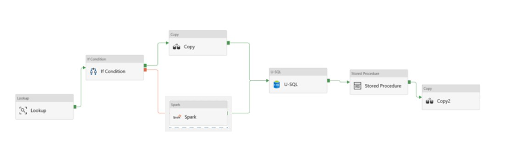
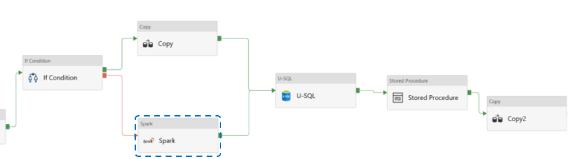

# 6. Azure Data Factory を使う

# もくじ

# 1. Azure Data Factoryとは

Azure Data Factory とは、さまざまなデータを収集して連携できるデータ統合管理のクラウドサービスです。

クラウドのデータ結合だけでなく、オンプレミスとクラウドを利用するハイブリッド運用でもデータの統合ができます。オンプレミスや SaaS などのクラウドサービスに利用しているデータを一元管理したり、データの変換や管理画面の設定・管理を GUI 操作のみで実現できます。

また、さまざまなシステムに連携して、データ分析に必要な情報を抽出するための一連の処理を自動化し、**ETL**や**ELT**といったデータ統合にも活用できます。

> **ETL・ELTとは？**
ETL・ELT とは、データの Extract（抽出）、Transform（変換・加工）、Load（格納）の頭文字をとった用語で、これらの処理の順番に頭文字を並べたものです。
従来は一般的なストレージの容量も少なく、一度に集められるデータが少なかったため、データ抽出→変換・加工→格納の順序で処理をするのが一般的で、ETL が使われてきました。しかし、現在は、大容量のストレージが利用できるようになったため、加工・変換前の生データを保管できるようになったため、データの抽出→格納→変換・加工という ELT の手法も使われるようになってきています。
> 

Azure Data Factory は、従来の ETL はもちろん、柔軟なスケールアウトスケールアップが可能なため ELT も数回のマウスクリックで利用できます。

# 2. Azure Data Factoryでの未整理データ統合管理について

## 2.1. 概要

近年あらゆる情報がデータ化されてきているものの、テキストデータや画像データ、映像データなどのさまざまなデータ形式が混在して蓄積されるということが多くあります。近年ビジネスにも活用されるビッグデータにおいてはさらに未整理のデータが混在していることがあります。

そこで、このような膨大なデータを分析・活用するために、さまざまなシステムから収集したデータを総合的に運用できる仕組みが必要になりました。

このような背景から、データの抽出から変換、格納までを自動的に行える Azure Data Factory などのデータ統合管理を行うものが注目されています。

## 2.2. 代表的な機能

◆**さまざまなシステムとの連携**

Azure Data Factory は、さまざまなシステムとの連携機能を持っています。

たとえば、オンプレミスで管理する顧客情報やマーケティング情報、クラウドで管理する膨大なシステムログなどと連携可能です。データベースならば、リレーショナル、非リレーショナル、その他のストレージシステムをもつシステムと連携します。

◆**データの収集**

システムと連携した後、各種システムからデータを収集してデータストアに移動させます。

たとえば、 Azure Data Factory で収集したデータを、クラウド内のストレージ（Azure Blob Storage など）に格納することでストレージ容量を気にすることなく、大容量のデータ収集が可能になります。

- [Azure Blob Storage](https://esg.teldevice.co.jp/iot/azure/column/column18.html)

◆**データの変換・強化**

収集されてストレージに格納されたデータを変換処理します。これにより、統一された形式のデータが使えるようになるので、グラフなどを作成できるようになります。

データ変換は自動的に行うこともできますが、手動で変換プログラムを作成も可能です。また、外部アクティビティをサポートしているため、「HDInsight Hadoop」「Spark」「Data Lake Analytics」「Azure Machine Learning」など、目的別にデータを対応させることもできます。

◆**モニター機能**

Azure Data Factory でアクティビティやパイプラインを構築して運用しているとき、状況をモニターできる機能です。アクティビティやパイプラインを監視すれば、データ統合の成功率や失敗率を確認できます。

## 2.3. 料金

Azure Data Factory は従量課金制となります。

最新の料金は[公式サイト](https://azure.microsoft.com/ja-jp/pricing/details/data-factory/)をご確認ください。

# 3. Azure Data Factoryで利用される主な用語

Azure Data Factory を知る上で必要な用語をこちらに記載します。

## 3.1. パイプライン

パイプラインでは以下の図のように、タスクの処理の順番や関連性を線でつないで可視化します。

パイプラインは、タスクとタスクを連携して実行する論理的なグループのことです。さまざまなアクティビティをパイプラインで 1 つの機能としてまとめることで、一連のタスクを一元的に実行・管理できます。

## 3.2. アクティビティ

アクティビティは、以下の図の「点線」と「→」で示されている一つひとつの処理ステップのことを指します。

アクティビティには、データ移動やデータ変換、制御アクティビティといった 3 つのアクティビティがサポートされています。

1 つのアクティビティの中に複数のアクティビティを設定は可能ですが、複雑になるため、上の図のように複数のアクティビティを設定してパイプラインで管理する方法が良い例です。

## 3.3. データセット

以下の図は、データストア内のデータ構造を示しています。

データセットとは、以下のようなデータストア内のデータを示します。

- テーブル
- ファイル
- フォルダ
- ドキュメント　など

## 3.4. リンクサービス

以下の図は、外部リソースに接続するための接続情報のリンクを表しています。

リンクサービスでは、ユーザは外部サービスとの接続のために接続プロトコルを考えたりプログラムを作成することなく簡単に外部サービスとリンクできます。

たとえば、BLOB コンテナやフォルダは Azure BLOB データセットで指定してリンク（接続）するなど可能です。

## 3.5. マッピングデータフロー（Data Flow）

以下の図は、データ処理の設計を可視化したものです。

マッピングデータフローは、データの結合や集計処理などの ETL 処理を GUI で視覚的に設計できます。これにより、ノンプログラミングでデータ変換ロジックの開発が可能です。

# 4. Azure Data Factoryの使い方

Azure Data Factory を使う際の簡単な流れをこちらに記載します。

なお、詳しい内容については[クイック スタート: Azure portal と Azure Data Factory Studio を使用してデータ ファクトリを作成する](https://docs.microsoft.com/ja-jp/azure/data-factory/quickstart-create-data-factory-portal#main)をご参考ください。

1. **Web ブラウザにて Azure Portalにアクセス（Microsoft Edge、Google Chromeに対応しています）**
2. **Azure Portalのメニューから「リソースの作成」を選択**
3. **「統合」→「Data Factory」を選択**
4. **「Create Data Factory」ページにて、「Basics」タブにてデータファクトリを作成するサブスクリプションを選択**
5. **「リソースグループ」にて、ドロップダウンからのリスト選択、あるいは新規作成を選択して新しいリソースグループの名前を入力**
6. **「リージョン」にて、データファクトリの場所を選択**
7. **「名前」に、ユニークな名前を入力（グローバルにユニークである必要があるので、「This Data Factory name is not available」というエラーが出た場合には、その他の名前を入力してください）**
8. **「バージョン」にて「v2」を選択**
9. **「Next:Git configuration」タブより、「Configure Git Later」のチェックボックスをオンにする**
10. **「確認と作成」を選択し、検証に成功後「作成」を選択**
11. **「作成と監視」を選択し、ブラウザの新規タブにて Azure Data Factory ユーザインターフェースアプリケーションを起動**

# 99. 参考

- [https://esg.teldevice.co.jp/iot/azure/column/column25.html](https://esg.teldevice.co.jp/iot/azure/column/column25.html)

[Azure Data Factoryとは？さまざまなデータの連携や統合管理をクラウドで実現｜Microsoft Azureコラム｜東京エレクトロンデバイス](https://esg.teldevice.co.jp/iot/azure/column/column25.html)

# 99. 参考

- [https://esg.teldevice.co.jp/iot/azure/column/column25.html](https://esg.teldevice.co.jp/iot/azure/column/column25.html)

[Azure Data Factoryとは？さまざまなデータの連携や統合管理をクラウドで実現｜Microsoft Azureコラム｜東京エレクトロンデバイス](https://esg.teldevice.co.jp/iot/azure/column/column25.html)

- [https://docs.microsoft.com/ja-jp/azure/machine-learning/how-to-data-ingest-adf#consume-data-in-azure-machine-learning](https://docs.microsoft.com/ja-jp/azure/machine-learning/how-to-data-ingest-adf#consume-data-in-azure-machine-learning)

[Azure Data Factory を使用したデータ インジェスト - Azure Machine Learning](https://docs.microsoft.com/ja-jp/azure/machine-learning/how-to-data-ingest-adf#consume-data-in-azure-machine-learning)