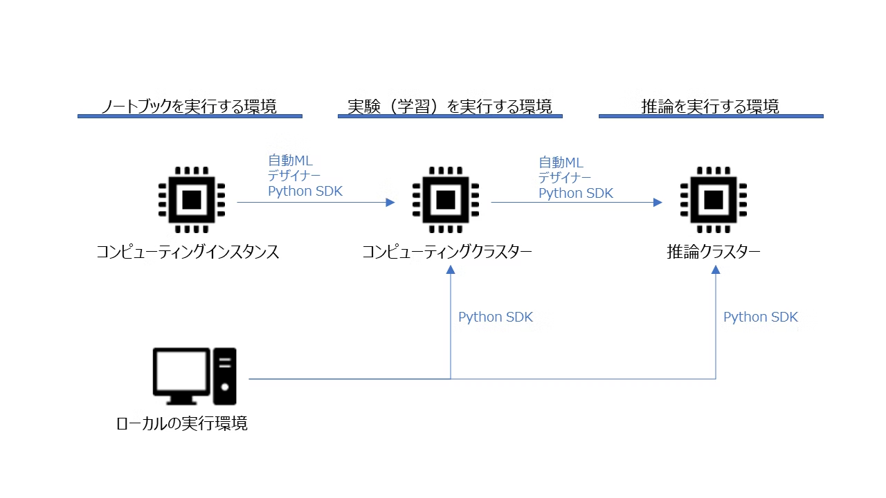

# 7. Azure Machine Learningを使う

# 1. Azure Machine Learning とは？

[Azure Machine Learning](https://azure.microsoft.com/ja-jp/services/machine-learning/)　とは Azure のサービスの 1 つで、Azure で機械学習モデルを構築、運用できるプラットフォームです。

Azure 上で**ノートブック**（Python）を用いたモデル構築だけでなく、データを投入するだけで自動的に最適なモデルやパラメータ探索をする **AutoML** や GUI ベースでパイプラインを構築できる **デザイナ** 機能もあり、幅広いユーザにとって活用場面のあるサービスです。

利用方法は以下参考に記載しています。

- [https://qiita.com/gnbrganchan/items/43e6c44754cb83220db5](https://qiita.com/gnbrganchan/items/43e6c44754cb83220db5)

- 公式で出されている利用ガイド
  - [https://docs.microsoft.com/ja-jp/learn/modules/use-automated-machine-learning/](https://docs.microsoft.com/ja-jp/learn/modules/use-automated-machine-learning/)

## 2. 全体像

Azure Machine Learning における機械学習モデルの構築・運用の流れとしては下記の流れになります。

1. **データの登録**
2. **モデルの選択・学習・評価**
3. **モデルデプロイ**
4. **運用**

# 3. データの取り込み

データソースは csv ファイルや Web 上のデータ等、おおよそ何でも使えます。

ここではアセットからデータ登録する方法について触れます。

## 3.1. アセットからのデータ取込

ホーム画面から `アセット`⇒`データセット`⇒`データセットの作成` でデータを登録できます。


図の赤枠をクリックすると、以下のような選択肢が表示されます。

- ローカルファイルから
- データストアから
    - **[Azure Blob Storage](https://azure.microsoft.com/ja-jp/services/storage/blobs/)**から取得する際はこちら選択します。
- Web ファイルから
- Open Datasets から

ここではローカルファイルからと仮定してデータセットを登録しますが、任意のものを選択するようにしてください。

登録画面に以下の手順で情報を入れていくと、データセットの登録が進みます。

データの形式などは Azure 側である程度判別してくれるので、ユーザ側でそこまで細かい設定をする必要はありません。

各種設定例は以下のとおりです。**[Azure Machine Learning のしくみ: リソースとアセット (v2)](https://docs.microsoft.com/ja-jp/azure/machine-learning/concept-azure-machine-learning-v2)もご参考ください。**

- **基本情報**

[Untitled](https://www.notion.so/32aa6d6be22f4b7882a8a1b636f7b903)

- **データストアとファイルの選択**

[Untitled](https://www.notion.so/0a3ab437356b480892e1b676bf9ab233)

- **設定とプレビュー**

[Untitled](https://www.notion.so/361da43e051a4a9ab8c5adf82793ec7b)

- **スキーマ**

[Untitled](https://www.notion.so/e2ee57dcac4449d89f7d5e4d1a394ba6)

ここまで来るとデータセットの登録が完了します。データセットの登録が完了すると、`アセット`⇒`データセット` に登録したデータセットが表示されます。

# 4. モデルの学習

Azure Machine Learning のコア機能となるモデルの学習ですが、Python でユーザが自由にモデルを構築できるノートブックをはじめ、データと予測対象列を指定すると自動的に最適なモデル学習してくれる **AutoML**　やノンプログラミングで予測パイプラインを構築できる **デザイナ** など、多彩なインターフェースが用意されています。

ここではそれら利用方法について触れていきます。

なお、詳細は以下公式ドキュメントをご参考ください。

[Azure Machine Learning とは - Azure Machine Learning](https://docs.microsoft.com/ja-jp/azure/machine-learning/overview-what-is-azure-machine-learning)

## 4.1. ノートブックを使って学習する

ノートブックを使って自由にモデルを構築できます。
ノートブックから Azure Machine Learning 上のアセットにアクセスするには Python SDK のインポートが必要になります。

事前準備など必要ですが、scikit-learn 等を使ったローカル環境と変わらない操作でモデルの学習ができます。

## 4.2. AutoMLを使って学習する

### 4.2.1. 概要と学習方法

AutoML を使うと指定したデータ/メトリクスに対してさまざまなモデルを試行してくれます。Azure Machine Learning では、データメトリクスを指定した一連の学習を「実験」と呼び、1 つの実験の中の個々のモデルの学習のことを「実行」と呼んで区別しています。

つまり、**1 つの実験を作成すると AutoML によっていくつもの実行が作成されます。**

- 参考：[自動 ML とは AutoML - Azure Machine Learning](https://docs.microsoft.com/ja-jp/azure/machine-learning/concept-automated-ml#how-automated-ml-works)

ホーム画面から作成者⇒AutoML ⇒新しい AutoML の実行を選択すると AutoML を始めることができます。


**データセットの選択**

学習に使用するデータセットを選択します。データセットを登録済みであれば、登録したデータセットが表示されます。ここで初めてデータを登録も可能です。

**実行の構成**

<!-- textlint-disable prh -->
コンピューティングクラスターを選択します。

この画面から新にコンピューティングクラスターを作成もできます。

<!-- textlint-enable prh -->

**タスクの種類の選択**

今回の目的が**分類（カテゴリ値の予測）**なのか、**回帰（連続値の予測）**なのか、**時系列の予測**なのかを選択します。

**ハイパーパラメータの設定**

ハイパーパラメータに関する設定します。

自動でも行えるるため適宜設定が必要となります。

**テストデータの指定**

テストデータを指定します。Azure Machine Learning 上でも作成可能ですが、元データのうちの ○ ％のデータをテストデータとして使用できません。

そのため、「特定の期間だけをテストデータとしたい場合」など制約がある場合は適宜 Synapse Analytics Pipeline でテスト用データを用意し Azure Blob Strage に配置しておくなどする必要があります。

以上で設定終了です。

必要な情報を入力し終えると、AutoML が動き出し学習が始まります。

実験が完了し実験 ID をクリックすると、実験の詳細画面に遷移し、今回の実験におけるベストモデルとそのときの精度など詳細情報を確認できます。

- 実験 ID 選択した時の例


### 4.2.2. 過学習への対策

AutoML では以下のように過学習や不均衡データへの対策として、それらを特定するためのグラフやメトリクスを提供しています。

詳細は以下ご参考ください。

[AutoML でのオーバーフィット データと不均衡データの回避 - Azure Machine Learning](https://docs.microsoft.com/ja-jp/azure/machine-learning/concept-manage-ml-pitfalls)

<!-- textlint-disable prh -->
## 4.3. デザイナーを使って学習する
<!-- textlint-enable prh -->

### 4.3.1. 概要と学習方法
<!-- textlint-disable prh -->
デザイナー機能を使うと、GUI によるモデル構築が可能です。

AutoML では完全に自動でモデルが選択・学習されますが、デザイナー機能を使うと使用するモデルや特徴量生成・選択をある程度自由に行うことができます。

部分的に R や Python のコードを挿入もできるので、柔軟性を高めつつ視覚的に処理がわかりやすいモデリングを実行可能となります。

デザイナー機能は `作成者>デザイナー` から使用できます。

利用方法については以下公式ドキュメントをご参照ください。

- 参考：**[Azure Machine Learning デザイナーとは - Microsoft Docs](https://docs.microsoft.com/ja-jp/azure/machine-learning/concept-designer)**

以降ではメモ程度に記載していきます。

> **💡Hint**
デザイナーで使うことができるモジュールは Azure Machine Learning 特有のもので、慣れるまでは使い勝手がわかりにくいため、初めのうちはサンプルをコピーしてデータセット等を書き換えながら使用することをおすすめします。
> 

今回は二値分類タスクを想定します。「Sample 3: Binary Classification with Feature Selection - Income Prediction」をベースにパイプラインを作成していきます。
サンプルを開くと、作成済みのパイプラインが表示されます。
デザイナーを使って学習するには、AutoML のときと同様にコンピューティングクラスターを設定する必要があります。
ここではあらかじめ作成したコンピューティングクラスターを使用します。
このサンプルでは「Adult Census Income Binary Classification dataset」というデータセットを使っていますので、まずこれを今回学習させたいデータに置き換えます。


データセットは変更しましたが、予測対象とするカラムの情報などがサンプルのままなので、適宜書き換えます。（今回のターゲットは「Survived」列です）


データセット・ターゲット列等を適切に設定したのち、「送信」をクリックするとパイプラインが動き出し、学習が始まります。
各モジュールの設定が正しくされていれば問題なく進みますが、列名の指定等に誤りがあると、途中で実行が止まってしまいます。
実行に失敗すると、下図のように失敗した箇所が赤く表示されます。


パイプラインを実行すると、`アセット⇒パイプライン` に表示されます。  
ここで状態が「完了」となっていれば、パイプライン実行が問題なく完了したことになります。

モデルの学習結果については、デザイナーの画面から「Evaluate Model」モジュールをクリックすることで確認できます。
Evaluate Model 画面から `「出力とログ」⇒「データ出力を表示する」⇒グラフのマーク（可視化）` をクリックすると、ROC 曲線などモデルの学習結果に関する情報を確認できます。


> **❗重要**
> 
> 
> 以下ではより詳細な利用方法が記載されています。ご参考ください。
> 
> - [https://docs.microsoft.com/ja-jp/azure/machine-learning/tutorial-designer-automobile-price-train-score](https://docs.microsoft.com/ja-jp/azure/machine-learning/tutorial-designer-automobile-price-train-score)
> 
> [チュートリアル: デザイナー - コードなし回帰モデルをトレーニングする - Azure Machine Learning](https://docs.microsoft.com/ja-jp/azure/machine-learning/tutorial-designer-automobile-price-train-score)
> 

### 4.3.2. モデルの選定方法

モデリング時に使用するアルゴリズムを選択するにあたり、Azure では以下のようにチートシートが提供されています。

- アルゴリズムチートシート


アルゴリズム選定時には上記シートおよび以下をご参考ください。

[機械学習アルゴリズム チート シート - デザイナー - Azure Machine Learning](https://docs.microsoft.com/ja-jp/azure/machine-learning/algorithm-cheat-sheet)

[機械学習アルゴリズムの選択方法 - Azure Machine Learning](https://docs.microsoft.com/ja-jp/azure/machine-learning/how-to-select-algorithms)

# 5. モデルの登録・デプロイ・推論

学習したモデルを使って Web サービスを開始したり、新しいデータから予測値を算出するには、学習したモデルを登録する必要があります。Web サービスとして使用するためには更にデプロイが必要です。
バッチ的に新しいデータを読み込ませて予測値を算出するだけであればデプロイする必要はなく、ノートブックから登録したモデルを呼び出すことで推論ができます。もちろんデプロイしても構いません。

## 5.1. ノートブックを使ってデプロイする

### 5.1.1. AutoMLの結果を利用する

AutoML で実行した実験結果をノートブックから取得・利用できます。
実験結果の取得には Experiment()を使用します。

以下の処理では、AutoML で作成した実験 titanic_exp01 において精度が最もよかったモデルを探索し、呼び出しています。
experiment.get_runs(include_children = True)によって、子実験まで含めた全実験を取得し、**それぞれにおける精度を比較することで** 最良精度の実行 ID を max_acc_runid に保存しています。
最後に、Run(experiment=experiment, run_id=max_acc_runid)によって実験 ID から実行結果を呼び出しています。

```python
# 実験名を指定して実験結果を取得
experiment = Experiment(workspace=ws, name="titanic_exp01")

max_acc_runid = None
max_acc = None

# すべての子実験結果から、最良のモデルを探索
for run in experiment.get_runs(include_children = True):
    run_metrics = run.get_metrics()
    run_details = run.get_details()
    # メトリクスが保存されていないid（親ID等）はスキップ
    if len(run_metrics) == 0:
        continue
    # メトリクスやIDはdict型で保存されている
    run_acc = run_metrics["accuracy"]
    run_id = run_details["runId"]
#     print(run_id + ":" + str(run_acc))

    # 精度が最大のIDを記録
    if max_acc is None:
        max_acc = run_acc
        max_acc_runid = run_id
    else:
        if run_acc > max_acc:
            max_acc = run_acc
            max_acc_runid = run_id

# 最良精度のIDと精度を出力
print("Best run_id: " + max_acc_runid)
print("Best run_id accuracy: " + str(max_acc))

# idを指定して実験結果を呼び出し
best_run = Run(experiment=experiment, run_id=max_acc_runid)
```

### 5.1.2. モデルを登録する

Run.register_model によって、実行結果からモデルを登録できます。
モデルを登録すると、Azure Machine Learning のアセット上で確認できるようになり、モデルのデプロイや呼び出しができるようになります。

```python
model = best_run.register_model(model_name = 'model_automl01', model_path = "", model_framework = Model.Framework.SCIKITLEARN)
```

### 5.1.3. ノートブックを使って推論する

ここでは学習済みモデルをサービスとしてデプロイするのではなく、予測用データを用いて予測値を算出する方法を紹介します。

```python
# モデルのpklファイルを含む、実行に関するデータをすべてAzure上のマイファイルにダウンロード
best_run.download_files(output_directory = "./download")
# pklファイルからモデルをロード
model = joblib.load("./download/outputs/model.pkl")
# 推論用のデータセットを読み込み
dataset = Dataset.get_by_name(workspace = ws, name = "titanic-test").to_pandas_dataframe()
# 予測を実行
pred = model.predict(dataset)
# csvとして出力
sub = pd.DataFrame({"PassengerId" : dataset.PassengerId, "Survived" : pred})
sub.to_csv("./submission.csv", index = False)
```

## 5.2. AutoMLからデプロイする

AutoML で実行した実験結果からモデルを選択し、デプロイしてサービスとして開始できます。
`作成者⇒自動ML` または `アセット⇒実験` から実行した実験を選択し、その中からどれかモデルを選択すると画面上にデプロイが表示されます。


選択後デプロイするモデルの名前やデプロイの形式を選択してください。

デプロイが完了すると、モデルの概要画面の「デプロイの状態」が完了になります。

さらに、`アセット⇒エンドポイント` にデプロイしたモデルが表示されます。

デプロイしたモデルにリクエストを送信することで、モデルの動作確認を実施できます。

ここまでの流れは以下ご参考ください。

- [https://docs.microsoft.com/ja-jp/azure/machine-learning/how-to-use-automated-ml-for-ml-models#deploy-your-model](https://docs.microsoft.com/ja-jp/azure/machine-learning/how-to-use-automated-ml-for-ml-models#deploy-your-model)

[スタジオ UI を使用して自動 ML を設定する - Azure Machine Learning](https://docs.microsoft.com/ja-jp/azure/machine-learning/how-to-use-automated-ml-for-ml-models#deploy-your-model)

## 5.3. デザイナーから推論・デプロイをする

利用方法の詳細は以下ご参考ください。

[](https://docs.microsoft.com/ja-jp/azure/machine-learning/concept-designer)

### 5.3.1. デザイナーから推論する

デザイナーで作成したモデルを使って推論するためには推論用のパイプラインを作成する必要があります。
推論パイプラインはトレーニングパイプラインのデザイナー画面から、「推論パイプラインの作成」をクリックすることで作成できます。


### 5.3.2. デザイナーからデプロイする

推論パイプラインのデザイナー画面から「デプロイ」をクリックすると、作成したパイプラインをデプロイできます。


# 6. Tips

## 6.1. Python SDKによるAzure Machine Learning上のアセットの操作

### 6.1.1. ノートブックを使用する

Azure Machine Learning 上のノートブック機能を使って、AutoML による学習など Azure Machine Learning の各種機能を利用できます。
ノートブックを使用するには後述のコンピューティングインスタンスが必要となります。

**SDKの読み込み**

始めに、Azure Machine Learning の各種機能を利用するためにライブラリをインポートする必要があります。
インポートが問題なく完了すると、下記スクリプトの最後の print 文により SDK のバージョンが表示されます。

```python
%matplotlib inline
import numpy as np
import matplotlib.pyplot as plt

import azureml.core
from azureml.core import Workspace
from azureml.core import Experiment
from azureml.core import Run
from azureml.core import Dataset
from azureml.core import Model
from azureml.train.sklearn import SKLearn
from azureml.core.compute import ComputeTarget, AmlCompute
from azureml.core.compute_target import ComputeTargetException

# check core SDK version number
print("Azure ML SDK Version: ", azureml.core.VERSION)
> Azure ML SDK Version:  1.6.0
```

**ワークスペースの読み込み**

次に、作業をするワークススペースを読み込みます。
ワークスペースの読み込みには **サブスクリプションID・リソースグループ名・ワークスペース名** の 3 つの情報が必要となります。

```python
subscription_id = '*****' # サブスクリプションIDを入力
resource_group  = '******' # リソースグループ名を入力
workspace_name  = '********' # ワークスペース名を入力

try:
    ws = Workspace(subscription_id = subscription_id, resource_group = resource_group, workspace_name = workspace_name)
#     ws.write_config()
    print('Library configuration succeeded')
except:
    print('Workspace not found')
```

ワークスペースの読み込みが完了すると、ワークブックから Azure Machine Learning を使用する準備が整います。

### 6.1.2. ローカルの環境からAzure Machine Learningを使用する

Python SDK を使うことで、ローカルの環境から Azure Machine Learning の各サービスを使用できるようになり、Azure Machine Learning 上のノートブックを使わない分、費用を抑えることができます。

- 参考：[https://docs.microsoft.com/ja-jp/azure/machine-learning/how-to-deploy-local](https://docs.microsoft.com/ja-jp/azure/machine-learning/how-to-deploy-local)

## 6.2. 仮想マシンの作成・管理

### 6.2.1. 概要

Azure Machine Learning に使う仮想マシンの作成・管理についてまとめます。
モデルの学習・推論に仮想マシンが必要なことは言うまでもないですが、Azure Machine Learning 上のワークブック機能を使う際にも仮想マシンが必要となります。

Azure Machine Learning 上で扱う仮想マシンは、`ホーム画面から管理⇒コンピューティング` で確認できます。


Azure Machine Learning で扱う仮想マシンには、「コンピューティングインスタンス」「コンピューティングクラスター」「推論クラスター」「アタッチされたコンピューティング」の 4 種類があります。
それぞれ、Azure 上でノートブック等を編集・実行するためのリソースや、ノードをいくつも立ち上げて学習・推論するためのインスタンスなど、役割が分かれています。
また、PythonSDK を使う場合、ローカルの環境から Azure の実験を submit したり、資産を操作できます。

- 各種コンピューティングインスタンスの役割



### 6.2.2. コンピューティングインスタンス

コンピューティングインスタンスはノートブックを使用するための仮想マシンです。
コンピューティングインスタンスを作成するにあたり必要な項目は下記の通りです。

[Untitled](https://www.notion.so/bceeeaa0ed594987b9199021f788f20f)

作成完了すると一覧に現れます。
コンピューティングインスタンスは、使用しないときは明示的に停止する必要がある（停止をしないと課金され続けてしまう）ため注意が必要です。

### 6.2.3. コンピューティングクラスター

コンピューティングクラスターはモデルの学習するための仮想マシンです。前述のコンピューティングインスタンスと名前が似ていますが、目的が異なります。

コンピューティングクラスターを作成するにあたり必要な項目は下記の通りです。

[Untitled](https://www.notion.so/7b9782bd986643bc9afd99f4db9355a6)

コンピューティングクラスターの最小ノード数を 0 に設定していれば、作成直後はどのジョブも投入されていないため**自動的にノード数が0となり課金されません**。
最小ノード数を 1 以上にすると何もしていなくてもノードが確保される状態となり費用が発生するので注意が必要です。


### 6.2.4. 推論クラスター

推論クラスターはモデルをデプロイ、推論するための仮想マシンです。
推論クラスターを作成するにあたり必要な項目は下記の通りです。

[Untitled](https://www.notion.so/a340b88f0bda4653b8911ba18ae37d30)

推論クラスターはアタッチされている間、費用が発生し続けます。
そのため、必要のない推論クラスターはデタッチまたは削除する必要があります。


推論クラスターをデタッチすると一覧から消えてしまいますが、再度推論クラスターの作成画面を開き、Kubernetes Service の項目で「既存のものを使用」を選択すると先ほどデタッチした推論クラスターを選択し、再度アタッチできます。


## 6.3. 費用

Azure Machine Learning の費用については[Azure Machine Learning の価格](https://azure.microsoft.com/ja-jp/pricing/details/machine-learning/)をご参照ください。

# 99. 参考

- [https://qiita.com/gnbrganchan/items/43e6c44754cb83220db5](https://qiita.com/gnbrganchan/items/43e6c44754cb83220db5)

[Azure Machine Learningのいろは - Qiita](https://qiita.com/gnbrganchan/items/43e6c44754cb83220db5)

- [https://www.simpletraveler.jp/2022/03/21/azuremachinelearning-automl-tutorials/](https://www.simpletraveler.jp/2022/03/21/azuremachinelearning-automl-tutorials/)

[https://www.simpletraveler.jp/2022/03/21/azuremachinelearning-automl-tutorials/](https://www.simpletraveler.jp/2022/03/21/azuremachinelearning-automl-tutorials/)

- [https://docs.microsoft.com/ja-jp/azure/machine-learning/concept-azure-machine-learning-v2?tabs=cli](https://docs.microsoft.com/ja-jp/azure/machine-learning/concept-azure-machine-learning-v2?tabs=cli)

[Azure Machine Learning (v2) のしくみ - Azure Machine Learning](https://docs.microsoft.com/ja-jp/azure/machine-learning/concept-azure-machine-learning-v2?tabs=cli)

- [https://docs.microsoft.com/ja-jp/azure/machine-learning/](https://docs.microsoft.com/ja-jp/azure/machine-learning/)

[Azure Machine Learning のドキュメント](https://docs.microsoft.com/ja-jp/azure/machine-learning/)

- [https://docs.microsoft.com/ja-jp/learn/modules/use-automated-machine-learning/](https://docs.microsoft.com/ja-jp/learn/modules/use-automated-machine-learning/)

[Azure Machine Learning で自動機械学習を使用する - Learn](https://docs.microsoft.com/ja-jp/learn/modules/use-automated-machine-learning/)